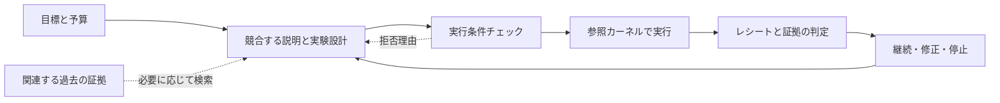

<div align="center">

<picture>
  <source media="(prefers-color-scheme: dark)" srcset=".github/assets/rds-hero-dark.svg">
  
</picture>

# Research Direction Selector

**研究者と研究者の AI のための研究支援**

次の実験に、明確な問い、公平な比較、そして意思決定につながる結果を。

[](https://github.com/kongtou20070406/research-direction-selector/actions/workflows/test.yml)


[](CONTRIBUTING.md)
[](https://github.com/kongtou20070406/research-direction-selector/stargazers)

[English](README.md) · [简体中文](README.zh-CN.md) · **日本語**

[実測結果](#実測結果と具体的な価値) · [目指すもの](#目指すもの) · [L1–L4](#l1l4) · [クイックスタート](#クイックスタート) · [コントリビュート](#コントリビュート)

</div>

> この版は `main` から公開する **v5.5.0-rc.2 プレリリース**です。研究者とその AI 向けの[ダウンロード](https://github.com/kongtou20070406/research-direction-selector/releases/tag/v5.5.0-rc.2)。五つの構成要素を固定し、[計画](docs/roadmap.md)で実装と今後の検証を分けています。

Research Direction Selector（RDS）は、実行可能なローカル参照カーネルを備えた、Codex 向けの研究支援スキルです。研究目標、競合する説明、過去の経験、プログラムによるチェックを結び付け、**現在の証拠と予算のもとで、次にどの実験を行うべきか**という問いに取り組みます。

研究者が目標と投入する資源を決め、モデルが候補となる方針を設計し、プログラムが実行上の制約を確認します。その結果をもとに次の一手を見直します。RDS は、評価指標の停滞、メカニズムのアブレーション、予算配分、中断した研究の再開に適しています。

> **2 つの使い方：**[SKILL.md](SKILL.md) を通じて実際の研究プロジェクトで協働する方法と、参照 CLI で制限されたスカラー実験を実行し、予算・データ利用・証拠判定のプロトコルを検証する方法があります。実際の GPU 学習は、研究プロジェクト自身の学習コードで実行します。

## 実測結果と具体的な価値

2026-09-30 のリリース検査で得られた結果です。

| 検査 | 実際の結果 | 検査する動作 |
| --- | --- | --- |
| [回帰テスト](tests/) | **204 件成功、4 件の任意検査をスキップ、計 208 件** | カーネル、Advisor、形式アダプター、画面の動作。ネイティブ Lean 未設定、PyTorch 不在。 |
| [過去の事例のリプレイ](benchmark/README.md) | **6/6 成功** | 記録済みの意思決定パケットと関連する実行条件。 |
| [合成攻撃シナリオ](benchmark/redteam/) | **4/4 成功** | 事前に定めた四つのプロトコル攻撃。 |
| [公開タスクを改編したコンポーネント課題](docs/advisor-benchmark.md) | **8/8 ケース、28/28 条件を確認** | 明示的な契約、証拠不足、依存関係、コスト、予算、出典の識別。 |

公開タスク課題は ScienceAgentBench と CORE-Bench のメタデータを使い、人がルールを改編しました。八つのローカル fixture の処理と結果の組み立てに **83.0743 ms** を要しました。小規模なメタデータ検査の時間です。[入力](benchmark/advisor-public/source-facts.json)と[条件ごとの出力](benchmark/advisor-public/results.json)を公開しています。**科学タスク全体のスコアと研究品質の改善は未測定**です。件数が示すのは表の動作であり、他システムとの順位ではありません。

skill 間の比較は延期し、実プロジェクトの使いやすさ、実用性、研究全段階の L2 支援を優先します。[ベンチマーク選定資料](docs/benchmark-plan.md)は後日の参考として残し、比較実験は実行も予定もしていません。

次の研究判断を支援する具体的な動作を確認しました。

- **証拠不足を保持する：**一つの学習損失から収束を診断しません（C1）。事実の出典を削除すると `NEEDS_EVIDENCE` に変わり、照会を提案します（C4）。
- **要求とワークフローに応じて提案を変える：**20 特徴の契約を 10 に変更すると利用可能な候補が入れ替わります（C3）。embedding の証拠がない場合、二段階の前提関係をたどって証拠を求めます（C6）。
- **既知のコストと予算で判断する：**不明なコストは不明のまま保持し（C5）、予算ゼロでは正のコストを持つ検査を阻止します（C7）。
- **再現対象の出典を確認する：**異なる capsule ID なら、選択した出典の後続検査を阻止します（C8）。

検査した範囲では、プログラムが判断条件と導出を保持し、人と AI が確認できます。実際の科学的成果は、研究プロジェクト自身の実験と評価で確かめる必要があります。

## 目指すもの

RDS の中心的な目的は、人間の研究を自動化支援することです。証拠の調査、実験の生成と選択、実行の手配、結果の評価、振り返りと再開を支援します。研究者の目標と判断を中心に置き、Lean との互換性は適切な数学的部分問題に利用します。

研究者が、総コストに見合う次の実験を選び、検査可能なプロセスで実行し、中断した場合も証拠を起点に再開できるよう支援します。長期的な目標は、検証済みのフィードバックを通じて意思決定方針を改善できる研究ループです。その中でも、目標、資源、解釈に関する決定権は研究者が保持します。

提案する実験は、常に 3 つの問いに答える必要があります。**どの説明を区別するのか、どうすれば公平で予算内に収まる比較になるのか、そして、それぞれの結果が何を変えるのか。**

## 研究者と研究者の AI へ

1. 下記の手順で [Skill](SKILL.md) を導入し、AI アシスタントで研究プロジェクトを開きます。
2. 研究課題、指標、現在のベースライン、予算を伝え、コード・ログ・既存結果を示します。まだ曖昧なアイデアでも始められます。
3. 推奨実験が区別できる説明と総コストを確認します。実行後は、証拠が支える結論と次の判断の変化を確認します。

AI に渡す開始指示の例：

```text
この研究プロジェクトを Research Direction Selector（RDS）で支援してください。
まず既存の証拠と判断を復元してください。
目標、指標、ベースライン、予算を明確にし、有効な対照とログを再利用してください。
競合する説明を区別できる次の実験を推奨してください。
予想される観測、反証条件、総コスト、結果ごとの判断を説明してください。
数学的検査、実際の実行、機序の証拠を分けて記録してください。
seed の追加は既定にせず、観測済みの不安定性が判断に影響し追加予算が承認された場合だけ検討してください。
```

## 五つの構成要素

| 構成要素 | 役割 |
| --- | --- |
| **1 · Skill** | 目標、仮説、対照、証拠の解釈を整理する研究手順。 |
| **2 · 実行と受け入れ判定のカーネル** | 実行管理、予算と証拠の検査、実行記録の収集、対応する数学的検査。 |
| **3 · 研究状態と記憶** | `.rds/`、Obelisk、判断グラフで目標、設定、結果、失敗条件を保存。 |
| **4 · Advisor** | 観測と適用範囲を持つ規則から診断と行動候補を提案し、証拠に基づく候補生成を発展させる。 |
| **5 · RSI** | RDS 自身の規則・方針の変更を提案して評価し、証拠に支えられた改善を採用。 |

最初の三つが研究ループの基盤を担い、Advisor と RSI が拡張します。記憶が Advisor に根拠を供給し、カーネルが選択した行動を検査します。これは機能上の役割であり、ローカル実装を共有できます。L1–L4 は自律性の段階で、追加の構成要素ではありません。

## L1–L4

RDS は通常の対話を通じて単一モデルでも利用できます。五つの構成要素が、目標の明確化 → 証拠の調査 → 実験選択と確認 → 実行 → 結果評価 → 証拠の蓄積と再開を支えます。各ラウンドで、**分かったこと、未解決のこと、次の行動、それを行う理由**を示します。

RDS は **Kramer ら（2026）の科学的発見の自動化フレームワーク**を採用します。論文は運転自動化を参考にしており、原尺度は **L0–L5 の六段階**です。ここでは番号や意味を変えずに L1–L4 を紹介します。[原名・出典と解釈の範囲（English）](docs/research-autonomy.md)を参照してください。

| レベル | 採用したフレームワークの範囲 |
| --- | --- |
| **L1 · 機械による支援** | 科学的作業の一側面を計算機が支援します。 |
| **L2 · 部分的な自動化** | 発見の重要な一部分を完全に自動化します。 |
| **L3 · 条件付き自動化** | 限定した分野で発見サイクル全体を自動化します。 |
| **L4 · 高度な自動化** | 複数分野で発見サイクルを実行し、限定的に目標も自ら設定します。 |

自律性の説明であり、科学的品質のスコア、SAE 適合、安全認証を意味しません。**現在の RDS は参照計算と明示的に接続した候補探索に局所的な L2 機能を備え、人間向けの研究手順も提供します。この記述は限定した作業に対するもので、汎用の研究等級ではありません。科学的な L3・L4 の完全なループや、一連の GPU 研究サービスは実証していません。** 参照ランナーの L3 識別子は過去の実装上の名称であり、外部尺度の達成を意味しません。

**短期の製品目標は六つの研究段階すべてへの L2 支援です。** 各段階で利用できる自動化を用意し、研究方向、重要な判断、科学的結果の受け入れは研究者が決めます。これは対象範囲の目標であり、論文の L2 の再定義や完全な L3 ループの実装済み主張ではありません。長期の研究方向は原尺度の L4 と L5、すなわち複数分野での発見と限定的な目標設定、および全面的な自律です。納期や実装済み能力の約束ではありません。成果物と検証条件は[ロードマップ](docs/roadmap.md)に示します。

**RSI は独立した構成要素と評価軸です。** 方針改善の主張には、未使用の独立事例で研究軌跡全体を同じ総予算で前向きに比較し、失敗と否定的な結果を保存する必要があります。これは L4 の定義ではなく、改善もまだ実証していません。

## 実装済みの機能

| 機能 | 実装箇所 | 研究プロセスでの役割 |
| --- | --- | --- |
| **意思決定につながる実験を選ぶ** | スキルのプロトコル | 因果的に異なる方針を比較し、競合する説明、両者を区別できる予測、肯定的・否定的な結果それぞれに対する次の一手を明確にします。 |
| **介入が実際に成立するかを確かめる** | プロトコル + スカラー実行条件チェック | 実際に実行される方程式とコードから、主張する変化を確認します。明示的なスカラー閾値命題には、条件付きの記号検証プローブを利用できます。 |
| **証拠の種類を分けて記録する** | 参照カーネル | タスク上の改善、メカニズムの判定、実行状態を独立して記録し、「実行が完了した」「スコアが上がった」という結果をそのままメカニズムの成立と解釈することを避けます。 |
| **予算とデータ利用を制約する** | 参照カーネル | SQLite トランザクションで参照実行の予算を予約し、データへのアクセスを記録します。プラン・コード・データ・検証器のバージョンを実行レシートに紐付けます。 |
| **既存の結果を再利用する** | スカラーキャッシュ + 履歴ブリッジ | 参照カーネルは、対照の AST とデータの SHA-256 をキーにスカラー対照の結果をキャッシュします。研究の再開時には、必要に応じて既存の Obelisk 履歴を検索します。 |
| **フィードバックを修正の手がかりにする** | Advisor + 判断ルール | Advisor が実行条件チェックのエラー、損失、ログについて診断を提供します。適用範囲を持つ判断ルールが、次の提案のレビューを支援します。 |

## 形式検証とルールの義務

宣言した命題、バックエンドによる探索、独立した検査、科学的評価を分けて扱います。`main` はスカラー AST/SymPy と、[PR #2](https://github.com/kongtou20070406/research-direction-selector/pull/2) の宣言型レジストリ、独立検査可能な数学的証明書、限定的なネイティブ Lean4 接続を含みます。Python アダプターは証明書の検査を報告します。ネイティブ Lean 検査は対応する閉じた有理数の義務に限り、実行ファイルの設定が必要です。旧実験版 `LeanFormalEngine`/Tactic ディスパッチャーは別のプロトタイプです。`RULE_ALIGNED` はメタデータの確認であり、tactic の成功ラベルは宣言した命題の証明を意味しません。[検証範囲（English）](docs/formal-verification.md)と[アダプター時間の生データ](benchmark/results/formal-windows-python313.json)を参照してください。

23 個の判断ルールに、前提条件・反証条件・実行可能領域の式を記録しました。表は義務の対応関係を示し、23 個の因果定理の証明を主張するものではありません。変数・証拠・候補 tactic は[義務ガイド（English）](docs/rule-obligations.md)に記載しています。追加メタデータは現在のディスパッチャーでは強制検査されません。

<details>
<summary>23 個のルール義務を表示</summary>

| Rule ID | Preconditions / feasible-domain obligation | Falsifier |
| --- | --- | --- |
| [locked-test-selection](docs/rule-obligations.md#locked-test-selection) | selection frozen; clean confirmation cohort; `clean(T) and selection_data intersect T = empty` | confirmation reused or useful gain unsupported |
| [deployment-information](docs/rule-obligations.md#deployment-information) | audited deployment input lineage; `inputs(model) subseteq I_deploy` | target-only input required |
| [preserve-quantifiers](docs/rule-obligations.md#preserve-quantifiers) | explicit quantifiers and policy class; `fixed-action failure does_not_imply all-policy failure` | quantifier scope is widened |
| [computation-graph-identity](docs/rule-obligations.md#computation-graph-identity) | bound tensor graph and checkpoint; `pool(z1)=pool(z2) => h(pool(z1))=h(pool(z2))` | claimed identity is erased |
| [proxy-primary-bridge](docs/rule-obligations.md#proxy-primary-bridge) | matched route intervention; `Delta_task and Delta_route are separate` | gain survives route removal |
| [short-budget-fidelity](docs/rule-obligations.md#short-budget-fidelity) | matched short/full endpoint protocols; `early_rank versus full_rank on measured candidates` | ranks reverse |
| [method-recipe-variance](docs/rule-obligations.md#method-recipe-variance) | existing records and same-seed control; extra seeds only after observed decision-relevant instability; `Delta_i=s*(M_T(seed_i)-M_C(seed_i))` | recipe or implementation explains gain |
| [realized-boundary-not-knob](docs/rule-obligations.md#realized-boundary-not-knob) | finite S>=0; rho>=0; exact modeled equation; `m=rho*S/(1+S); rho>1: m>=1 iff S>=1/(rho-1)` | no realized crossing or source differs |
| [depth-versus-trajectory](docs/rule-obligations.md#depth-versus-trajectory) | one checkpoint and the same examples; `M_k=M(F_theta_star^k(X),Y)` | different checkpoints replace a trajectory |
| [reuse-baseline-control](docs/rule-obligations.md#reuse-baseline-control) | successful receipt and full control identity; `H(AST_new)=H(AST_receipt); H(data_new)=H(data_receipt)` | result-affecting binding drifts |
| [trained-anchor-not-method-win](docs/rule-obligations.md#trained-anchor-not-method-win) | measured anchor plus matched control; `feasible(anchor) does_not_imply Delta>delta_min` | only the anchor completed |
| [resource-canary-before-campaign](docs/rule-obligations.md#resource-canary-before-campaign) | measured run configuration and overhead; `memory_peak<=limit; makespan+overhead<=B_remaining` | canary invalidates feasibility |
| [bundled-change-needs-component-control](docs/rule-obligations.md#bundled-change-needs-component-control) | component intervention manifest; `changed_factors={target_component}` | multiple effective components change |
| [ablation-is-intervention-specific](docs/rule-obligations.md#ablation-is-intervention-specific) | precise executed ablation manifest; `manifest_executed=manifest_declared` | actual arm differs or scope is widened |
| [transfer-requires-matched-protocol](docs/rule-obligations.md#transfer-requires-matched-protocol) | matched target-task comparison; `Delta_target=s*(M_target(T)-M_target(C))` | matched target gain disappears |
| [protocol-versioned-evidence](docs/rule-obligations.md#protocol-versioned-evidence) | artifact and protocol lineage; `signatures match except the declared intervention` | historical rows cannot be reconciled |
| [normalization-removal-confound](docs/rule-obligations.md#normalization-removal-confound) | normalization retained; initial operator matched; `rho*raw/(1+S) versus raw changes the equation` | amplitude or optimization remains confounded |
| [executed-manipulation-validity](docs/rule-obligations.md#executed-manipulation-validity) | source-derived domain plus observed property; `exists x in D with the declared manipulation` | no realized manipulation |
| [learned-support-not-allowed-support](docs/rule-obligations.md#learned-support-not-allowed-support) | fitted operator and matched learned/fixed arms; `realized_support differs from allowed_support` | fitted operators never cross |
| [hard-budget-reallocation](docs/rule-obligations.md#hard-budget-reallocation) | spent/reserved work; protected confirmation floor; `spent+reserved+new+overhead<=total` | replacement exceeds authorized cap |
| [adaptive-test-reuse](docs/rule-obligations.md#adaptive-test-reuse) | exposure lineage and frozen selection; `used_for_choice(T) => exploratory(T)` | exposed data called independent |
| [implementation-equivalence-before-speedup](docs/rule-obligations.md#implementation-equivalence-before-speedup) | declared inputs, norms and tolerances; `forward_error<=eps_f; gradient_error<=eps_g` | discrepancies exceed tolerance |
| [source-aware-evaluator-check](docs/rule-obligations.md#source-aware-evaluator-check) | source-aware audit without later sealed outcomes; `judge_score does_not_imply source_feasibility` | claimed distinction is unattainable |

</details>

[ドキュメント](docs/README.md)には採用した自律性の尺度と実験フロー、英中の用語とコントリビュートガイドがあります。[Lean4/mathlib との互換性](docs/lean-integration.md)は、人間の研究を自動化支援する RDS のループ内で適切な数学的部分問題を扱います。ネイティブアダプターは閉じた有理数の義務で Lean カーネルを再利用し、汎用 mathlib モデル変換は今後の課題です。C++ は測定済みのアダプター性能問題に限る選択肢です。

## ワークフロー



スキル層は、答えの定まっていない研究課題を比較プロトコルに落とし込みます。参照カーネルは、明確なプランを検査可能な実行記録に落とし込みます。実行条件チェックの通過は、対応するプログラム上の制約を満たしたことを意味します。科学的な結論には、問いに対応する証拠と解釈が引き続き必要です。

## クイックスタート

### 1. Codex で使う

リポジトリ全体を `research-direction-selector` という名前のスキルディレクトリに配置し、スクリプトと参考資料を保持します。以下の PowerShell コマンドで、個人用スキルディレクトリにインストールできます。

```powershell
New-Item -ItemType Directory -Path "$env:USERPROFILE/.agents/skills" -Force | Out-Null
git clone --branch v5.5.0-rc.2 https://github.com/kongtou20070406/research-direction-selector.git "$env:USERPROFILE/.agents/skills/research-direction-selector"
```

研究プロジェクトの `.agents/skills/research-direction-selector/` に配置することもできます。スキルの配置場所と呼び出し方は、[OpenAI 公式スキルドキュメント](https://learn.chatgpt.com/docs/build-skills)を参照してください。

その後は、次のように課題をそのまま伝えます。

> RDS で次の一手を選んでください。目標は、同じ学習予算で現在のベースラインを上回ることです。残りの資源は限られています。まず完了済みの実験とコードを確認し、その後の方針を決められる比較を 1 つ推薦してください。どのような結果なら停止、または方針転換するかも説明してください。

RDS は、現在のファイルと会話から目標と制約を整理し、1 つの推奨方針と、最大 1 つの重要な代替案を提示します。必要な実験フォームはモデルが内部で構成するため、研究者は普段の言葉で目標、優先順位、予算を調整し続けられます。

### 2. ローカル参照サンプルを実行する

**Python 3.11+** が必要です。通常のスカラー実行は Python 標準ライブラリのみに依存し、GPU は不要です。実際に履歴を検索するには、Obelisk が別途インストールされている必要があります。

```powershell
git clone --branch v5.5.0-rc.2 https://github.com/kongtou20070406/research-direction-selector.git
Set-Location research-direction-selector
python -B scripts/rds_cli.py --version
```

リポジトリのルートで、次のサンプルを実行します。毎回新しい一時ディレクトリにコピーすることで、契約と実行状態を互いに独立させます。

```powershell
$RdsDemo = Join-Path ([System.IO.Path]::GetTempPath()) ("rds-demo-" + [guid]::NewGuid().ToString("N"))
New-Item -ItemType Directory -Path $RdsDemo | Out-Null
Copy-Item -Path 'examples/reference-run/*.json', 'examples/reference-run/*.csv', 'examples/reference-run/*.py' -Destination $RdsDemo

python -B scripts/rds_cli.py --root $RdsDemo init --contract "$RdsDemo/contract.json"
python -B scripts/rds_cli.py --root $RdsDemo hypothesis add --spec "$RdsDemo/hypothesis.json"
python -B scripts/rds_cli.py --root $RdsDemo gate check --plan "$RdsDemo/plan.json"
python -B scripts/rds_cli.py --root $RdsDemo plan create --spec "$RdsDemo/plan.json"
$RdsRun = python -B scripts/rds_cli.py --root $RdsDemo run execute --id P1 | ConvertFrom-Json
python -B scripts/rds_cli.py --root $RdsDemo decide --run $RdsRun.run_id
python -B scripts/rds_cli.py --root $RdsDemo status
```

このサンプルでは、開発データ上の paired MSE（対応するサンプルでの平均二乗誤差）を用いて、`control(x) = x` と `treatment(x) = 2*x` を比較します。各ステップの期待される結果は次のとおりです。

| コマンド | 出力フィールド | 期待値 |
| --- | --- | --- |
| `run execute` | `run_status` | `SUCCEEDED` |
| `decide` | `assessment.task_gain` | `EXPLORATORY` |
| `decide` | `assessment.mechanism` | `UNTESTED` |

これは、参照実行が成功し、探索段階の改善の証拠が得られたことを示します。`init` は既存の状態を保持します。契約を変更する場合は、新しい `--root` を使用してください。すべてのプロジェクトコマンドで、`--root` はサブコマンドの前に置きます。

### 3. 条件付き記号検証を有効にする

代数的な閾値や収縮境界を明示的に宣言する場合は、オプションの依存パッケージをインストールします。

```powershell
python -m pip install -r requirements-formal.txt
```

通常の実験では、軽量な AST チェックと厳密な有理数計算を使用します。記号検証アダプターは現在、有界な実領域におけるスカラー閾値チェックに対応しています。依存パッケージの不足や未対応の命題は `UNKNOWN` となり、受け入れを拒否します。宣言の詳細は、[実行契約](references/l3-state-machine.md)を参照してください。

## Advisor：プログラムのフィードバックから次の提案へ

Advisor は観測、競合する説明、最小の判別方法、限界、出典を返します。train/validation loss の単一ペアは `INSUFFICIENT_EVIDENCE` です。比較可能な曲線は `--fit-telemetry` で指定できます。数値異常は元の故障を確認し、文書抜粋は独立 WAL ストアで `UNREVIEWED` のまま保持します。

有界探索は三値条件と `prerequisite_for` の判断依存関係から証拠要求と候補を組み合わせ、推導を保存します。現在は五つの規則に実行可能な設定があり、他の規則はレビュー用です。出典付きで比較可能な実測コストだけを Pareto 比較に用います。不明コストは不明のまま、入力出典は `INPUT_REPORTED` のままです。学習を実行せず、グラフ経路から因果を証明しません。

```powershell
python -B scripts/rds_cli.py --root $RdsDemo advise
python -B scripts/rds_cli.py --root $RdsDemo advise --train-loss 0.9 --val-loss 1.0 --baseline-loss 1.0
python -B scripts/rds_cli.py --root $RdsDemo advise --research-context examples/advisor-search/boundary-context.json
python -B scripts/rds_cli.py --root . advise --literature "lr"
python -B scripts/rds_dashboard.py --root $RdsDemo --output dist/dashboard.html
```

境界例は明示的な合成例です。ダッシュボードは読み取り専用のオフライン HTML を出力します。[設計](docs/advisor-graph-design.md)、[文献](docs/advisor-evidence.md)、[利用方法](docs/dashboard.md)、[公開タスクのコンポーネント検査](docs/advisor-benchmark.md)を参照してください。研究提案の品質改善は未測定です。既存証拠と対応する対照を優先し、観測済み seed 不安定性が判断を変える場合だけ追加 seed を検討します。

## 研究の再開：Obelisk を再利用する

過去の決定、棄却済みの方針、実験設定が次の一手に影響し得るものの、現在のコンテキストにない場合、RDS はインストール済み Obelisk の公開 CLI を通じて関連する履歴を検索します。取得元の識別情報とページング情報を保持し、現在のファイルと現在の指示を優先します。

```powershell
python -B scripts/rds_cli.py history prepare --project-path 'C:\research\my-project' --terms 'baseline' --output 'C:\queries\obq-baseline-unique-token.mjs'
python -B scripts/rds_cli.py history query --query 'C:\queries\obq-baseline-unique-token.mjs'
```

プレースホルダーのパスを実際の絶対パスに置き換え、検索ごとに新しいクエリファイル名を使用してください。ブリッジは、同一クエリ内で厳密な `project_path` を使って会話を特定し、証拠を取得します。履歴の結果は新たな権限を与えず、メモリへの自動書き込みも行いません。詳細は、[Obelisk bridge](references/obelisk.md)を参照してください。

## 回帰シナリオと検証

5 つの回帰シナリオが、研究で繰り返し生じる意思決定を扱います。

| シナリオ | 検討する意思決定 |
| --- | --- |
| 公平なベースライン | 限られた予算で、実行可能な比較の基準を構築します。 |
| 交絡要因の分離 | 一度に変える要因を 1 つに限定し、開発セットの少数サンプルでの改善は探索的な結果として扱います。 |
| 課題の変更 | 明示的な課題変更に従い、参照レシピと比較コストを確認します。 |
| 介入の成立確認 | 実行された介入が、検証対象の性質を実際に変えることを確かめます。 |
| 予算と確認用データ | 既存の割り当てを取消・延期し、評価コストを計上してテストセットの再利用を追跡します。 |

オプションの依存パッケージをインストールした後、リポジトリのルートで実行します。

```powershell
python -B -m unittest discover -s tests -v
python -B benchmark/run.py
python -B benchmark/redteam/runner.py
```

単体テストはカーネルの動作を検証し、過去の事例のリプレイは意思決定パケットの整合性と関連する実行条件チェックを検証します。red-team runner は、あらかじめ用意したプロトコル攻撃のシナリオを検証します。[GitHub Actions](https://github.com/kongtou20070406/research-direction-selector/actions) は、Windows / Ubuntu、Python 3.11 / 3.13 で単体テストと過去の事例のリプレイを実行します。

過去の学習スコアは会話内の報告であり、自動リプレイは合成スカラー入力を使用します。これらの事例はスキル開発に使用済みです。回帰チェックの通過は自律研究の品質を証明せず、実際の GPU 実験や独立した前向き評価の代わりにもなりません。評価方法と情報隔離の取り決めは、[benchmark/README.md](benchmark/README.md)を参照してください。

## このプレリリースの対応範囲

| 部分 | 現在の対応範囲 |
| --- | --- |
| 研究支援スキル | 目標契約、競合する説明、公平な比較、予算、人間の介入に関するプロトコル。 |
| 参照実行カーネル | 制限された `control(x)` / `treatment(x)` の有理式、paired MSE、予算台帳、データアクセス記録、実行レシート。1 回の割り当ては最大 60 秒。 |
| スカラー対照のキャッシュ | 同一プロジェクト内で、対照の AST とデータのバイト列のハッシュに基づいて結果を再利用。実際の確率的学習におけるシード、checkpoint、学習レシピの再利用は、プロジェクト側で実装する必要があります。 |
| 数学アダプター | 有界スカラー、対応するアフィン力学、Linear/ReLU の box、具体的テンソル。原生 Lean は閉じた有理数義務を検証します。一般 ODE や任意ネットワークは未対応です。 |
| ルールと分岐のツール | 適用範囲と反証条件を持つルールのレビュー・検証・適用、および明示的な分岐。敵対的なチェックと自動修復は、引き続き実験的なモジュールです。 |

予算台帳が記録するのは、割り当てられた worker runtime です。セットアップ、検証、制御のオーバーヘッドは別途計上する必要があります。実際の長時間学習には、プロジェクトの学習コードとホストのスケジューラーを使用します。ハッシュとトランザクションは監査と整合性チェックに用います。ローカル書き込み権限を持つ人はプログラムや成果物を変更できるため、参照カーネルは OS のセキュリティサンドボックスや改ざん不可能性を保証しません。

<details>
<summary>実験的モジュールの実装上の制限</summary>

- `auto-repair` は SQLite スナップショットから規則候補を提案します。候補数は研究判断の改善を示しません。
- alignment チェックはキーワードによるヒューリスティックを使用し、その計数を独立した実測による研究提案の正確さと解釈することはできません。
- ルールファイルの適用は通常のファイル書き込みを使用し、トランザクションロックやアトミックな置換は行いません。

</details>

## ドキュメント一覧

| ドキュメント | 内容 |
| --- | --- |
| [英中ドキュメント](docs/README.md) | 研究フロー、形式検証、23 個のルール義務、用語。 |
| [調整原則と義務](references/scientific_tuning_principles.json) | 適用範囲を明示した診断仮説、形式的な部分命題、実証チェック。 |
| [SKILL.md](SKILL.md) | 研究協働、方針選択、証拠の解釈に関するプロトコル。 |
| [実行契約](references/l3-state-machine.md) | CLI コマンド、状態、データ利用、形式宣言、信頼境界。 |
| [判断ルール集](references/judgment-graph.yaml) | 適用範囲、競合する説明、反証条件を持つ意思決定ルール。 |
| [RSI の証拠に関する説明](references/rsi-evidence.md) | 研究プロセスの修正に用いる証拠とその範囲。 |
| [Obelisk bridge](references/obelisk.md) | 範囲を限定した履歴検索と元の証拠の読み取り。 |
| [参照サンプル](examples/reference-run/) | 実行可能な契約、仮説、プラン、スカラーデータ。 |
| [過去の事例の評価プロトコル](benchmark/README.md) | 意思決定パケット、回帰チェック、前向きな応答評価の方法。 |
| [カーネルのテスト](tests/test_rds_l3.py) | 実行、予算、データアクセス、形式検証の振り分け、レシートの回帰テスト。 |

## 今後の計画と評価条件

以下は優先順位であり、完成済みの機能や公開日を示すものではありません。

| 優先項目 | 次の到達点 | 必要な証拠 |
| --- | --- | --- |
| **Advisor** | 観測、判断の依存関係、適用範囲を持つ規則から説明を区別する候補を生成し、総コストで絞る。 | 出典を持つ公開事例、競合する説明、判断への影響、提案の質とコストの比較。 |
| **実際の訓練観測** | 対応する訓練設定とログを、介入の検査と実行記録に結び付ける。 | 想定した介入が実際に起きたことを示す再現可能な実行と非対応範囲。 |
| **規則回帰と RSI** | 規則・方針の変更を評価し、否定的な結果も保存する。 | 未使用事例と同じ総予算の前向き研究軌跡比較。過去のリプレイだけでは不足。 |
| **Lean 協調** | レビュー中の限定ネイティブ接続を、適切な mathlib モデル義務へ広げる。 | 期待する定理の結び付け、公理監査、独立検査、別途確認したモデル対応。 |

## コントリビュート

初めてのコントリビュートは、ドキュメントの修正、翻訳の改善、最小再現サンプルの追加から始められます。**Fork → ブランチ → 検証 → PR** の一連の手順とチェックコマンドは、[CONTRIBUTING.md](CONTRIBUTING.md)を参照してください。

| 貢献したい内容 | 始め方 |
| --- | --- |
| ドキュメントと翻訳 | 3 言語の README のコマンド・機能・限界を同期し、リンクと表示を確認します。 |
| 因果判断ルール | 元の資料、適用範囲、競合する説明、それらを区別する実験、反証条件を提示します。 |
| カーネルと検証器 | 最小再現と関連する回帰テストを提出し、対応する型、定義域、`UNKNOWN` の動作を明記します。 |
| 新しい研究事例 | 公開可能な当時の情報、意思決定上の問い、評価プロトコルを提示し、後の結果を提案者への入力から分離します。 |

[問題の報告](https://github.com/kongtou20070406/research-direction-selector/issues/new/choose)または[PR の提出](https://github.com/kongtou20070406/research-direction-selector/compare)から参加できます。目標、証拠の意味、主要な実行インターフェースを変更する前には、issue で設計をすり合わせることを推奨します。否定的な結果と証拠の限界を保持し、`.rds/` の実行状態、認証情報、非公開の会話、公開できないデータをコミットしないでください。

## 関連エコシステムと設計上の参考

- [Obelisk](https://github.com/tommy0103/obelisk) は、既存の会話と元の証拠の履歴検索を提供します。RDS はその公開 CLI を再利用します。
- [Academic Research Skills](https://github.com/Imbad0202/academic-research-skills) は、研究から執筆、査読、修正までのワークフローを扱います。このリポジトリでは、その多言語ナビゲーションとコントリビュートの構成を参考にしています。両者はそれぞれ実験の意思決定と論文作業を支援できますが、現在、自動的に引き継ぐアダプターはありません。

ブランド画像と本リポジトリの文章は RDS オリジナルです。上記のリンクは依存関係と設計上の参考を示すものであり、各プロジェクトが RDS を支持していることを意味しません。

## 検索キーワード

研究方針の選択 · AI による研究支援 · 実験設計 · 仮説検証 · 因果推論 · 再現可能な研究 · Advisor · 証明義務 · Lean4 互換性 · エージェントスキル · Codex · CLI · Obelisk。
