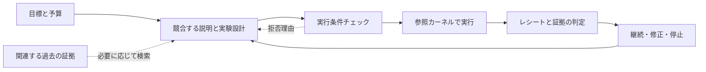

<div align="center">

<picture>
  <source media="(prefers-color-scheme: dark)" srcset=".github/assets/rds-hero-dark.svg">
  
</picture>

**Research Direction Selector · 研究方針の選択と実験監査**

次の実験に、明確な問い、公平な比較、そして意思決定につながる結果を。

[](https://github.com/kongtou20070406/RDS/actions/workflows/test.yml)


[](CONTRIBUTING.md)
[](https://github.com/kongtou20070406/RDS/stargazers)

[English](README.md) · [简体中文](README.zh-CN.md) · **日本語**

[クイックスタート](#クイックスタート) · [ワークフロー](#ワークフロー) · [過去の事例](#過去の事例と検証) · [コントリビュート](#コントリビュート) · [ドキュメント一覧](#ドキュメント一覧)

</div>

RDS は、実行可能なローカル参照カーネルを備えた、Codex 向けの研究支援スキルです。研究目標、競合する説明、過去の経験、プログラムによるチェックを結び付け、**現在の証拠と予算のもとで、次にどの実験を行うべきか**という問いに取り組みます。

研究者が目標と投入する資源を決め、モデルが候補となる方針を設計し、プログラムが実行上の制約を確認します。その結果をもとに次の一手を見直します。RDS は、評価指標の停滞、メカニズムのアブレーション、予算配分、中断した研究の再開に適しています。

> **2 つの使い方：**[SKILL.md](SKILL.md) を通じて実際の研究プロジェクトで協働する方法と、参照 CLI で制限されたスカラー実験を実行し、予算・データ利用・証拠判定のプロトコルを検証する方法があります。実際の GPU 学習は、研究プロジェクト自身の学習コードで実行します。

## 主な機能

| 機能 | 研究プロセスでの役割 |
| --- | --- |
| **意思決定につながる実験を選ぶ** | 因果的に異なる方針を比較し、競合する説明、両者を区別できる予測、肯定的・否定的な結果それぞれに対する次の一手を明確にします。 |
| **介入が実際に成立するかを確かめる** | 実際に実行される方程式とコードから、主張する変化を確認します。明示的なスカラー閾値命題には、条件付きの記号検証プローブを利用できます。 |
| **証拠の種類を分けて記録する** | タスク上の改善、メカニズムの判定、実行状態を独立して記録し、「実行が完了した」「スコアが上がった」という結果をそのままメカニズムの成立と解釈することを避けます。 |
| **予算とデータ利用を制約する** | SQLite トランザクションで参照実行の予算を予約し、データへのアクセスを記録します。プラン・コード・データ・検証器のバージョンを実行レシートに紐付けます。 |
| **既存の結果を再利用する** | 参照カーネルは、対照の AST とデータの SHA-256 をキーにスカラー対照の結果をキャッシュします。研究の再開時には、必要に応じて既存の Obelisk 履歴を検索します。 |
| **フィードバックを修正の手がかりにする** | Advisor が実行条件チェックのエラー、損失、ログについて診断を提供します。適用範囲を持つ判断ルールが、次の提案のレビューを支援します。 |

## ワークフロー



スキル層は、答えの定まっていない研究課題を比較プロトコルに落とし込みます。参照カーネルは、明確なプランを検査可能な実行記録に落とし込みます。実行条件チェックの通過は、対応するプログラム上の制約を満たしたことを意味します。科学的な結論には、問いに対応する証拠と解釈が引き続き必要です。

## クイックスタート

### 1. Codex で使う

リポジトリ全体を `research-direction-selector` という名前のスキルディレクトリに配置し、スクリプトと参考資料を保持します。以下の PowerShell コマンドで、個人用スキルディレクトリにインストールできます。

```powershell
New-Item -ItemType Directory -Path "$env:USERPROFILE/.agents/skills" -Force | Out-Null
git clone https://github.com/kongtou20070406/RDS.git "$env:USERPROFILE/.agents/skills/research-direction-selector"
```

研究プロジェクトの `.agents/skills/research-direction-selector/` に配置することもできます。スキルの配置場所と呼び出し方は、[OpenAI 公式スキルドキュメント](https://learn.chatgpt.com/docs/build-skills)を参照してください。

その後は、次のように課題をそのまま伝えます。

> RDS で次の一手を選んでください。目標は、同じ学習予算で現在のベースラインを上回ることです。残り時間は 48 時間です。まず完了済みの実験とコードを確認し、その後の方針を決められる比較を 1 つ推薦してください。どのような結果なら停止、または方針転換するかも説明してください。

RDS は、現在のファイルと会話から目標と制約を整理し、1 つの推奨方針と、最大 1 つの重要な代替案を提示します。必要な実験フォームはモデルが内部で構成するため、研究者は普段の言葉で目標、優先順位、予算を調整し続けられます。

### 2. ローカル参照サンプルを実行する

**Python 3.11+** が必要です。通常のスカラー実行は Python 標準ライブラリのみに依存し、GPU は不要です。実際に履歴を検索するには、Obelisk が別途インストールされている必要があります。

```powershell
git clone https://github.com/kongtou20070406/RDS.git
Set-Location RDS
python -B scripts/rds_cli.py --version
```

リポジトリのルートで、次のサンプルを実行します。毎回新しい一時ディレクトリにコピーすることで、契約と実行状態を互いに独立させます。

```powershell
$RdsDemo = Join-Path ([System.IO.Path]::GetTempPath()) ("rds-demo-" + [guid]::NewGuid().ToString("N"))
New-Item -ItemType Directory -Path $RdsDemo | Out-Null
Copy-Item -Path 'examples/reference-run/*.json', 'examples/reference-run/*.csv', 'examples/reference-run/*.py' -Destination $RdsDemo

python -B scripts/rds_cli.py --root $RdsDemo init --contract "$RdsDemo/contract.json"
python -B scripts/rds_cli.py --root $RdsDemo hypothesis add --spec "$RdsDemo/hypothesis.json"
python -B scripts/rds_cli.py --root $RdsDemo gate check --plan "$RdsDemo/plan.json"
python -B scripts/rds_cli.py --root $RdsDemo plan create --spec "$RdsDemo/plan.json"
$RdsRun = python -B scripts/rds_cli.py --root $RdsDemo run execute --id P1 | ConvertFrom-Json
python -B scripts/rds_cli.py --root $RdsDemo decide --run $RdsRun.run_id
python -B scripts/rds_cli.py --root $RdsDemo status
```

このサンプルでは、開発データ上の paired MSE（対応するサンプルでの平均二乗誤差）を用いて、`control(x) = x` と `treatment(x) = 2*x` を比較します。各ステップの期待される結果は次のとおりです。

| コマンド | 出力フィールド | 期待値 |
| --- | --- | --- |
| `run execute` | `run_status` | `SUCCEEDED` |
| `decide` | `assessment.task_gain` | `EXPLORATORY` |
| `decide` | `assessment.mechanism` | `UNTESTED` |

これは、参照実行が成功し、探索段階の改善の証拠が得られたことを示します。`init` は既存の状態を保持します。契約を変更する場合は、新しい `--root` を使用してください。すべてのプロジェクトコマンドで、`--root` はサブコマンドの前に置きます。

### 3. 条件付き記号検証を有効にする

代数的な閾値や収縮境界を明示的に宣言する場合は、オプションの依存パッケージをインストールします。

```powershell
python -m pip install -r requirements-formal.txt
```

通常の実験では、軽量な AST チェックと厳密な有理数計算を使用します。記号検証アダプターは現在、有界な実領域におけるスカラー閾値チェックに対応しています。依存パッケージの不足や未対応の命題は `UNKNOWN` となり、受け入れを拒否します。宣言の詳細は、[実行契約](references/l3-state-machine.md)を参照してください。

## Advisor：プログラムのフィードバックから次の提案へ

Advisor は、実行条件チェックの拒否理由、損失値、ログの要約、分岐の状態を修正の手がかりに変えます。上記の初期化を完了すると、方針に関する提案を取得したり、損失値を入力したりできます。

```powershell
python -B scripts/rds_cli.py --root $RdsDemo advise
python -B scripts/rds_cli.py --root $RdsDemo advise --train-loss 0.9 --val-loss 1.0 --baseline-loss 1.0
```

[ログ要約ツール](scripts/rds_compress.py)は、損失の傾向、スループット、勾配のピーク値、異常フラグを抽出し、`advise --telemetry` に渡せます。Advisor は、ローカル文書からキーワードに基づいて助言に関する記述を抜き出すことにも対応しています。

これらの診断は、固定閾値、文字列による分類、提案テンプレートを使用します。検証すべき手がかりとして扱い、元の曲線、コード、競合する説明を区別する実験と併せてレビューしてください。Advisor と、正式なスカラー閾値チェックを担う記号検証プローブは別のモジュールです。

## 研究の再開：Obelisk を再利用する

過去の決定、棄却済みの方針、実験設定が次の一手に影響し得るものの、現在のコンテキストにない場合、RDS はインストール済み Obelisk の公開 CLI を通じて関連する履歴を検索します。取得元の識別情報とページング情報を保持し、現在のファイルと現在の指示を優先します。

```powershell
python -B scripts/rds_cli.py history prepare --project-path 'C:\research\my-project' --terms 'C7' --output 'C:\queries\obq-c7-unique-token.mjs'
python -B scripts/rds_cli.py history query --query 'C:\queries\obq-c7-unique-token.mjs'
```

プレースホルダーのパスを実際の絶対パスに置き換え、検索ごとに新しいクエリファイル名を使用してください。ブリッジは、同一クエリ内で厳密な `project_path` を使って会話を特定し、証拠を取得します。履歴の結果は新たな権限を与えず、メモリへの自動書き込みも行いません。詳細は、[Obelisk bridge](references/obelisk.md)を参照してください。

## 過去の事例と検証

このリポジトリには、実際の研究協働で混同しやすい問題をレビュー可能な事例にまとめた、5 つの過去の意思決定パケットがあります。

| 事例 | 主な問い |
| --- | --- |
| July 8 · ベースラインの構築 | 限られた予算で、実行可能かつ公平な比較の基準をどう構築するか？ |
| Aug 2 · コンパイラーのアブレーション | 辞書とルーティングの要因をどう分離し、開発セットの少数サンプルでの改善を確認済みの結果と扱わずに済むか？ |
| Aug 30 · GoPro への転換 | 研究者の明確な方針転換をどう実行し、公式の学習レシピと比較コストを再確認するか？ |
| Sep 13 · C7 の境界 | 安全余裕を狭めることと、実際にメカニズムの境界を越えることをどう区別するか？ |
| Sep 14 · 48h の予算 | 既存の割り当てをどう取消・延期し、評価コストとテストセットの再利用をどう考慮するか？ |

オプションの依存パッケージをインストールした後、リポジトリのルートで実行します。

```powershell
python -B -m unittest discover -s tests -v
python -B benchmark/run.py
python -B benchmark/redteam/runner.py
```

単体テストはカーネルの動作を検証し、過去の事例のリプレイは意思決定パケットの整合性と関連する実行条件チェックを検証します。red-team runner は、あらかじめ用意したプロトコル攻撃のシナリオを検証します。[GitHub Actions](https://github.com/kongtou20070406/RDS/actions) は、Windows / Ubuntu、Python 3.11 / 3.13 で単体テストと過去の事例のリプレイを実行します。

過去の学習スコアは会話内の報告であり、自動リプレイは合成スカラー入力を使用します。これらの事例はスキル開発に使用済みです。回帰チェックの通過は自律研究の品質を証明せず、実際の GPU 実験や独立した前向き評価の代わりにもなりません。評価方法と情報隔離の取り決めは、[benchmark/README.md](benchmark/README.md)を参照してください。

## 現在の機能と限界

| 部分 | 現在の対応範囲 |
| --- | --- |
| 研究支援スキル | 目標契約、競合する説明、公平な比較、予算、人間の介入に関するプロトコル。 |
| 参照実行カーネル | 制限された `control(x)` / `treatment(x)` の有理式、paired MSE、予算台帳、データアクセス記録、実行レシート。1 回の割り当ては最大 60 秒。 |
| スカラー対照のキャッシュ | 同一プロジェクト内で、対照の AST とデータのバイト列のハッシュに基づいて結果を再利用。実際の確率的学習におけるシード、checkpoint、学習レシピの再利用は、プロジェクト側で実装する必要があります。 |
| 条件付き形式検証アダプター | 有界なスカラー代数閾値。現在、`dynamics` は `UNKNOWN` を返します。一般的な行列、ODE、ニューラルネットワークの性質には追加のアダプターが必要です。 |
| ルールと分岐のツール | 適用範囲と反証条件を持つルールのレビュー・検証・適用、および明示的な分岐。敵対的なチェックと自動修復は、引き続き実験的なモジュールです。 |

予算台帳が記録するのは、割り当てられた worker runtime です。セットアップ、検証、制御のオーバーヘッドは別途計上する必要があります。実際の長時間学習には、プロジェクトの学習コードとホストのスケジューラーを使用します。ハッシュとトランザクションは監査と整合性チェックに用います。ローカル書き込み権限を持つ人はプログラムや成果物を変更できるため、参照カーネルは OS のセキュリティサンドボックスや改ざん不可能性を保証しません。

<details>
<summary>実験的モジュールの実装上の制限</summary>

- `auto-repair` は依然として旧状態ファイルを読み取り、現在の SQLite 実行台帳には未接続です。
- alignment チェックはキーワードによるヒューリスティックを使用し、その計数を独立した実測による研究提案の正確さと解釈することはできません。
- `advise --plan` には、入れ子の SQLite 書き込みトランザクションによるロック競合のリスクがあります。プランの確認には `gate check` を直接使用してください。
- ルールファイルの適用は通常のファイル書き込みを使用し、トランザクションロックやアトミックな置換は行いません。

</details>

## ドキュメント一覧

| ドキュメント | 内容 |
| --- | --- |
| [SKILL.md](SKILL.md) | 研究協働、方針選択、証拠の解釈に関するプロトコル。 |
| [実行契約](references/l3-state-machine.md) | CLI コマンド、状態、データ利用、形式宣言、信頼境界。 |
| [判断ルール集](references/judgment-graph.yaml) | 適用範囲、競合する説明、反証条件を持つ意思決定ルール。 |
| [RSI の証拠に関する説明](references/rsi-evidence.md) | 研究プロセスの修正に用いる証拠とその範囲。 |
| [Obelisk bridge](references/obelisk.md) | 範囲を限定した履歴検索と元の証拠の読み取り。 |
| [参照サンプル](examples/reference-run/) | 実行可能な契約、仮説、プラン、スカラーデータ。 |
| [過去の事例の評価プロトコル](benchmark/README.md) | 意思決定パケット、回帰チェック、前向きな応答評価の方法。 |
| [カーネルのテスト](tests/test_rds_l3.py) | 実行、予算、データアクセス、形式検証の振り分け、レシートの回帰テスト。 |

## コントリビュート

初めてのコントリビュートは、ドキュメントの修正、翻訳の改善、最小再現サンプルの追加から始められます。**Fork → ブランチ → 検証 → PR** の一連の手順とチェックコマンドは、[CONTRIBUTING.md](CONTRIBUTING.md)を参照してください。

| 貢献したい内容 | 始め方 |
| --- | --- |
| ドキュメントと翻訳 | 3 言語の README のコマンド・機能・限界を同期し、リンクと表示を確認します。 |
| 因果判断ルール | 元の資料、適用範囲、競合する説明、それらを区別する実験、反証条件を提示します。 |
| カーネルと検証器 | 最小再現と関連する回帰テストを提出し、対応する型、定義域、`UNKNOWN` の動作を明記します。 |
| 新しい研究事例 | 公開可能な当時の情報、意思決定上の問い、評価プロトコルを提示し、後の結果を提案者への入力から分離します。 |

[問題の報告](https://github.com/kongtou20070406/RDS/issues/new/choose)または[PR の提出](https://github.com/kongtou20070406/RDS/compare)から参加できます。目標、証拠の意味、主要な実行インターフェースを変更する前には、issue で設計をすり合わせることを推奨します。否定的な結果と証拠の限界を保持し、`.rds/` の実行状態、認証情報、非公開の会話、公開できないデータをコミットしないでください。

## 関連エコシステムと設計上の参考

- [Obelisk](https://github.com/tommy0103/obelisk) は、既存の会話と元の証拠の履歴検索を提供します。RDS はその公開 CLI を再利用します。
- [Academic Research Skills](https://github.com/Imbad0202/academic-research-skills) は、研究から執筆、査読、修正までのワークフローを扱います。このリポジトリでは、その多言語ナビゲーションとコントリビュートの構成を参考にしています。両者はそれぞれ実験の意思決定と論文作業を支援できますが、現在、自動的に引き継ぐアダプターはありません。

ブランド画像と本リポジトリの文章は RDS オリジナルです。上記のリンクは依存関係と設計上の参考を示すものであり、各プロジェクトが RDS を支持していることを意味しません。
