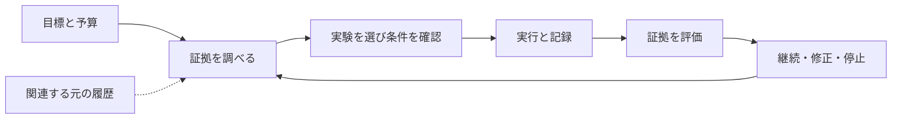

<div align="center">


# Research Direction Selector

**人とその AI のための研究支援**

研究の問い、既存の証拠、限られた予算から次の実験を選び、その結果を次の判断へつなげます。

[](https://github.com/kongtou20070406/research-direction-selector/actions/workflows/test.yml)

[](https://github.com/kongtou20070406/research-direction-selector/releases)
[](https://github.com/kongtou20070406/research-direction-selector/stargazers)

[English](README.md) · [简体中文](README.zh-CN.md) · **日本語**

[AI と使う](#ai-と使う) · [ローカルで実行](#ローカルで実行) · [五つの構成要素](#五つの構成要素) · [検証済みの動作](#検証済みの動作) · [ドキュメント](#ドキュメント)

</div>

Research Direction Selector（RDS）は、研究者とその AI が証拠を調べ、実験を設計し、実行を手配し、次の行動を判断するためのツールです。指標が停滞したとき、異なる説明が異なる介入を要求するとき、残りの予算が少ないとき、中断した研究を実際の結果から再開するときに使えます。

目標と制約を普段の言葉で伝えてください。RDS は、**次の実験がどの説明を区別できるか、比較を公平にする条件、総コスト、各結果が次の判断に与える影響**を整理します。証拠を実行と振り返りに結び付け、次の会話で作業を続けられるようにします。

現在のバージョンは **v5.6.0-rc.1** です。Agent Skill、ローカル CLI、操作状態を記録する SQLite 台帳を組み合わせ、人間が主導する研究フローと個別タスクの限定的な自動化を支援します。実装済みの動作と残る課題は[ロードマップ](docs/roadmap.md)で確認できます。

| 入口 | 用途 |
| --- | --- |
| **AI と協働** | [SKILL.md](SKILL.md)を通じて実際の研究課題を議論し、コードと証拠を調べ、次の実験を選びます。 |
| **ローカルツール** | CLI で元の記録を取り込み、Advisor 候補を確認し、固定したプロジェクトコマンドを実行し、コストと現在の状態を確認します。 |
| **研究者が確認** | 構造化された CLI 結果や[オフラインダッシュボード](docs/dashboard.md)を読みます。ダッシュボードは読み取り専用のスナップショットです。 |

## AI と使う

Skill をインストールしたら研究プロジェクトを開き、AI に次のように伝えます。

```text
このプロジェクトを Research Direction Selector（RDS）で進めてください。
まずコード、完了した実験、関連する過去の判断を確認してください。
目標は［研究の問い／主要指標］、使える予算は［予算］です。
競合する説明を区別できる次の実験を推薦してください。
対照、予想される観測、反証条件、総コスト、結果ごとの次の判断を示してください。
許可された作業を実行、証拠の検討、継続まで進めてください。
実行成功、課題の改善、機構の証拠を分けて記録してください。
観測済みの seed 不安定性が今回の判断に影響するときだけ、追加 seed を検討してください。
```

具体的な問題から始めることもできます。

- 「指標が改善しなくなりました。既存のログから学習の問題と容量の限界を区別してください。」
- 「この二つのアブレーションは複数の要素を変えています。説明を区別する最小の公平な比較を設計してください。」
- 「このプロジェクトを続けてください。新しい作業の前に、残りの予算と完了済みの実行を確認してください。」
- 「RDS を使って RDS を開発してください。関連テストを実行し、失敗を読み、次のルール変更を評価してください。」

研究者が方向、予算、科学的結果の受け入れを決めます。AI は必要な作業記録を構成し、研究者は普段の言葉で議論を続けられます。既存の証拠と有効な対照を優先します。追加 seed は、判断に影響する観測済みの不安定性から必要性を説明できる場合に検討します。

### Skill をインストール

ローカル端末を使えるコーディング Agent に、この設定指示を渡せます。

```text
https://github.com/kongtou20070406/research-direction-selector から
tag v5.6.0-rc.1 を research-direction-selector Agent Skill としてインストールしてください。
scripts、references、examples を含むリポジトリ全体を保持してください。
現在のプロジェクトの .agents/skills に配置し、CLI のバージョンを確認してください。
その後 SKILL.md を読み、私の実際の研究課題から協働を始めてください。
```

Windows で個人用に手動インストールする場合：

```powershell
New-Item -ItemType Directory -Path "$env:USERPROFILE/.agents/skills" -Force | Out-Null
git clone --branch v5.6.0-rc.1 https://github.com/kongtou20070406/research-direction-selector.git "$env:USERPROFILE/.agents/skills/research-direction-selector"
```

プロジェクト内の配置先は `.agents/skills/research-direction-selector/` です。Skill はスクリプトと参考資料を使用するため、ファイルの相対配置を保ってください。Skill の検出と呼び出し方はホストによります。他の助手も [SKILL.md](SKILL.md)を直接読めます。

## ローカルで実行

**Python 3.11+** が必要です。CPU プロジェクト例と通常のスカラー実行は標準ライブラリのみで動き、GPU は不要です。履歴検索には Obelisk を別途インストールします。適用できる記号検査には[オプション依存](requirements-formal.txt)があります。

```powershell
git clone --branch v5.6.0-rc.1 https://github.com/kongtou20070406/research-direction-selector.git
Set-Location research-direction-selector
python -B scripts/rds_cli.py --version
python -B scripts/rds_cli.py --help
```

以下のコマンドは RDS のチェックアウトから実行します。研究用ワークスペースを指定する `--root` はサブコマンドの前に置きます。

### 新しいワークスペースで実際の CPU 例を実行

この例は、記録済みの六行のデータに定数の対照と線形の処理を当てはめます。`prepare.py` が新しいディレクトリにコード、データ、評価器、プロトコル、実ファイルに結び付いた実行マニフェストを作成します。

```powershell
$RdsDemo = Join-Path ([System.IO.Path]::GetTempPath()) ("rds-project-" + [guid]::NewGuid().ToString("N"))
python -B examples/project-runner/prepare.py --root $RdsDemo
python -B scripts/rds_cli.py --root $RdsDemo project init --contract "$RdsDemo/contract.json"
python -B scripts/rds_cli.py --root $RdsDemo project create --manifest "$RdsDemo/control.json"
python -B scripts/rds_cli.py --root $RdsDemo project execute --id control
python -B scripts/rds_cli.py --root $RdsDemo project create --manifest "$RdsDemo/treatment.json"
python -B scripts/rds_cli.py --root $RdsDemo project execute --id treatment
python -B scripts/rds_cli.py --root $RdsDemo project costs
python -B scripts/rds_cli.py --root $RdsDemo project status
```

成功したレシートの `run_status` は `SUCCEEDED` で、元の stdout、stderr、指標、成果物の識別情報を保持します。`task_gain` と `mechanism` は `UNKNOWN` のままです。これは実測したデモ出力であり、科学的受け入れには別の評価が必要です。wall time は実測し、未測定の CPU／GPU／API 資源は不明のまま、推定の課金を分けて記録します。

契約は、正確な argv、入力、出力先、資源の予約、タイムアウトを制限します。非ゼロ終了、必要な出力の欠落、評価器やプロトコルの変更は成功になりません。復旧は既存の試行を照合し、重複起動しません。許可されたプロジェクトコードを信頼する仕組みであり、OS のセキュリティサンドボックスではありません。

Windows で、許可済みのコマンドを会話終了後も継続する場合は `project execute --id <id> --background` を使えます。一意の RDS Task Scheduler タスクを登録し、非表示 worker で実行して TaskID を記録します。ローカルでの登録・開始権限が必要です。実際の受け入れ確認では通常権限の失敗後、昇格した登録が成功しました。他のプラットフォームは現在、前景実行に対応しています。[プロジェクト例](examples/project-runner/)と[実行ガイド](docs/development-loop.md#execute-a-locked-project-command--m04)を参照してください。

以前の限定スカラー例は [examples/reference-run/](examples/reference-run/)に残しています。[ワークフロー](docs/research-workflow.md#one-experiment-in-the-reference-cli)に期待する出力と証拠フィールドがあります。

## 五つの構成要素

同じ研究フロー内のソフトウェアの責務です。

| 構成要素 | 役割 | 入口 |
| --- | --- | --- |
| **1 · Skill** | 研究者と目標を整理し、競合仮説、公平な比較、証拠の解釈を扱います。 | [AI と使う](#ai-と使う) |
| **2 · 実行・受け入れカーネル** | 実行条件を検査し、資源を予約し、対応コマンドを実行して確認可能なレシートを集めます。 | [ローカルで実行](#ローカルで実行) |
| **3 · 研究状態と記憶** | 目標、プロトコル、結果、予算、失敗を保持し、Obelisk で関連する元の履歴を取得します。 | [研究を再開](#研究を再開) |
| **4 · Advisor** | 観測と適用範囲を持つルールから、診断、証拠要求、有限の実験候補を生成します。 | [Advisor](#advisor) |
| **5 · RSI** | RDS 自身のルールや方針の変更を提案し、リプレイ、採用、ロールバックを行います。 | [RDS で RDS を開発](#rds-で-rds-を開発) |

最初の三つが基本的な研究プロセスを支え、Advisor と RSI が拡張します。操作台帳は研究状態を保持し、Obelisk は会話履歴を検索します。複数の責務が実装を共有する場合もあります。[構成要素ガイド](docs/rds-purpose.md)に境界を示しています。



## Advisor

Advisor は観測を読み、未確定の内容を示します。適用範囲を持つルールを検索し、対照、競合する説明、測定、停止条件、結果に応じた判断を含む有限の実験テンプレートを組み合わせます。欠けた証拠は要求となり、未知のコストは未知のままです。候補の assurance は `HEURISTIC_ONLY` で、実際の研究状況に照らして検討します。

付属の有限テンプレート例を試せます。

```powershell
python -B scripts/rds_cli.py advise --research-context examples/experiment-templates/context.json --templates examples/experiment-templates/templates.json
```

自分の記録には、元の設定、指標、ログ、レシートを指定する成果物マニフェストを用意します。

```text
python -B scripts/rds_cli.py --root <project> artifacts import --manifest <manifest.json>
python -B scripts/rds_cli.py --root <project> advise --artifacts <manifest.json> --templates <templates.json>
```

取り込みはフィールドの位置、実行とプロトコルの結び付き、欠落、矛盾を保持します。`DECLARED`、`OBSERVED`、`DERIVED`、`UNKNOWN` は事実がレポートに入った方法を示します。ログの値を読むことは機構の証明ではありません。一組の train/validation loss だけでは適合状態を診断できません。取り込んだ文書抜粋は、Advisor の独立 WAL ストアで `UNREVIEWED` のままです。

参照台帳からオフライン HTML を出力できます。

```powershell
python -B scripts/rds_dashboard.py --root <reference-project> --output dist/dashboard.html
```

[記録の取り込みと組み合わせ](docs/development-loop.md)、[Advisor 設計](docs/advisor-graph-design.md)、[証拠](docs/advisor-evidence.md)、[ダッシュボードの範囲](docs/dashboard.md)を参照してください。

## 研究を再開

既存の操作台帳に判断の境界を保存し、再開時に現在の状態と比較します。

```powershell
python -B scripts/rds_cli.py --root $RdsDemo checkpoint save --id after-fit
python -B scripts/rds_cli.py --root $RdsDemo checkpoint restore --id after-fit
python -B scripts/rds_cli.py --root $RdsDemo project recover --id treatment
```

保存時の `--decision <decision.json>` で、研究の問いと未取得の証拠を保持できます。復元は現在の予算、データアクセス、実行を返し、その後の更新や矛盾を報告して現在の入力を確認します。台帳を置き換えず、完了した作業を繰り返しません。通常の状態表示はプロジェクト全体を再 hash しません。

関連する過去の判断や棄却済みの方針が現在のコンテキストにない場合、インストール済みの [Obelisk](https://github.com/tommy0103/obelisk) CLI で、正確なプロジェクト範囲の元の履歴を検索できます。

```text
python -B scripts/rds_cli.py history prepare --project-path <absolute-project-path> --terms baseline --output <unique-absolute-query.mjs>
python -B scripts/rds_cli.py history query --query <unique-absolute-query.mjs>
```

実際の絶対パスと毎回新しいクエリファイル名を使います。取得は出典の識別情報とページングを保持し、現在のファイルと指示を優先します。新たな権限を与えず、記憶を自動作成しません。[現在の状態からの継続](docs/development-loop.md#resume-the-live-research-decision--m06)と [Obelisk bridge](references/obelisk.md)を参照してください。

## RDS で RDS を開発

RDS 開発は自身のツールで実際のテストを実行し、元の出力を取り込み、Advisor の提案を調べ、ルール変更を評価します。新しい空のワークスペースで隔離した開発ループを再現できます。

```text
python -B examples/self-development/run.py --workspace <new-empty-workspace>
```

例は CLI 出力、元のテストログ、コスト、プロセスレシート、checkpoint を保持します。さらに、宣言した開発／留保ケースに対して隔離したルール変更をリプレイし、適格な結果を採用してロールバックを試します。元のリポジトリの判断グラフは保持されます。提案、リプレイ、採用は別々で、`--force` は証拠を省略しません。

これは RSI の最初の人間主導のソフトウェアフィードバックループです。有限ケースの合格は、検査したソフトウェア動作を示します。研究方針の改善には、未使用の独立ケースで、失敗や負の結果を含む同じ総予算で研究軌跡全体を前向きに比較する必要があります。その科学的改善は未測定です。[開発ループ](docs/development-loop.md)と [RSI の証拠境界](references/rsi-evidence.md)を参照してください。

## 検証済みの動作

**2026-09-30** の今回の全テストと、実際の実行器による二回目の開発ループの結果です。

| 検査 | 記録された結果 | 証拠の範囲 |
| --- | --- | --- |
| [全回帰テスト](tests/) | **269 合格、4 スキップ、計 273**、45.880 秒 | 構成要素と統合の動作。ネイティブ Lean 2 件は未設定、PyTorch 2 件は依存パッケージなし。 |
| [RDS が自身の開発テストを実行](examples/self-development/run.py) | **65/65 合格**、スキップなし | 実プロジェクトレシートは `SUCCEEDED`、元の記録は `IMPORTED`、Advisor が次の変更を検討。 |
| 有限 RSI 開発例 | **基準 1/4 → 候補 4/4**、宣言した留保ケースで **2 改善、0 回帰** | 隔離したグラフを `APPLIED` 後 `ROLLED_BACK`。作者が宣言したケース分割であり、独立した研究方針スコアではありません。 |

一回目の 49 ケースの選択では 2 件の失敗が見つかりました。fixture と誤った assertion を修正した後、更新した 65 ケースが合格しました。これは実際の開発フィードバックの記録であり、研究品質の向上を示すものではありません。

以下の回帰と構成要素の検査も今回再実行しました。

| 検査 | 記録結果 | 検査対象 |
| --- | --- | --- |
| [過去の事例リプレイ](benchmark/README.md) | **6/6 合格** | 決定パケットと関連ゲート。実行入力は合成スカラー。 |
| [合成対抗シナリオ](benchmark/redteam/) | **4/4 合格** | あらかじめ定義した四つのプロトコル攻撃。 |
| [公開タスクから改編した構成要素テスト](docs/advisor-benchmark.md) | **8/8 ケース、28/28 検査合格** | 改編したメタデータ fixture の契約、証拠欠落、依存関係、コスト、予算、出典識別。 |

構成要素テストは ScienceAgentBench と CORE-Bench のメタデータおよび手動で改編したルールを使いました。記録された **98.8786 ms** は八つのローカル fixture の処理と結果組み立ての時間です。[入力](benchmark/advisor-public/source-facts.json)と[各検査の結果](benchmark/advisor-public/results.json)を公開しています。科学タスクそのものは実行していません。欠けた証拠を要求し、条件変更で候補の適格性を変え、未知のコストをゼロにしない動作を検査しています。

端から端までの科学タスクスコア、研究品質の向上、独立 RSI 軌跡の改善は**未測定**です。Skill 間の比較は保留中です。[benchmark の検討記録](docs/benchmark-plan.md)は候補タスクを保持していますが、比較実験を予定していません。

## 対応範囲と自律性の目標

短期の製品目標は、**研究の六段階すべてに L2 支援を提供すること**です。目標の整理 → 証拠の調査 → 実験の選択 → 実行 → 評価 → 振り返りと継続を支援します。各段階を実用的に自動化し、研究者は方向、重要な判断、科学的結果の受け入れを担います。これはカバレッジの目標です。

RDS は Kramer らが 2026 年に正式発表した科学発見の自動化フレームワークを採用し、元の **L0–L5** 番号を保持します。L1 は研究の一側面を支援、L2 は重要な発見要素一つを完全自動化、L3 は限定領域の発見サイクル全体を自動化、L4 は複数領域で発見を行い限定的に目標を自律設定します。長期の研究方向は元の **L4 と L5** で、納期の約束ではありません。[出典と解釈の限界](docs/research-autonomy.md)および[ロードマップ](docs/roadmap.md)を参照してください。

現在の RDS は、参照計算と明示的に結び付いた候補探索で**限定的な L2 機能**を持ち、人間向けの協働手順を提供します。完全な科学的 L3／L4 ループや端から端までの GPU 研究サービスは実証していません。既存の `L3` 実行器識別子は歴史的な実装名です。自律性、科学的品質、安全認証、RSI による方針改善は別の軸です。

プロジェクト実行器には実 CPU での受け入れ証拠があります。GPU 研究プロジェクトには、そのプロジェクトの学習器、観測手段、科学的評価器が必要です。コストは資源の単位を保ち、wall time を CPU time と見なしません。対照の再利用は対応する完全なプロトコルと成果物の識別を確認します。`run_status`、`task_gain`、`mechanism` は分けて記録します。

### 数学的部分問題

Lean4/mathlib との協働は、研究フロー内の適切な数学的問題を対象とします。RDS は対応する閉じた有理数の義務に Lean カーネルを再利用し、限定スカラー、アフィン、box ネットワーク、具体的テンソルの検査には独立して確認した Python 証明書を提供します。数学的妥当性と実際の科学モデルへの対応には、それぞれの証拠が必要です。一般 mathlib 変換、任意のネットワーク、一般 ODE は実装範囲外です。

[検証ガイド](docs/formal-verification.md)、[Lean 接続ガイド](docs/lean-integration.md)、[23 個のルール義務](docs/rule-obligations.md)に型、仮定、`UNKNOWN` の動作を記載しています。

## ドキュメント

| ガイド | 内容 |
| --- | --- |
| [ドキュメント索引](docs/README.md) | 英中ナビゲーションと実装範囲。 |
| [SKILL.md](SKILL.md) | 研究協働と方向選択。 |
| [開発ループ](docs/development-loop.md) | 元の記録、有限の組み合わせ、コスト、プロジェクト実行、RSI、継続。 |
| [研究ワークフロー](docs/research-workflow.md) | 証拠の軸と限定参照例。 |
| [五つの構成要素](docs/rds-purpose.md) · [自律性](docs/research-autonomy.md) · [ロードマップ](docs/roadmap.md) | 責務、採用したレベル、受け入れ条件。 |
| [参照実行契約](references/l3-state-machine.md) | 既存スカラー CLI の状態とデータ使用制約。 |
| [Advisor 設計](docs/advisor-graph-design.md) · [判断グラフ](references/judgment-graph.yaml) | 適用範囲を持つルール、依存関係、候補の動作。 |
| [Benchmark プロトコル](benchmark/README.md) | 過去のケース、情報分離、評価の限界。 |

## コントリビュート

文書、翻訳、適用範囲を持つ研究ルール、最小の再現例を歓迎します。[CONTRIBUTING.md](CONTRIBUTING.md)を読み、**fork → ブランチ → 検査 → PR** で参加してください。ルールには出典、適用範囲、競合する説明、判別実験、反証条件を含めます。負の結果と証拠の限界を保持してください。

[問題を報告](https://github.com/kongtou20070406/research-direction-selector/issues/new/choose)するか、[PR を提出](https://github.com/kongtou20070406/research-direction-selector/compare)できます。私的な会話、認証情報、未公開データ、`.rds/` の操作状態はコミットしないでください。

## 関連プロジェクト

- [Obelisk](https://github.com/tommy0103/obelisk) は RDS が再利用する公開の履歴 CLI を提供します。用途、Agent／人向けの入口、セットアップを直接説明する構成が、この README の参考です。
- [Academic Research Skills](https://github.com/Imbad0202/academic-research-skills) は研究から執筆、査読、修正までを扱います。多言語ナビゲーションと貢献の構成を以前の文書で参考にしました。自動的な引き継ぎアダプターはありません。

RDS の文章とブランド素材は独自のものです。リンクは依存関係や設計上の参考を示し、他のプロジェクトによる支持を意味しません。
