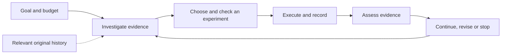

<div align="center">


# Research Direction Selector

**Research assistance for people and their AI**

Turn a research question, existing evidence and a limited budget into a useful next experiment — then keep the result available for the next decision.

[](https://github.com/kongtou20070406/research-direction-selector/actions/workflows/test.yml)

[](https://github.com/kongtou20070406/research-direction-selector/releases)
[](https://github.com/kongtou20070406/research-direction-selector/stargazers)

**English** · [简体中文](README.zh-CN.md) · [日本語](README.ja-JP.md)

[Use with your AI](#use-with-your-ai) · [Run locally](#run-locally) · [Five components](#five-components) · [Verified behavior](#verified-behavior) · [Docs](#documentation)

</div>

Research Direction Selector (RDS) helps a researcher and their AI investigate evidence, design experiments, arrange execution and decide what follows. Use it when the metric has plateaued, two explanations suggest different interventions, the remaining budget is small, or an interrupted project needs to resume from its actual results.

You describe the goal and constraints in ordinary language. RDS helps identify **what the next experiment can distinguish, how to make the comparison fair, its full cost, and what each possible outcome changes**. It carries the evidence through execution and review so the next conversation can continue the work.

This checkout is **v5.6.0-rc.1**. The current implementation combines an agent Skill, local command-line tools and operational SQLite ledgers. It supports a human-directed research workflow, with scoped automation of individual tasks. See the [roadmap](docs/roadmap.md) for implemented behavior and remaining work.

| Entry | Use it for |
| --- | --- |
| **With your AI** | Discuss a real research question, review code and evidence, and choose the next experiment through [SKILL.md](SKILL.md). |
| **Local tools** | Import original records, inspect Advisor candidates, run a locked project command, account for costs and resume current state through the CLI. |
| **For the researcher** | Read structured CLI results or an [offline dashboard](docs/dashboard.md); the dashboard is a read-only snapshot. |

## Use with your AI

After installing the Skill, open your research project and give your AI an instruction such as:

```text
Use Research Direction Selector (RDS) on this project.
First inspect the code, completed experiments and relevant past decisions.
My goal is [research question / primary metric]; my available budget is [budget].
Recommend the next experiment that can distinguish competing explanations.
State the control, expected observations, falsifier, full cost and next decision.
Carry the authorized work through execution, evidence review and continuation.
Keep execution success, task gain and mechanism evidence separate.
Consider extra seeds only when observed instability affects this decision.
```

You can also start with a concrete problem:

- “The metric has stopped improving. Use the existing logs to distinguish a training problem from a capacity limit.”
- “These two ablations changed several things. Design the smallest fair comparison that separates their explanations.”
- “Continue this project. Check the remaining budget and completed runs before proposing more work.”
- “Use RDS to develop RDS: run the relevant tests, read the failures and evaluate the next rule change.”

The researcher sets the direction, budget and acceptance of scientific results. The AI constructs the necessary working records; you can keep discussing the project in ordinary language. Existing evidence and valid controls come first. Additional seeds need observed instability that matters to the decision, rather than being a routine expense.

### Install the Skill

Give a coding agent with local shell access this setup instruction:

```text
Install Research Direction Selector from
https://github.com/kongtou20070406/research-direction-selector
at tag v5.6.0-rc.1 as the research-direction-selector agent Skill.
Keep the whole repository, including scripts, references and examples.
Use this project's .agents/skills directory and verify the CLI version.
Then read SKILL.md and help me start from my actual research question.
```

For a manual personal installation on Windows:

```powershell
New-Item -ItemType Directory -Path "$env:USERPROFILE/.agents/skills" -Force | Out-Null
git clone --branch v5.6.0-rc.1 https://github.com/kongtou20070406/research-direction-selector.git "$env:USERPROFILE/.agents/skills/research-direction-selector"
```

A project-local checkout belongs at `.agents/skills/research-direction-selector/`. Keep the repository files together: the Skill uses its scripts and references. Skill discovery and invocation depend on the host; [SKILL.md](SKILL.md) is also readable directly by another assistant.

## Run locally

Use **Python 3.11+**. The CPU project example and ordinary scalar runner use the standard library and require no GPU. Obelisk history retrieval needs a separate Obelisk installation; supported symbolic checks have [optional dependencies](requirements-formal.txt).

```powershell
git clone --branch v5.6.0-rc.1 https://github.com/kongtou20070406/research-direction-selector.git
Set-Location research-direction-selector
python -B scripts/rds_cli.py --version
python -B scripts/rds_cli.py --help
```

Run the following commands from the RDS checkout. Put `--root` before the subcommand; it selects the research workspace.

### A real CPU project in a fresh workspace

This example fits a constant control and a linear treatment to a recorded six-row dataset. `prepare.py` creates the code, data, evaluator, protocol and file-bound manifests in a new directory.

```powershell
$RdsDemo = Join-Path ([System.IO.Path]::GetTempPath()) ("rds-project-" + [guid]::NewGuid().ToString("N"))
python -B examples/project-runner/prepare.py --root $RdsDemo
python -B scripts/rds_cli.py --root $RdsDemo project init --contract "$RdsDemo/contract.json"
python -B scripts/rds_cli.py --root $RdsDemo project create --manifest "$RdsDemo/control.json"
python -B scripts/rds_cli.py --root $RdsDemo project execute --id control
python -B scripts/rds_cli.py --root $RdsDemo project create --manifest "$RdsDemo/treatment.json"
python -B scripts/rds_cli.py --root $RdsDemo project execute --id treatment
python -B scripts/rds_cli.py --root $RdsDemo project costs
python -B scripts/rds_cli.py --root $RdsDemo project status
```

A successful receipt has `run_status: SUCCEEDED` and retains raw stdout, stderr, metrics and artifact identities. `task_gain` and `mechanism` remain `UNKNOWN`: this is measured demonstration output, and scientific acceptance requires a separate assessment. Wall time is measured; unmeasured CPU/GPU/API resources remain unknown and separately charged estimates.

The contract bounds exact argv commands, inputs, output paths, resource reservations and timeouts. A nonzero exit, missing output or changed evaluator/protocol prevents successful completion. Recovery reconciles an existing attempt without starting it again. Approved project code is trusted; the runner is not an OS security sandbox.

On Windows, an authorized command that must continue after the conversation can use `project execute --id <id> --background`. This registers one RDS-owned Task Scheduler task with a hidden worker and records its TaskID. Local permission to register and start tasks is required; the actual acceptance run used elevated registration after an ordinary-permission failure. Other platforms currently support foreground execution. See the [project example](examples/project-runner/) and [execution guide](docs/development-loop.md#execute-a-locked-project-command--m04).

The earlier restricted scalar example remains available at [examples/reference-run/](examples/reference-run/), with its [workflow and expected evidence fields](docs/research-workflow.md#one-experiment-in-the-reference-cli).

## Five components

These are software responsibilities within one research workflow:

| Component | What it does | Entry |
| --- | --- | --- |
| **1 · Skill** | Clarify the goal, frame competing hypotheses, choose fair comparisons and interpret evidence with the researcher. | [Use with your AI](#use-with-your-ai) |
| **2 · Execution and acceptance kernel** | Check execution constraints, reserve resources, run supported commands and collect inspectable receipts. | [Run locally](#run-locally) |
| **3 · Research state and memory** | Preserve goals, protocols, results, budgets and failures; retrieve relevant original history through Obelisk. | [Resume research](#resume-research) |
| **4 · Advisor** | Turn observations and scoped rules into diagnostics, evidence requests and finite experiment candidates. | [Advisor](#advisor) |
| **5 · RSI** | Propose, replay, adopt and roll back changes to RDS's own rules and policies. | [Develop RDS with RDS](#develop-rds-with-rds) |

The first three support the basic research process; Advisor and RSI extend it. Operational ledgers preserve research state, while Obelisk retrieves conversation history. These functions can share an implementation. [The component guide](docs/rds-purpose.md) explains their boundaries.



## Advisor

Advisor reads observations and states what remains uncertain. It can retrieve scoped rules and compose finite experiment templates with controls, rival explanations, measurements, stopping conditions and result-dependent decisions. Missing evidence becomes a request; unknown cost stays unknown. Candidates have `HEURISTIC_ONLY` assurance and require review in their actual research context.

Try the included finite template example:

```powershell
python -B scripts/rds_cli.py advise --research-context examples/experiment-templates/context.json --templates examples/experiment-templates/templates.json
```

For your own records, provide an artifact manifest that names the original configuration, metrics, logs and receipts:

```text
python -B scripts/rds_cli.py --root <project> artifacts import --manifest <manifest.json>
python -B scripts/rds_cli.py --root <project> advise --artifacts <manifest.json> --templates <templates.json>
```

The importer retains field locations, run/protocol bindings, missing items and conflicts. `DECLARED`, `OBSERVED`, `DERIVED` and `UNKNOWN` describe how a fact entered the report; reading a value from a log does not prove its mechanism. A single train/validation loss pair remains insufficient for a fit diagnosis. Imported document excerpts remain `UNREVIEWED` in the Advisor's independent WAL store.

For a reference-ledger snapshot, the dashboard exports offline HTML:

```powershell
python -B scripts/rds_dashboard.py --root <reference-project> --output dist/dashboard.html
```

See [record import and composition](docs/development-loop.md), [Advisor design](docs/advisor-graph-design.md), [evidence](docs/advisor-evidence.md) and [dashboard scope](docs/dashboard.md).

## Resume research

Save the decision boundary in the existing operational ledger, then compare it with live state when continuing:

```powershell
python -B scripts/rds_cli.py --root $RdsDemo checkpoint save --id after-fit
python -B scripts/rds_cli.py --root $RdsDemo checkpoint restore --id after-fit
python -B scripts/rds_cli.py --root $RdsDemo project recover --id treatment
```

Use `--decision <decision.json>` when saving to retain the research question and pending evidence. Restore returns current budgets, data exposures and runs, reports forward updates or conflicts, and checks current input bindings. It does not replace the ledger or repeat completed work. Ordinary status reads do not hash the whole project.

When relevant earlier decisions or rejected approaches are missing from the current context, the installed [Obelisk](https://github.com/tommy0103/obelisk) CLI can retrieve original history in the exact project scope:

```text
python -B scripts/rds_cli.py history prepare --project-path <absolute-project-path> --terms baseline --output <unique-absolute-query.mjs>
python -B scripts/rds_cli.py history query --query <unique-absolute-query.mjs>
```

Use real absolute paths and a new query filename for each request. Retrieval retains source identity and paging, respects current files and instructions, grants no new authority and does not automatically write memories. See [live-state continuation](docs/development-loop.md#resume-the-live-research-decision--m06) and the [Obelisk bridge](references/obelisk.md).

## Develop RDS with RDS

RDS development uses its own tools to execute real tests, import their original output, inspect Advisor suggestions and evaluate a rule revision. Reproduce the isolated development loop in a new empty workspace:

```text
python -B examples/self-development/run.py --workspace <new-empty-workspace>
```

The example retains CLI output, raw test logs, costs, a process receipt and a checkpoint. It also replays an isolated rule change against declared development/held-out cases, adopts an eligible result, and exercises rollback. The original repository graph is preserved. Proposal, replay and adoption remain separate; `--force` does not bypass evidence.

This is the RSI component's first human-directed software feedback loop. Passing finite rule cases establishes the checked software behavior. A claim that a research policy improved needs prospective whole-trajectory comparisons on unused independent cases at equal total budgets, including failed work and negative results. That scientific improvement remains unmeasured. See the [development loop](docs/development-loop.md) and [RSI evidence boundary](references/rsi-evidence.md).

## Verified behavior

The latest full suite and second real executor iteration on **2026-09-30** produced:

| Check | Recorded result | Evidence scope |
| --- | --- | --- |
| [Full regression suite](tests/) | **269 passed; 4 skipped; 273 total**, 45.880 s | Component and integration behavior. Two native Lean checks lacked configuration; two PyTorch checks lacked the dependency. |
| [RDS executes its development tests](examples/self-development/run.py) | **65/65 passed**, no skips | Actual project receipt `SUCCEEDED`; original records imported as `IMPORTED`; Advisor inspected the next change. |
| Finite RSI development example | **Baseline 1/4 → candidate 4/4**; declared held-out cases: **2 improvements, 0 regressions** | Isolated graph `APPLIED` then `ROLLED_BACK`; author-declared case partitions, not an independent scientific-policy score. |

The first development iteration exposed two failures in a 49-case selection. Fixing the fixture and an incorrect assertion preceded the updated 65-case passing run. This records an actual development feedback cycle; it does not imply research quality gains.

The remaining regression and component checks were also rerun for this release:

| Check | Recorded result | What it checked |
| --- | --- | --- |
| [Historical replay](benchmark/README.md) | **6/6 passed** | Recorded decision packets and associated gates, with synthetic scalar execution inputs. |
| [Synthetic adversarial scenarios](benchmark/redteam/) | **4/4 passed** | Four predefined protocol attacks. |
| [Public-task-adapted component challenge](docs/advisor-benchmark.md) | **8/8 cases; 28/28 checks passed** | Contracts, evidence gaps, dependencies, costs, budgets and source identity in adapted metadata fixtures. |

The component challenge used ScienceAgentBench and CORE-Bench metadata with manually adapted rules. Its recorded **98.8786 ms** covers processing eight local fixtures and assembling results. [Inputs](benchmark/advisor-public/source-facts.json) and [per-check results](benchmark/advisor-public/results.json) are available. It did not execute the scientific tasks. These checks show concrete behavior: missing evidence produces a request, changed requirements change eligible candidates, and unknown cost is preserved rather than treated as zero.

End-to-end scientific task scores, scientific research-quality gains and independent RSI trajectory gains remain **unmeasured**. Cross-skill comparisons are deferred; [benchmark notes](docs/benchmark-plan.md) retain candidate tasks without scheduling a comparison.

## Scope and autonomy goals

The near-term product goal is **L2 support across all six research stages**: clarify the goal → investigate evidence → select experiments → execute → assess → reflect and continue. Each stage should provide useful automation while the researcher retains research direction, key judgments and acceptance of scientific results. This is a coverage goal.

RDS adopts Kramer et al.'s scientific-discovery automation framework, published in 2026, with the original **L0–L5** numbering. L1 assists an aspect of research; L2 fully automates one significant discovery component; L3 automates the whole discovery cycle in a limited domain; L4 extends discovery across multiple domains with limited autonomous goal setting. The long-term research directions are the original **L4 and L5**, rather than delivery-date promises. See the [source and interpretation limits](docs/research-autonomy.md) and [roadmap](docs/roadmap.md).

Current RDS has **scoped L2 functionality** in reference computation and bound candidate search, plus a human-facing collaboration protocol. A complete scientific L3/L4 loop or end-to-end GPU research service has not been demonstrated. Existing `L3` runner identifiers are historical engineering names. Autonomy is separate from scientific quality, safety certification and RSI policy improvement.

The project runner has real CPU acceptance evidence. A GPU research project still needs its own trainer, instrumentation and scientific evaluator. Costs preserve resource units; wall time is not CPU time. Control reuse checks the complete supported protocol and artifact identity. Evidence axes keep `run_status`, `task_gain` and `mechanism` separate.

### Mathematical subproblems

Lean4/mathlib cooperation is part of the research workflow for suitable mathematical questions. RDS reuses the Lean kernel for supported closed rational obligations and has independently checked Python certificates for narrow scalar, affine, box-network and concrete-tensor checks. Mathematical validity and correspondence to the actual scientific model require their own evidence. General mathlib translation, arbitrary networks and general ODEs remain outside the implemented scope.

The [verification guide](docs/formal-verification.md), [Lean integration guide](docs/lean-integration.md) and [23 rule-obligation definitions](docs/rule-obligations.md) hold the detailed types, assumptions and `UNKNOWN` behavior.

## Documentation

| Guide | Start here for |
| --- | --- |
| [Documentation index](docs/README.md) | English/Chinese navigation and implementation scope. |
| [SKILL.md](SKILL.md) | Research collaboration and direction selection. |
| [Development loop](docs/development-loop.md) | Original records, finite composition, costs, project execution, RSI and continuation. |
| [Research workflow](docs/research-workflow.md) | Evidence axes and the restricted reference example. |
| [Five components](docs/rds-purpose.md) · [Autonomy](docs/research-autonomy.md) · [Roadmap](docs/roadmap.md) | Responsibilities, adopted levels and acceptance gates. |
| [Reference execution contract](references/l3-state-machine.md) | Existing scalar CLI states and data-use constraints. |
| [Advisor design](docs/advisor-graph-design.md) · [Judgment graph](references/judgment-graph.yaml) | Scoped rules, dependencies and candidate behavior. |
| [Benchmark protocol](benchmark/README.md) | Historical cases, information separation and evaluation limits. |

## Contribute

Documentation, translations, scoped research rules and minimal reproducible cases are welcome. Start with [CONTRIBUTING.md](CONTRIBUTING.md), then **fork → branch → check → PR**. For a rule, include its source, applicable scope, rival explanations, discriminating experiment and falsifier. Preserve negative results and the limits of the evidence.

[Report an issue](https://github.com/kongtou20070406/research-direction-selector/issues/new/choose) or [open a PR](https://github.com/kongtou20070406/research-direction-selector/compare). Keep private conversations, credentials, unpublished data and `.rds/` operational state out of commits.

## Related projects

- [Obelisk](https://github.com/tommy0103/obelisk) provides the public history CLI reused by RDS. Its direct explanation of purpose, agent/human entry points and setup informed this README's organization.
- [Academic Research Skills](https://github.com/Imbad0202/academic-research-skills) covers research-to-writing, review and revision. Its language navigation and contribution structure informed earlier documentation. An automatic handoff adapter is not included.

RDS text and brand assets are original. These links describe dependencies and design references, without implying endorsement.
