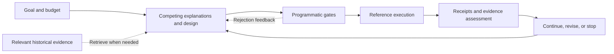

<div align="center">

<picture>
  <source media="(prefers-color-scheme: dark)" srcset=".github/assets/rds-hero-dark.svg">
  
</picture>

# Research Direction Selector

**Research assistance for people and their AI**

Give every experiment a clear question, a fair control, and a result that changes the next decision.

[](https://github.com/kongtou20070406/RDS/actions/workflows/test.yml)


[](CONTRIBUTING.md)
[](https://github.com/kongtou20070406/RDS/stargazers)

**English** · [简体中文](README.zh-CN.md) · [日本語](README.ja-JP.md)

[Results](#measured-results-and-concrete-strengths) · [Our goal](#our-goal) · [L1–L4](#l1l4) · [Quick start](#quick-start) · [Contribute](#contribute)

</div>

> This checkout is **v5.5.0-rc.2**, a pre-release from `main` for researchers and their AI. [Download the release](https://github.com/kongtou20070406/RDS/releases/tag/v5.5.0-rc.2). The five components below anchor the project; [the roadmap](docs/roadmap.md) separates implemented behavior from future validation.

Research Direction Selector (RDS) is a research collaboration skill for Codex with an executable local reference kernel. It connects research goals, competing explanations, past evidence, and programmatic checks to answer: **given the evidence and budget, which experiment is worth doing next?**

The researcher sets the goal and resources, the model designs candidate routes, the program checks execution constraints, and the results inform the next step. Use it for metric plateaus, mechanism ablations, budget allocation, and resuming interrupted research.

> **Two ways to use RDS:** work on a real research project through [SKILL.md](SKILL.md), or run restricted scalar experiments through the reference CLI to inspect budget, data-use, and evidence protocols. Real GPU training stays with your project's trainer.

## Measured results and concrete strengths

The 2026-09-30 release checks produced these results:

| Check | Actual result | What it checks |
| --- | --- | --- |
| [Regression suite](tests/) | **204 passed; 4 optional checks skipped; 208 total** | Kernel, Advisor, formal adapters and dashboard behavior. Native Lean was not configured; PyTorch was unavailable. |
| [Historical replay](benchmark/README.md) | **6/6 passed** | Recorded decision packets and associated gates. |
| [Synthetic adversarial scenarios](benchmark/redteam/) | **4/4 passed** | Four predefined protocol attacks. |
| [Public-task-adapted component challenge](docs/advisor-benchmark.md) | **8/8 cases; 28/28 checks passed** | Explicit contracts, missing evidence, dependencies, costs, budgets and source identity. |

The public-task challenge used ScienceAgentBench and CORE-Bench metadata with manually adapted rules. It took **83.0743 ms** to process the eight local fixtures and assemble results; this is a small metadata check, not scientific task execution. [Raw inputs](benchmark/advisor-public/source-facts.json) and [per-check outputs](benchmark/advisor-public/results.json) are available. End-to-end scientific task scores and research-quality improvement remain **unmeasured**; these counts establish the listed behavior, not a comparative ranking.

The checks show concrete benefits for the researcher's next decision:

- **Keep missing evidence visible:** a lone training-loss value does not become a convergence diagnosis (C1); deleting a fact's source changes readiness to `NEEDS_EVIDENCE` and creates a query (C4).
- **Let requirements and workflow change suggestions:** changing a 20-feature contract to 10 exchanges the eligible candidates (C3); missing embedding evidence triggers a request along two prerequisite edges (C6).
- **Respect uncertain cost and available budget:** unknown cost stays unknown (C5); zero budget blocks a positive-cost check (C7).
- **Check the source being reproduced:** a different capsule ID blocks the downstream check for the selected source (C8).

These results support explicit, inspectable decision checks within the tested scope. The program retains the conditions and derivation for review; real scientific outcomes still require the project's experiments and evaluation.

## Our goal

RDS's core goal is to automate assistance to human research: investigate evidence, generate and select experiments, arrange execution, assess results, reflect and continue. The researcher's goals and decisions remain central; Lean compatibility serves suitable mathematical subproblems within this process.

Help researchers make the next experiment worth its full cost, carry it through an inspectable process, and resume from the evidence when work is interrupted. The long-term goal is a research loop that can improve its decision policy through tested feedback, while the researcher retains control of goals, resources, and interpretation.

Every proposed experiment should answer three questions: **which explanations does it distinguish, what makes the comparison fair and affordable, and what would each possible result change?**

## For researchers and their AI

1. Install the [Skill](SKILL.md) using the instructions below, then open your research project with your AI assistant.
2. Describe the question, metric, current baseline and available budget; point to code, logs and previous results. You can start with an uncertain idea.
3. Review the recommended next experiment, what it can distinguish and its full cost. After execution, ask what the evidence supports and how the next decision changes.

Copy this starting instruction to your AI:

```text
Use Research Direction Selector (RDS) for this research project.
Recover existing evidence and decisions first.
Clarify my goal, metric, baseline and budget; reuse valid controls and logs.
Recommend the next experiment that can distinguish competing explanations.
Explain the expected observations, falsifier, full cost and decision consequences.
Keep mathematical checks, actual execution and mechanism evidence separate.
Do not default to more seeds; consider them only if observed instability matters
to the decision and the additional budget is authorized.
```

## Five components

| Component | Responsibility |
| --- | --- |
| **1 · Skill** | Research procedures: clarify goals, frame hypotheses, choose controls and interpret evidence. |
| **2 · Execution and acceptance kernel** | Manage runs, check budgets and evidence, collect receipts and invoke supported mathematical checks. |
| **3 · Research state and memory** | Preserve goals, configurations, results and failure conditions through `.rds/`, Obelisk and the judgment graph. |
| **4 · Advisor** | Use observations and scoped rules to suggest diagnostics and candidate actions; develop evidence-driven candidate generation. |
| **5 · RSI** | Propose changes to RDS's own rules and policies, evaluate them and retain only supported improvements. |

The first three support the basic research loop; Advisor and RSI enhance it. Memory supplies evidence to Advisor, while the kernel checks the chosen action. These are functional responsibilities and can share a local implementation. L1–L4 are workflow levels, not additional components.

## L1–L4

RDS works through ordinary conversation and can be used by a single model. Its five components are the **Skill**, **execution and acceptance kernel**, **research state and memory**, **Advisor**, and **RSI**: three foundations plus two enhancements. L1–L4 describe the research workflow. The loop is: clarify the goal → choose an experiment → check its design → manage execution → assess results → accumulate evidence and continue. Each round should explain **what we know, what remains unknown, what comes next, and why it is worth doing**. Current execution coverage is bounded below.

These are RDS's working levels for explaining its roadmap, not an industry standard or a score for a model's scientific ability.

| Level | Responsibility | Evidence needed |
| --- | --- | --- |
| **L1 · Evidence assistance** | Find and organize literature, code, logs, and prior decisions for a researcher-directed task. | Traceable sources and a clear account of what is known or missing. |
| **L2 · Experiment advice** | Compare routes and propose a scoped, falsifiable experiment with a fair control and a budget. | A design that distinguishes competing explanations and states the next step for either result. |
| **L3 · Bounded execution loop** | Within an authorized contract, admit plans, execute, collect artifacts, assess results, and recover interrupted work. | Engine-produced execution records, protocol-enforced budget and data-use constraints, and reproducible recovery. |
| **L4 · Tested policy improvement** | Use failures and counterexamples to revise scoped decision rules and test whether the revised research policy improves subsequent work. | Prospective comparisons of whole research trajectories at equal total budgets, including independent cases and negative results. |

RDS currently provides **L2 research guidance and building blocks for L3 through its scalar reference kernel**. Its rules, branching, and repair tools are experimental foundations for L4. It has not established an end-to-end GPU research loop or measured a research-policy improvement across independent trajectories. At every level, goals, budgets, authorization, and scientific interpretation remain under the researcher's control.

## Implemented capabilities

| Capability | Implementation | What it contributes |
| --- | --- | --- |
| **Experiments that change a decision** | Skill protocol | Compare causally distinct routes, name competing explanations, and state what positive and negative results would change. |
| **Checks on the actual intervention** | Protocol + scalar gates | Inspect the executed equations and code; explicit scalar threshold claims can use a conditional symbolic probe. |
| **Separate evidence axes** | Reference kernel | Record task gain, mechanism assessment, and run status independently, so a completed run or a better score does not silently become mechanism support. |
| **Budget and data-use gates** | Reference kernel | Reserve reference-run allocations in SQLite transactions, track data exposure, and bind plans, code, data, and verifier versions to execution receipts. |
| **Reuse of existing work** | Scalar cache + history bridge | Cache scalar controls by control AST and dataset SHA-256; retrieve relevant research history through the installed Obelisk CLI. |
| **Feedback for the next proposal** | Advisor + judgment rules | Advisor supplies gate-error hints, loss and log diagnostics; scoped judgment rules help review subsequent proposals. |

## Formal verification and rule obligations

The architecture separates declared propositions, backend search, independent checking, and scientific assessment. `main` now includes the scalar AST/SymPy path, a declarative registry, independently checked mathematical certificates and a narrow native Lean4 interface from [PR #2](https://github.com/kongtou20070406/RDS/pull/2). Python adapters report certificate checks; native Lean checking is limited to supported closed rational obligations and requires a configured executable. The older experimental `LeanFormalEngine`/Tactic dispatcher is a separate prototype: `RULE_ALIGNED` checks metadata, and tactic success labels do not establish a proof of the declared goal. See [verification scope](docs/formal-verification.md) and [raw adapter timing measurements](benchmark/results/formal-windows-python313.json).

Each of the 23 scoped judgment nodes now has explicit **preconditions, a falsifier and a feasible-domain expression**. The table maps obligations rather than claiming 23 proved causal theorems. Full variable definitions, required evidence and candidate tactic mappings are in the [rule obligation guide](docs/rule-obligations.md); none of the added metadata is currently enforced by the dispatcher.

<details>
<summary>View all 23 rule obligations</summary>

| Rule ID | Preconditions and feasible-domain obligation | Falsifier |
| --- | --- | --- |
| [locked-test-selection](docs/rule-obligations.md#locked-test-selection) | selection frozen; clean confirmation cohort; `clean(T) and selection_data intersect T = empty` | confirmation reused or useful gain unsupported |
| [deployment-information](docs/rule-obligations.md#deployment-information) | audited deployment input lineage; `inputs(model) subseteq I_deploy` | target-only input required |
| [preserve-quantifiers](docs/rule-obligations.md#preserve-quantifiers) | explicit quantifiers and policy class; `fixed-action failure does_not_imply all-policy failure` | quantifier scope is widened |
| [computation-graph-identity](docs/rule-obligations.md#computation-graph-identity) | bound tensor graph and checkpoint; `pool(z1)=pool(z2) => h(pool(z1))=h(pool(z2))` | claimed identity is erased |
| [proxy-primary-bridge](docs/rule-obligations.md#proxy-primary-bridge) | matched route intervention; `Delta_task and Delta_route are separate` | gain survives route removal |
| [short-budget-fidelity](docs/rule-obligations.md#short-budget-fidelity) | matched short/full endpoint protocols; `early_rank versus full_rank on measured candidates` | ranks reverse |
| [method-recipe-variance](docs/rule-obligations.md#method-recipe-variance) | existing records and a matched same-seed contrast; extra seeds only after observed decision-relevant instability; `Delta_i=s*(M_T(seed_i)-M_C(seed_i))` | recipe or implementation explains gain |
| [realized-boundary-not-knob](docs/rule-obligations.md#realized-boundary-not-knob) | finite S>=0; rho>=0; exact modeled equation; `m=rho*S/(1+S); rho>1: m>=1 iff S>=1/(rho-1)` | no realized crossing or source differs |
| [depth-versus-trajectory](docs/rule-obligations.md#depth-versus-trajectory) | one checkpoint and the same examples; `M_k=M(F_theta_star^k(X),Y)` | different checkpoints replace a trajectory |
| [reuse-baseline-control](docs/rule-obligations.md#reuse-baseline-control) | successful receipt and full control identity; `H(AST_new)=H(AST_receipt); H(data_new)=H(data_receipt)` | result-affecting binding drifts |
| [trained-anchor-not-method-win](docs/rule-obligations.md#trained-anchor-not-method-win) | measured anchor plus matched control; `feasible(anchor) does_not_imply Delta>delta_min` | only the anchor completed |
| [resource-canary-before-campaign](docs/rule-obligations.md#resource-canary-before-campaign) | measured run configuration and overhead; `memory_peak<=limit; makespan+overhead<=B_remaining` | canary invalidates feasibility |
| [bundled-change-needs-component-control](docs/rule-obligations.md#bundled-change-needs-component-control) | component intervention manifest; `changed_factors={target_component}` | multiple effective components change |
| [ablation-is-intervention-specific](docs/rule-obligations.md#ablation-is-intervention-specific) | precise executed ablation manifest; `manifest_executed=manifest_declared` | actual arm differs or scope is widened |
| [transfer-requires-matched-protocol](docs/rule-obligations.md#transfer-requires-matched-protocol) | matched target-task comparison; `Delta_target=s*(M_target(T)-M_target(C))` | matched target gain disappears |
| [protocol-versioned-evidence](docs/rule-obligations.md#protocol-versioned-evidence) | artifact and protocol lineage; `signatures match except the declared intervention` | historical rows cannot be reconciled |
| [normalization-removal-confound](docs/rule-obligations.md#normalization-removal-confound) | normalization retained; initial operator matched; `rho*raw/(1+S) versus raw changes the equation` | amplitude or optimization remains confounded |
| [executed-manipulation-validity](docs/rule-obligations.md#executed-manipulation-validity) | source-derived domain plus observed property; `exists x in D with the declared manipulation` | no realized manipulation |
| [learned-support-not-allowed-support](docs/rule-obligations.md#learned-support-not-allowed-support) | fitted operator and matched learned/fixed arms; `realized_support differs from allowed_support` | fitted operators never cross |
| [hard-budget-reallocation](docs/rule-obligations.md#hard-budget-reallocation) | spent/reserved work; protected confirmation floor; `spent+reserved+new+overhead<=total` | replacement exceeds authorized cap |
| [adaptive-test-reuse](docs/rule-obligations.md#adaptive-test-reuse) | exposure lineage and frozen selection; `used_for_choice(T) => exploratory(T)` | exposed data called independent |
| [implementation-equivalence-before-speedup](docs/rule-obligations.md#implementation-equivalence-before-speedup) | declared inputs, norms and tolerances; `forward_error<=eps_f; gradient_error<=eps_g` | discrepancies exceed tolerance |
| [source-aware-evaluator-check](docs/rule-obligations.md#source-aware-evaluator-check) | source-aware audit without later sealed outcomes; `judge_score does_not_imply source_feasibility` | claimed distinction is unattainable |

</details>

[Documentation](docs/README.md) includes the L1–L4 experiment flow, bilingual terminology and contributor guidance. [Lean4/mathlib compatibility](docs/lean-integration.md) serves suitable mathematical subproblems within RDS's human research-assistance loop. The native adapter reuses the Lean kernel for closed rational obligations; broader mathlib model translation remains planned. C++ is an optional adapter optimization after profiling.

## Workflow



The skill turns an open research question into a comparison protocol. The reference kernel turns an explicit plan into an inspectable execution record. Passing a gate satisfies the corresponding program constraints; a scientific conclusion still needs evidence and interpretation matched to its question.

## Quick start

### 1. Use the skill in Codex

Place the complete repository in a skill folder named `research-direction-selector`, keeping its scripts and references. To install in your personal skills directory with PowerShell:

```powershell
New-Item -ItemType Directory -Path "$env:USERPROFILE/.agents/skills" -Force | Out-Null
git clone --branch v5.5.0-rc.2 https://github.com/kongtou20070406/RDS.git "$env:USERPROFILE/.agents/skills/research-direction-selector"
```

You can also place it in your research project's `.agents/skills/research-direction-selector/`. See the [official OpenAI skills documentation](https://learn.chatgpt.com/docs/build-skills) for discovery and invocation.

Then describe your research problem:

> Use RDS to choose our next experiment. We want to beat the current baseline at the same training budget, with limited resources remaining. Read the completed experiments and code first. Recommend a comparison that can decide the next route, and tell us which result would make us stop or change direction.

RDS extracts goals and constraints from the current files and conversation, then returns one recommended direction and at most one serious alternative. The model constructs the experiment forms internally; the researcher can adjust goals, priorities, and resources in ordinary language.

### 2. Run the local reference example

Requires **Python 3.11+**. Ordinary scalar execution uses only the Python standard library and needs no GPU. Live history retrieval separately requires an installed Obelisk CLI.

```powershell
git clone --branch v5.5.0-rc.2 https://github.com/kongtou20070406/RDS.git
Set-Location RDS
python -B scripts/rds_cli.py --version
```

From the repository root, run this example. It uses a fresh temporary directory each time to keep contracts and run state independent:

```powershell
$RdsDemo = Join-Path ([System.IO.Path]::GetTempPath()) ("rds-demo-" + [guid]::NewGuid().ToString("N"))
New-Item -ItemType Directory -Path $RdsDemo | Out-Null
Copy-Item -Path 'examples/reference-run/*.json', 'examples/reference-run/*.csv', 'examples/reference-run/*.py' -Destination $RdsDemo

python -B scripts/rds_cli.py --root $RdsDemo init --contract "$RdsDemo/contract.json"
python -B scripts/rds_cli.py --root $RdsDemo hypothesis add --spec "$RdsDemo/hypothesis.json"
python -B scripts/rds_cli.py --root $RdsDemo gate check --plan "$RdsDemo/plan.json"
python -B scripts/rds_cli.py --root $RdsDemo plan create --spec "$RdsDemo/plan.json"
$RdsRun = python -B scripts/rds_cli.py --root $RdsDemo run execute --id P1 | ConvertFrom-Json
python -B scripts/rds_cli.py --root $RdsDemo decide --run $RdsRun.run_id
python -B scripts/rds_cli.py --root $RdsDemo status
```

The example compares `control(x) = x` with `treatment(x) = 2*x` using paired MSE on development data. Expected results across the steps:

| Command | Output field | Expected value |
| --- | --- | --- |
| `run execute` | `run_status` | `SUCCEEDED` |
| `decide` | `assessment.task_gain` | `EXPLORATORY` |
| `decide` | `assessment.mechanism` | `UNTESTED` |

The reference execution succeeds and produces exploratory gain evidence. `init` preserves existing state; use a new `--root` for a different contract. Put the global `--root` before the subcommand.

### 3. Enable conditional symbolic verification

For explicitly declared algebraic thresholds or contraction boundaries, install the optional dependencies:

```powershell
python -m pip install -r requirements-formal.txt
```

Ordinary experiments use lightweight AST checks and exact rational arithmetic. The symbolic adapter currently checks scalar thresholds over bounded real domains; missing dependencies or unsupported claims return `UNKNOWN` and block admission. See the [executable contract](references/l3-state-machine.md) for declarations.

## Advisor: from program feedback to a next step

Advisor reports observations, competing explanations, minimal tests, limitations and sources. A single train/validation loss pair returns `INSUFFICIENT_EVIDENCE`; comparable paired curves can be supplied with `--fit-telemetry`. Numerical faults prompt source localization before parameter changes. Imported excerpts remain `UNREVIEWED` in an independent WAL store.

The bounded search prototype checks explicit three-valued conditions, follows `prerequisite_for` reasoning edges, combines evidence requests and candidate checks, and retains the derivation. Five rules have executable bindings; the other rules remain review material. Only sourced, comparable observed costs enable Pareto comparisons. Unknown costs remain unknown; input sources remain `INPUT_REPORTED`. The program does not execute training or establish a causal mechanism from a graph path.

```powershell
python -B scripts/rds_cli.py --root $RdsDemo advise
python -B scripts/rds_cli.py --root $RdsDemo advise --train-loss 0.9 --val-loss 1.0 --baseline-loss 1.0
python -B scripts/rds_cli.py --root $RdsDemo advise --research-context examples/advisor-search/boundary-context.json
python -B scripts/rds_cli.py --root . advise --literature "lr"
python -B scripts/rds_dashboard.py --root $RdsDemo --output dist/dashboard.html
```

The boundary example is explicitly synthetic. The dashboard exports a read-only offline HTML snapshot. See [graph design](docs/advisor-graph-design.md), [source evidence](docs/advisor-evidence.md), [dashboard usage](docs/dashboard.md), and [public-task component challenges](docs/advisor-benchmark.md). Research-quality improvement remains unmeasured. Reuse existing evidence and matched controls first; consider extra seeds only after observed instability could change the decision.

## Resume research with Obelisk

When a missing prior decision, rejected route, or experiment setting could change the next step, RDS retrieves relevant history through the installed Obelisk public CLI. Source identities and pagination are retained; current files and instructions take priority.

```powershell
python -B scripts/rds_cli.py history prepare --project-path 'C:\research\my-project' --terms 'baseline' --output 'C:\queries\obq-baseline-unique-token.mjs'
python -B scripts/rds_cli.py history query --query 'C:\queries\obq-baseline-unique-token.mjs'
```

Replace the placeholder paths with real absolute paths and use a new query filename each time. The bridge locates sessions by exact `project_path` and searches within them in one query. Retrieved history grants no new authority and does not automatically write memories. See the [Obelisk bridge](references/obelisk.md).

## Regression scenarios & verification

Five regression scenarios cover recurring research decisions:

| Case | Decision under review |
| --- | --- |
| Fair baseline | Establish a feasible comparison anchor under a limited budget. |
| Confound isolation | Change one factor at a time and keep small development-set gains exploratory. |
| Task pivot | Follow an explicit change of task and audit the reference recipe and comparison cost. |
| Intervention validity | Verify that the executed intervention actually changes the property under test. |
| Budget and confirmation data | Cancel or defer allocations, account for evaluation cost, and track test-set reuse. |

After installing the optional dependencies, run from the repository root:

```powershell
python -B -m unittest discover -s tests -v
python -B benchmark/run.py
python -B benchmark/redteam/runner.py
```

Unit tests check kernel behavior; historical replays check packet integrity and associated gates; the red-team runner checks predefined protocol attacks. [GitHub Actions](https://github.com/kongtou20070406/RDS/actions) runs the unit tests and historical replays on Windows / Ubuntu with Python 3.11 / 3.13.

Historical training scores are session reports, and automated replays use synthetic scalar inputs. These cases have informed skill development. Passing regression checks does not establish autonomous research quality or replace real GPU experiments and independent prospective evaluation. See the [benchmark protocol](benchmark/README.md) for evaluation and information-separation conventions.

## Scope of this pre-release

| Component | Supported scope |
| --- | --- |
| Research skill | Goal contracts, competing explanations, fair comparisons, budgets, and human intervention. |
| Reference kernel | Restricted `control(x)` / `treatment(x)` rational expressions, paired MSE, budget ledger, data-exposure records, and receipts; at most 60 seconds per allocation. |
| Scalar control cache | Reuse by control AST and dataset-byte hash within a project; real stochastic training needs project-owned seed, checkpoint, and recipe validation. |
| Mathematical adapters | Bounded scalar checks, supported affine dynamics, Linear/ReLU boxes and concrete tensors; native Lean checks closed rational obligations. General ODEs and arbitrary networks remain unsupported. |
| Rules and branches | Review, validate, and apply scoped rules with falsifiers, plus explicit branching; adversarial screening and automatic repair remain experimental. |

The ledger accounts for allocated worker runtime; setup, validation, and control overhead must be counted separately. Use your project's trainer and host scheduler for real long jobs. Hashes and transactions support audit and consistency checks; a local writer can still alter the program and artifacts, so this kernel provides neither an OS security sandbox nor tamper-proof guarantees.

<details>
<summary>Engineering limits in experimental modules</summary>

- `auto-repair` reads a consistent SQLite snapshot and proposes heuristic rules; proposal counts do not establish improved research decisions.
- Alignment screening uses keyword heuristics; its counters are not independent measurements of scientific recommendation accuracy.
- Rule application uses ordinary file writes without a transaction lock or atomic replacement.

</details>

## Documentation

| Start here | What it covers |
| --- | --- |
| [Documentation index](docs/README.md) | English/Chinese guides for the workflow, verification, all 23 rule obligations and terminology. |
| [Tuning principle obligations](references/scientific_tuning_principles.json) | Scoped diagnostic hypotheses, formal subclaims and empirical checks. |
| [SKILL.md](SKILL.md) | Research collaboration, direction selection, and evidence interpretation. |
| [Executable contract](references/l3-state-machine.md) | CLI commands, state, data use, formal declarations, and trust boundaries. |
| [Judgment rules](references/judgment-graph.yaml) | Scoped decision rules with competing explanations and falsifiers. |
| [RSI evidence](references/rsi-evidence.md) | Evidence and limits behind revisions to the research process. |
| [Obelisk bridge](references/obelisk.md) | Bounded history retrieval and original evidence. |
| [Reference example](examples/reference-run/) | Runnable contract, hypothesis, plan, and scalar dataset. |
| [Benchmark protocol](benchmark/README.md) | Decision packets, regression checks, and prospective response evaluation. |
| [Kernel tests](tests/test_rds_l3.py) | Execution, budgets, data exposure, formal routing, and receipt regressions. |

## Roadmap and acceptance criteria

These are priorities, not completed capabilities or promised dates.

| Priority | Next milestone | Evidence required |
| --- | --- | --- |
| **Advisor** | Generate discriminating candidates from observations, graph dependencies and scoped rules; filter by total cost. | Public cases with provenance, competitive explanations and decision consequences; compare recommendation quality and cost. |
| **Actual training observations** | Bind supported trainer configurations and logs to intervention checks and receipts. | Reproducible runs showing that the intended intervention occurred; explicit unsupported cases. |
| **Rule regressions and RSI** | Evaluate rule/policy changes and retain negative results. | Held-out cases and prospective whole-trajectory comparisons at equal total budgets. Historical replay alone is insufficient. |
| **Lean collaboration** | Extend the narrow reviewed native interface to suitable mathlib model obligations. | Expected-theorem binding, axiom audit, independent checking and separately verified model correspondence. |

## Contribute

Start with a documentation fix, translation improvement, or minimal reproducible example. [CONTRIBUTING.md](CONTRIBUTING.md) explains the **fork → branch → verify → PR** workflow and check commands.

| Contribution | A useful starting point |
| --- | --- |
| Docs & translations | Keep commands, capabilities, and limits aligned across the three READMEs; check links and rendering. |
| Causal judgment rules | Provide original sources, scope, competing explanations, a discriminating experiment, and a falsifier. |
| Kernel & verifiers | Include a minimal reproduction and relevant regression checks; specify types, domains, and `UNKNOWN` behavior. |
| Research cases | Provide shareable information available at the decision time, the question, and an evaluation protocol; separate later outcomes from proposer inputs. |

[Report an issue](https://github.com/kongtou20070406/RDS/issues/new/choose) or [open a PR](https://github.com/kongtou20070406/RDS/compare). For changes to goals, evidence semantics, or major execution interfaces, discuss the design in an issue first. Preserve negative results and evidence limits; keep `.rds/` runtime state, credentials, private sessions, and non-public data out of submissions.

## Ecosystem & design references

- [Obelisk](https://github.com/tommy0103/obelisk) retrieves prior sessions and original evidence. RDS reuses its public CLI.
- [Academic Research Skills](https://github.com/Imbad0202/academic-research-skills) covers research, writing, review, and revision. Its language navigation and contribution structure informed this repository's presentation. The projects can support experiment decisions and manuscript work separately; no automatic handoff adapter is included.

RDS branding and copy are original. These links identify a dependency and design references, and do not imply endorsement.

## Search terms

Research direction selection · AI-assisted research · experiment design · hypothesis testing · causal inference · reproducible research · Advisor · proof obligations · Lean4 interoperability · agent skills · Codex · CLI · Obelisk.
