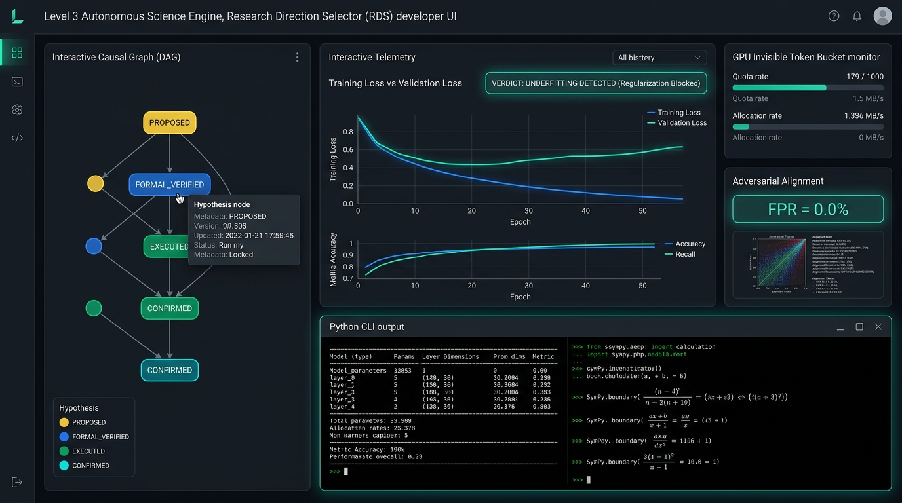

<div align="center">

# Research Direction Selector (RDS)

[](https://github.com/kongtou20070406/research-direction-selector/stargazers)
[](tests/)
[](LICENSE)
[](https://www.python.org/)
[](scripts/rds_probe.py)

**Autonomous research direction selection for AI and human scientists.**  
Turn "what to try next" into evidence-backed, fairly controlled, budget-bounded, decision-changing experiments.

</div>

<br />

<div align="center">
  
</div>

<br />

## Two sides of the research loop

RDS bridges human intent with programmatic rigor across two unified interfaces:

- **Agent side (`SKILL.md`)** — A collaborative skill for Codex, Claude Code, and other reasoning agents. The agent understands research goals, frames falsifiable hypotheses, inspects causal DAGs, designs fair controls, and translates gate feedback into structured next-step plans.
- **Kernel & CLI side (`rds_cli.py`)** — A deterministic local reference engine with SQLite WAL transactional accounting, rational AST sandboxing, Lean4-inspired formal tactic verification, and an evidence-grounded advisor.

Both read and write to the same `.rds/` state store and causal rule graph. The researcher sets the objective and resources; the agent drafts hypotheses; the engine enforces execution constraints; real evidence dictates the next decision.

---

## 5 Core Functional Components


按职责拆分，RDS 严格划分为 **3 个基础闭环组件 + 2 个增强组件**：

| 关键组件 | 主要职责 | 它回答的问题 |
| :--- | :--- | :--- |
| **① 科研规程：Skill** | 引导 AI 理解目标、提出假说、设计对照、组织下一步计划 | **这轮研究应该怎样思考和推进？** |
| **② 执行与验收内核** | 管理实验状态、调用运行工具、收集结果，执行预算和证据检查 | **实验怎么跑？结果符合哪些预定条件？** |
| **③ 研究状态与记忆** | 保存目标、配置、结果、失败条件和决策依据，支持跨会话恢复 | **我们已经做过什么、知道什么，为什么走到这里？** |
| **④ Advisor 建议引擎** | 根据当前观测、历史经验和规则，提出诊断线索与候选行动 | **现在遇到这个情况，下一步可以怎么做？** |
| **⑤ 自改进模块：RSI** | 提出规则或策略修改，经过评测后决定是否采用 | **RDS 自己哪些判断和做法需要改进？** |

### 各类子功能与名字的归属划分

为了避免概念重叠和层级混淆，系统内所有机制严格归入上述 5 个组件：
- **预算控制、基线缓存、日志提取、探针、形式化检查**：主要属于 **② 执行与验收内核** 的底层子模块。
- **`.rds/` 项目记录、Obelisk 历史接口、判断图谱（`judgment-graph.yaml`）**：主要归入 **③ 研究状态与记忆**，供其他组件读取。
- **L1～L4**：是讨论中的科研自治能力层级（L1 辅助检索 -> L2 方案建议 -> L3 有界自动闭环 -> L4 策略自演进），**不能另算组件**。

---

## 最容易混淆的三组关系

- **Skill 和 Advisor：** Skill 规定研究的基本做法（例如要求公平对照、区分指标与机制）；Advisor 针对当前具体情况提供候选行动（例如先检查训练更新路径，或沿因果图尝试正交分支）。
- **记忆和 Advisor：** 记忆保存“发生过什么、有什么依据”（原始日志、运行收据、因果图节点）；Advisor 利用这些记录推导“接下来最值得检查什么”。
- **Advisor 和 RSI：** Advisor 帮你改进**正在研究的模型或实验**；RSI 尝试改进 **RDS 自身的规则和决策策略**。

---

## Quick start

### 1. Let your agent use the Skill (Recommended)

Give the bootstrap instruction directly to Codex, Claude Code, or any shell-capable coding agent:

```text
Use Research Direction Selector (RDS) for this project.
First recover existing evidence, logs, and baselines.
Clarify my goal, metric, and budget; design a fair, controlled experiment
that can distinguish competing explanations and state its falsifier.
```

The agent loads [SKILL.md](SKILL.md), validates hypotheses against [references/judgment-graph.yaml](references/judgment-graph.yaml), and guides your research without mechanical busywork.

### 2. Run the deterministic CLI

RDS core has zero heavy dependencies and runs on pure Python 3.11+ standard library:

```powershell
# 1. Initialize research state from contract
python -B scripts/rds_cli.py --root ./study init --contract ./examples/reference-run/contract.json

# 2. Register research hypothesis
python -B scripts/rds_cli.py --root ./study hypothesis add --spec ./examples/reference-run/hypothesis.json

# 3. Pre-flight gate check (zero budget cost)
python -B scripts/rds_cli.py --root ./study gate check --plan ./examples/reference-run/plan.json

# 4. Create plan in transactional SQLite and allocate budget
python -B scripts/rds_cli.py --root ./study plan create --spec ./examples/reference-run/plan.json

# 5. Execute plan and generate tamper-proof evidence receipt
python -B scripts/rds_cli.py --root ./study run execute --id P1

# 6. Consult Advisor for evidence-grounded next steps
python -B scripts/rds_cli.py --root ./study advise
```

---

## Lean4-style Declarative Formal Engine

`scripts/rds_probe.py` unifies mathematical bounds, deep learning dynamics, and causal rules into a modular **Tactic Proof Engine** inspired by Lean 4 / Mathlib:

- **FormalRuleRegistry** — Pre-loads 28 rules & mathematical lemmas:
  - `lemma.gershgorin`: Matrix spectral contraction ($\sum_{j \ne i} |a_{ij}| < 1 - |a_{ii}| \implies \rho(A) < 1$)
  - `lemma.spectral_radius`: Dynamical transition matrix stability ($\rho(W) < 1$)
  - `lemma.residual_contraction`: Operator Lipschitz contraction ($\alpha < 1/K$)
  - `lemma.scale_invariance`: Normalization scale homogeneity ($f(\lambda x) = f(x)$)
  - `lemma.parameter_box`: Multi-dimensional feasible parameter intervals
- **Tactic Proof Dispatcher** — Discharges obligations declaratively:
  `tactics: [gershgorin, spectral_radius, lipschitz_scaling, scale_invariance, interval_check, linarith, by_rule, lean4]`
- **Native Lean 4 & 2.0s Circuit Breaker** — Binds to local `lean.exe` when raw Lean source is provided; bounded timeouts prevent solver deadlocks.

```python
from rds_probe import LeanFormalEngine

cert = LeanFormalEngine({
    "kind": "theorem",
    "theorem": "contraction_boundary",
    "tactics": [
        {"tactic": "gershgorin", "matrix": [[0.4, 0.1], [0.1, 0.4]]},
        {"tactic": "linarith", "claim": "0.5 < 1.0"}
    ]
}).verify()
# Output: {"status": "PASS", "assurance": "LEAN_TACTIC_PROVED", "proof_trace": [...]}
```

---

## Evidence-First Advisor

`scripts/rds_advisor.py` replaces arbitrary heuristics with causal rigor:
- **Refuses Ungrounded Pseudo-Diagnoses** — Single loss values never trigger "overfitting" or "underfitting" verdicts; requires paired train/validation curves with declared `trend_tolerance`.
- **Localization-First Anomaly Handling** — On NaN/Inf, guides root-cause localization of the first nonfinite tensor and FP32 replaying rather than blindly masking issues with `eps`.
- **Topological Candidate Generation** — Traverses the 28-node causal judgment graph to recommend Pareto-optimal, orthogonal exploration branches.

---

## Obelisk History Integration

RDS connects with [Obelisk](https://github.com/tommy0103/obelisk) to retrieve past session history without duplicating vector stores:

```powershell
python -B scripts/rds_cli.py history prepare --project-path 'C:\research\project' --terms 'C7' --output 'query.mjs'
python -B scripts/rds_cli.py history query --query 'query.mjs'
```

---

## Verification & Tests

```powershell
# Run the complete test suite (52 tests)
python -m unittest discover -s tests -p "test_*.py" -v

# Run historical case replays
python benchmark/run.py

# Run adversarial red-team stress tests
python benchmark/redteam/runner.py
```

---

## Repository layout

```text
SKILL.md                         Agent collaboration protocol (Component ①)
scripts/rds_cli.py               Execution kernel & transactional budget ledger (Component ②)
scripts/rds_probe.py             AST sandbox & Lean4 tactic proof engine (Component ②)
scripts/rds_compress.py          Telemetry log compression & spike monitor (Component ②)
references/judgment-graph.yaml   28-node causal judgment graph & lemmas (Component ③)
references/                      State machine contracts & RSI evidence (Component ③)
scripts/rds_obelisk.py           Obelisk session history bridge (Component ③)
scripts/rds_advisor.py           Evidence-grounded Advisor engine (Component ④)
scripts/rds_meta.py              RSI rule reflection & graph mutation (Component ⑤)
scripts/rds_adversary.py         RSI adversarial fuzzing & auto-repair (Component ⑤)
benchmark/                       Historical decision packets & red-team benchmarks
tests/                           Full regression test suite (52/52 passing)
```

---

## License

MIT License. See [LICENSE](LICENSE) for details.
