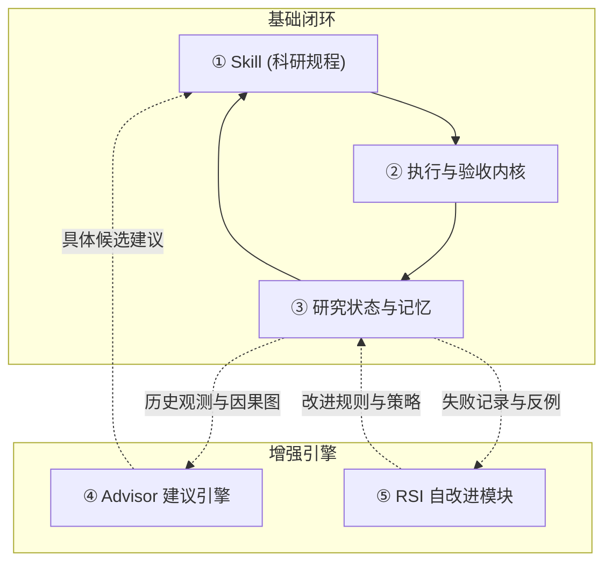

# Research Direction Selector (RDS)

**面向人类研究者与其 AI 助手的科研方向决策系统：把“下一步试什么”变成有证据、有对照、有预算、能改变决策的科学实验。**

[](tests/)
[](https://www.python.org/)
[](scripts/rds_probe.py)
[](references/judgment-graph.yaml)
[](#五大关键组件架构)

[五大关键组件](#五大关键组件架构) · [核心关系辨析](#最容易混淆的三组关系) · [快速上手](#快速上手) · [Lean4 声明式形式化引擎](#lean4-风格声明式形式化检验引擎) · [Advisor 建议引擎](#advisor-建议引擎) · [自改进模块 RSI](#自改进模块-rsi) · [验证与测试](#验证与测试)

---

## 核心目标与解决的问题

AI 辅助科研与科研流水线最容易在几种常见陷阱中失去方向：
1. **多变量混杂**：一次消融同时修改了网络层数、学习率、归一化方式等多个因素，无法归因；
2. **名义改动 vs 实际机制**：给模型组件或超参数换了新名字，实际执行的计算图或特征表示并未改变；
3. **早熟排序欺骗**：将短步数/极小算力下的初步排位直接等同于长训练周期的收敛排名；
4. **自适应测试集复用**：一边看着测试集分数一边调整架构，抹杀了真正独立的样本外验证；
5. **算力账本失控**：无节制推高排队任务，未将处理组、对照组与评估的全周期成本纳入统筹。

**RDS 让每次实验都承担明确的科学责任**：
- **明确区分哪两个竞争解释**（Competing Explanations）；
- **执行何种能够真实改变属性的操作**（Manipulation Check）；
- **正结果与负结果分别如何改变下一次决策**（Falsifiable Decision Consequence）。

---

## 五大关键组件架构

按职责明确拆分，RDS 由 **3 个基础闭环组件 + 2 个增强组件** 组成：

| 关键组件 | 主要职责 | 它回答的问题 |
| :--- | :--- | :--- |
| **① 科研规程：Skill** | 引导 AI 结构化理解研究目标、提出假说、设计公平对照、组织下一步计划 | **这轮研究应该怎样思考和推进？** |
| **② 执行与验收内核** | 管理实验状态机、调用运行工具、收集结果产物，严格执行预算和证据门禁检查 | **实验怎么跑？结果符合哪些预定条件？** |
| **③ 研究状态与记忆** | 保存目标、配置、结果、失败条件和决策依据，支持跨会话恢复与历史溯源 | **我们已经做过什么、知道什么，为什么走到这里？** |
| **④ Advisor 建议引擎** | 根据当前观测事实、历史经验与规则图谱，计算候选测试、诊断线索并排序 | **现在遇到这个情况，下一步可以怎么做？** |
| **⑤ 自改进模块：RSI** | 将规则库与决策策略本身作为改进对象，提出修订、评估回归并决定是否采纳 | **RDS 自己哪些判断和做法需要改进？** |

### 各类子功能与名字的归属划分

为了避免概念重叠和层级混淆，系统内所有机制严格归入上述 5 个组件：
- **预算控制、基线对照缓存、日志提取与压缩、形式化探针**：全部属于 **② 执行与验收内核** 的底层机制；
- **`.rds/` 项目状态库、Obelisk 历史检索接口、判断规则图谱（`judgment-graph.yaml`）**：全部属于 **③ 研究状态与记忆**，作为持久化数据供其它组件读取；
- **L1～L4**：是科研能力的阶段演化与落地层级（L1 辅助检索 -> L2 建议对比 -> L3 有界自动闭环 -> L4 策略自演进），**不是**额外的独立软件组件。

---

## 最容易混淆的三组关系



### 1. Skill 和 Advisor 的关系
- **Skill** 规定研究的基本规程与思考准则（例如：要求公平对照、区分指标与机制、严禁无界调参）；
- **Advisor** 针对当前运行出现的具体情况提供可操作的候选方案（例如：诊断 NaN 产生的定义域、提示先核验梯度更新路径，或沿因果图推荐正交分支）。

### 2. 状态记忆和 Advisor 的关系
- **研究状态与记忆** 忠实记录“发生过什么、有什么数据和依据”（原始日志、运行收据、判断规则定义）；
- **Advisor** 消费这些记录，结合先验逻辑推导“接下来最值得检查什么、能够区分哪些未决假设”。

### 3. Advisor 和 RSI 的关系
- **Advisor** 帮助研究者改进**当前正在研究的模型、代码或实验方案**；
- **RSI（Recursive Self-Improvement）** 尝试改进 **RDS 自身的规则库、门禁约束与决策策略**。

---

## 快速上手

### 1. 在 Codex / Agent 环境中对话

将本仓库置于智能体技能目录中（例如 `~/.agents/skills/research-direction-selector`），通过自然对话开启协作：

```text
用 RDS 协助推进当前实验。
先核对已有日志、代码和基线历史。
目标是在同等算力预算下解决发散问题，请提出一个能区分学习率与更新路径故障的对比方案，
并给出两臂的完整成本、操作检查和可证伪条件。
```

Codex 将自动通过 [SKILL.md](SKILL.md) 加载规程，在后台处理状态检查与方案提议，直接向研究者输出具备科学判别力的一组建议。

### 2. 命令行与参考内核（CLI）

RDS 核心运行时采用纯标准库构建，无需安装重型第三方框架即可启动标量参考实验与状态管理：

```powershell
# 查看 CLI 版本
python -B scripts/rds_cli.py --version

# 初始化项目并加载研究契约
python -B scripts/rds_cli.py --root ./my-study init --contract ./examples/reference-run/contract.json

# 注册待检验假说
python -B scripts/rds_cli.py --root ./my-study hypothesis add --spec ./examples/reference-run/hypothesis.json

# 严格门禁预检（不消耗预算）
python -B scripts/rds_cli.py --root ./my-study gate check --plan ./examples/reference-run/plan.json

# 正式在 SQLite 事务中创建计划并划拨预算
python -B scripts/rds_cli.py --root ./my-study plan create --spec ./examples/reference-run/plan.json

# 执行计划并输出结构化防篡改收据
python -B scripts/rds_cli.py --root ./my-study run execute --id P1

# 咨询 Advisor 获取下一步诊断与方向
python -B scripts/rds_cli.py --root ./my-study advise
```

---

## Lean4 风格声明式形式化检验引擎

针对深度学习研究中广泛存在的“经验公式不可靠、边界未证明”问题，RDS 在 `scripts/rds_probe.py` 中实现了类似 **Lean 4 / Mathlib** 的声明式引理库与战术证明系统（Tactic Proof Engine）：

- **FormalRuleRegistry**：预载 `judgment-graph.yaml` 中的 23 个因果方法论节点与核心数学引理：
  - `lemma.gershgorin`：矩阵谱收缩行和上界（Gershgorin 圆盘定理）；
  - `lemma.spectral_radius`：动力学转移矩阵谱半径 $\rho(W) < 1$；
  - `lemma.residual_contraction`：残差算子 Lipschitz 增量收缩条件（$\alpha < 1/K$）；
  - `lemma.scale_invariance`：规范化层尺度齐次不变性 $f(\lambda x) = f(x)$；
  - `lemma.parameter_box`：参数多维可行域区间包络；
- **战术证明链（Tactic Dispatcher）**：
  支持以声明式 Tactic 脚本完成形式化义务消解，如 `gershgorin`、`spectral_radius`、`lipschitz_scaling`、`scale_invariance`、`interval_check`、`linarith`、`by_rule`、`lean4`；
- **原生 Lean 4 对接与超时熔断**：
  提供对本地 `lean` 可执行文件的源码级调用支持；所有代数计算具备 2.0s 严格超时熔断机制，杜绝卡死。

```python
from rds_probe import LeanFormalEngine

# 示例：通过战术证明链验证算子收缩与区间包络
engine = LeanFormalEngine({
    "kind": "theorem",
    "theorem": "residual_contraction_proof",
    "tactics": [
        {"tactic": "gershgorin", "matrix": [[0.3, 0.1], [0.1, 0.3]]},
        {"tactic": "interval_check", "value": 0.5, "lower": 0.0, "upper": 1.0},
        {"tactic": "linarith", "claim": "0.4 < 1.0"}
    ]
})
cert = engine.verify()
# cert -> {"status": "PASS", "assurance": "LEAN_TACTIC_PROVED", "proof_trace": [...]}
```

---

## Advisor 建议引擎

Advisor（`scripts/rds_advisor.py`）遵循严格的因果推断与证据优先设计：
1. **拒绝无证据单点伪诊断**：杜绝仅凭单点 Loss 即断言“过拟合/欠拟合”的民科行为，要求必须具备配对曲线或明确可比历史；
2. **故障定位先行**：检测到数值异常（NaN/Inf）时，优先指导定位首个非有限值与 FP32 重放，而非盲目添加 `eps` 掩盖问题；
3. **基于因果图的候选生成与剪枝**：沿 `judgment-graph.yaml` 依赖关系展开合规性检查，排除被证伪路线，提供 Pareto 最优的正交探索方向。

---

## 自改进模块 RSI

RSI（Recursive Self-Improvement，`scripts/rds_meta.py`）通过科学闭环优化系统自身：
1. **反思沉淀（Reflection）**：从实验证伪记录和越界故障中自动提取候选因果规则；
2. **一致性审查（Alignment Fuzzing）**：验证候选规则的证伪判据、适用边界和 Primary Gate，防止规则库膨胀与退化；
3. **正交分叉（Orthogonal Branching）**：在探索连续未达预期阈值（Stagnation）时，强制标记停滞并要求开启在表示、机制或损失维度上真正正交的新分支。

---

## 验证与测试

仓库配备完备的单元测试、因果图核验与对抗性红蓝基准测试：

```powershell
# 运行 52 项核心单元测试（含执行内核、Lean4 战术引擎、Advisor 诊断）
python -m unittest discover -s tests -p "test_*.py" -v

# 运行历史案例基准重放
python benchmark/run.py

# 运行针对协议欺骗与软对抗攻击的 Red-Team 检验
python benchmark/redteam/runner.py
```

---

## 仓库结构导航

```text
SKILL.md                         科研协作规程与对话指引（组件 ①）
scripts/rds_cli.py               执行内核、命令行入口与预算事务账本（组件 ②）
scripts/rds_probe.py             AST 有理沙箱与 Lean4 声明式证明引擎（组件 ②）
scripts/rds_compress.py          遥测日志提炼与异常特征压缩（组件 ②）
references/judgment-graph.yaml   28 节点因果规则与形式化 Lemma 拓扑（组件 ③）
references/                      状态机契约、RSI 证据边界与历史桥接（组件 ③）
scripts/rds_obelisk.py           Obelisk 本地历史长程会话检索桥接（组件 ③）
scripts/rds_advisor.py           因果感知程序化 Advisor 建议引擎（组件 ④）
scripts/rds_meta.py              RSI 规则反思、校验与图谱合并引擎（组件 ⑤）
scripts/rds_adversary.py         RSI 对抗变体生成与脆弱性自愈（组件 ⑤）
benchmark/                       历史案例决策包、红蓝对抗集与重放套件
tests/                           全量单元测试与集成测试套件
```

---

## 贡献与许可证

欢迎提交改进 PR 与反例 Case。提交新规则请务必声明适用范围（Scope）、前置门禁（Primary Gate）、竞争解释（Alternatives）与明确证伪条件（Falsifier）。
本项目遵循 [MIT License](LICENSE)。
