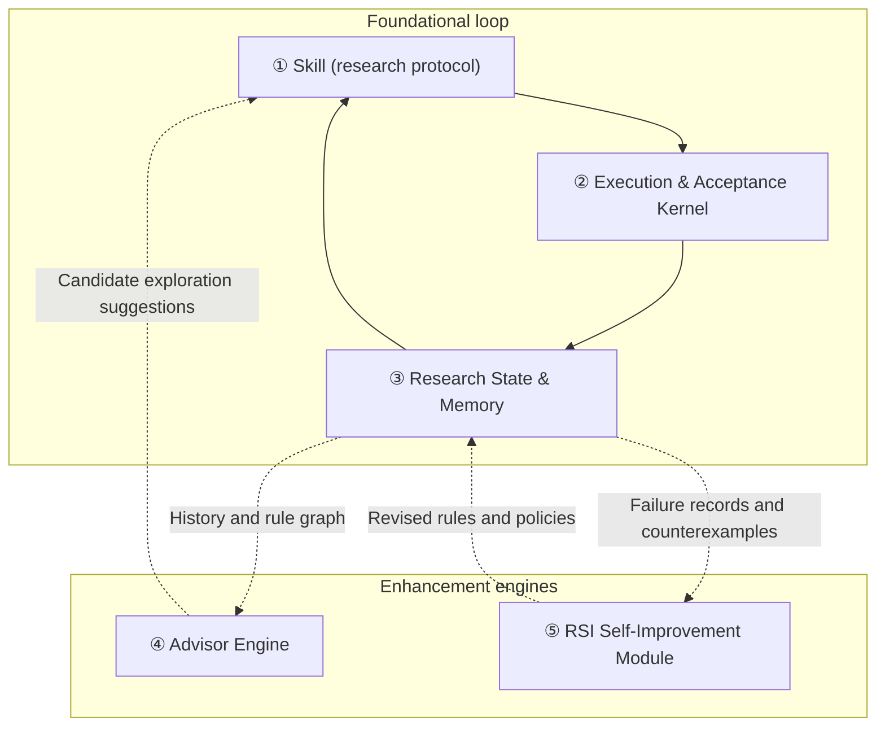

<div align="center">

<picture>
  <source media="(prefers-color-scheme: dark)" srcset=".github/assets/rds-hero-dark.svg">
  
</picture>

# Research Direction Selector

[](https://github.com/kongtou20070406/research-direction-selector/stargazers)
[](https://github.com/kongtou20070406/research-direction-selector/releases)
[](LICENSE)
[](https://github.com/kongtou20070406/research-direction-selector/actions/workflows/test.yml)

Turn a research question, existing evidence, and a limited budget into a decision-changing experiment -- driven by your agent, verified by your kernel.

**English** · [Simplified Chinese](README.zh-CN.md) · [Japanese](README.ja-JP.md)

</div>

<br />

## Two sides of the research loop

RDS has two sides that share one research state:

**Agent side** — the `research-direction-selector` agent skill (`SKILL.md`) teaches coding agents (Codex, Claude Code, etc.) how to understand research goals, frame falsifiable hypotheses, design fair controls, and turn gate feedback into structured next-step plans. The agent converses in plain language and plans experiments.

**Kernel side** — the local reference engine (`scripts/rds_cli.py`) manages transactional SQLite budgets, AST and bounded declarative formal gates, baseline caching, telemetry compression, and an evidence-grounded advisor.

Both read from and write to the same `.rds/` state store and `references/judgment-graph.yaml` causal rules.

---

## 5 Core Functional Components

Organized by responsibility, RDS has **5 core components**: 3 foundational components and 2 enhancement components.

| Core component | Main responsibility | Question it answers |
| :--- | :--- | :--- |
| **① Research protocol: Skill** | Guides the agent to understand goals, frame hypotheses, design controls, and plan the next step | **How should we reason about and advance this research?** |
| **② Execution & Acceptance Kernel** | Manages experiment state, invokes execution tools, collects results, and checks budgets and evidence | **How do we run the experiment? Which predefined conditions do the results satisfy?** |
| **③ Research State & Memory** | Preserves goals, configurations, results, failure conditions, and decision evidence across sessions | **What have we done, what do we know, and why did we reach this point?** |
| **④ Advisor Engine** | Uses observations, history, and rules to propose diagnostic leads and candidate actions | **Given the current situation, what can we try next?** |
| **⑤ Self-Improvement Module: RSI** | Proposes rule or policy changes and evaluates them before adoption | **Which of RDS's own judgments and practices should improve?** |



### Three relationships that are easy to confuse

- **Skill and Advisor:** Skill defines research practices, such as fair controls and the distinction between metrics and mechanisms. Advisor proposes actions for the current situation, such as checking whether training is sufficient or trying another candidate route.
- **Memory and Advisor:** Memory preserves what happened and its evidence. Advisor uses those records to suggest what is worth checking next.
- **Advisor and RSI:** Advisor helps improve the model or experiment under study. RSI attempts to improve **RDS's own rules and decision policies**.

### Where do the other names belong?

- **Budget controls, baseline caching, log extraction, probes, and formal checks** mainly belong to the underlying modules of **② Execution & Acceptance Kernel**.
- **`.rds/` project records, the Obelisk history interface, and the judgment graph (`judgment-graph.yaml`)** mainly belong to **③ Research State & Memory**, where other components can read them.
- **L1–L5** are [capability levels](docs/research-autonomy.md) discussed in the research framework, not additional components.

**The first 3 components support the basic research loop; Advisor adds proactive suggestions; RSI adds improvement of the tool itself.** The system has **3 foundational components + 2 enhancement components, for a total of 5**.

---

## Skill: agent-first research guidance

You can use RDS in your agent like:

```text
Use RDS to inspect why the metric has stopped improving. Use the existing logs to distinguish training problems from capacity limits.
Use RDS to review these two ablations that change several things at once. Design a minimal fair comparison that distinguishes the explanations.
Use RDS to continue this project. Check the remaining budget and completed runs before proposing new work.
Use RDS to evaluate the current contraction hypothesis and generate checked evidence for a supported formal statement.
```

### Install

#### Let your agent install it (recommended)

Give this setup instruction directly to Codex, Claude Code, or any agent with shell access:

```text
Install Research Direction Selector from
https://github.com/kongtou20070406/research-direction-selector
as the research-direction-selector agent Skill.
Keep the whole repository, including scripts, references, and examples.
Use this project's .agents/skills directory and verify the CLI version.
Then read SKILL.md and help me start from my actual research question.
```

#### Manual install

```powershell
New-Item -ItemType Directory -Path "$env:USERPROFILE/.agents/skills" -Force | Out-Null
git clone https://github.com/kongtou20070406/research-direction-selector.git "$env:USERPROFILE/.agents/skills/research-direction-selector"
```

---

## Deterministic Execution & Acceptance Kernel

The kernel (`scripts/rds_cli.py`) runs on pure Python 3.11+ standard library:

CLI invocations are logged locally by default. Show daily use with
`python -B scripts/rds_cli.py usage --days 7`, or select an inclusive range with
`usage --since 2026-09-01 --until 2026-10-01`. Add `--json` for command totals and
structured daily counts. See [CLI usage](docs/cli-usage.md) for tracking coverage
and the local log location.

Run the following CPU demonstration from the repository root, using a new empty `./my-project` directory. The preparation step creates the bound contract and manifests for both arms; this demonstration does not establish scientific confirmation. See the [project-runner example](examples/project-runner/README.md) for execution and receipt details.

```powershell
# 0. Prepare the example contract, data, and manifests
python -B examples/project-runner/prepare.py --root ./my-project

# 1. Initialize research state from contract
python -B scripts/rds_cli.py --root ./my-project project init --contract ./my-project/contract.json

# 2. Create and execute both arms with transactional budget
python -B scripts/rds_cli.py --root ./my-project project create --manifest ./my-project/control.json
python -B scripts/rds_cli.py --root ./my-project project execute --id control
python -B scripts/rds_cli.py --root ./my-project project create --manifest ./my-project/treatment.json
python -B scripts/rds_cli.py --root ./my-project project execute --id treatment

# 3. Check costs and status
python -B scripts/rds_cli.py --root ./my-project project costs
python -B scripts/rds_cli.py --root ./my-project project status
```

---

## Lean4-style Declarative Formal Verification

`scripts/rds_verify.py` provides finite declarative statements, registered domain rules, and independent certificate checking. Its bounded tactic facade is inspired by Lean-style proof workflows; it is not a general Lean or Mathlib prover.

- **Trusted rule registry** — Registers 12 atomic mathematical rules covering rational scalar thresholds, affine dynamics, scoped matrix spectral checks, supported Linear/ReLU properties, concrete tensors, and native closed-rational Lean obligations. Finite theorem modules compose these statements. This registry is separate from the 23-node methodology judgment graph.
- **Bounded tactic dispatcher** — `LeanFormalEngine().verify(spec, tactics)` accepts `rule`, `gershgorin`, `spectral_radius`, `scale_invariance`, `interval`, and `lean4`. Tactics select compatible registered checks; unsupported or inconclusive inputs return `UNKNOWN`.
- **Native Lean 4 adapter** — With a configured native Lean executable, fixed-template closed rational `eq`, `lt`, or `le` obligations receive `LEAN_KERNEL_CHECKED` after native rechecking and an empty-axiom audit. It does not accept arbitrary Lean source or user tactics.

Run this Python example from the repository root:

```python
import json
import sys
from pathlib import Path

sys.path.insert(0, "scripts")
from rds_verify import LeanFormalEngine, check_certificate

spec = json.loads(Path("examples/formal/theorem_module.json").read_text(encoding="utf-8"))
result = LeanFormalEngine().verify(spec, tactics=("rule",))
assert result["status"] == "PASS"
assert result["assurance"] == "CERTIFICATE_CHECKED"
assert check_certificate(spec, result["certificate"])
```

The same declaration is available through the CLI:

```powershell
python -B scripts/rds_cli.py --root . formal verify --spec examples/formal/theorem_module.json --output proof.json --no-cache
python -B scripts/rds_cli.py --root . formal check --spec examples/formal/theorem_module.json --certificate proof.json
```

A checked mathematical statement does not establish task performance, causal isolation, or correspondence with an executed training graph. See [formal verification](docs/formal-verification.md) for schemas, assurance labels, and supported scope.

---

## Advisor: Evidence-Grounded Suggestions

`scripts/rds_advisor.py` uses recorded evidence and the methodology graph to propose next steps:
- **Evidence before diagnosis** — A single loss value does not support an overfitting or underfitting diagnosis. Paired curves or comparable observations provide context for candidate explanations.
- **Localization before intervention** — For NaN/Inf, suggestions prioritize locating the first nonfinite value and checking precision or update paths before changing numerical safeguards.
- **Graph-guided candidates** — Methodology rules organize diagnostic leads and exploration candidates. Their ranking does not prove a causal effect, Pareto optimality, or that an experiment satisfies every rule obligation.

```powershell
python -B scripts/rds_cli.py --root ./my-project advise
```

---

## Obelisk History Integration

Recommended optional memory enhancement: [Obelisk](https://github.com/tommy0103/obelisk). The lightweight decision graph helps prevent repeated research loops; use Obelisk when you need exact details from past sessions, without duplicating a history store:

```powershell
python -B scripts/rds_cli.py history prepare --project-path 'C:\research\project' --terms 'C7' --output 'C:\queries\obq-c7-unique-token.mjs'
python -B scripts/rds_cli.py history query --query 'C:\queries\obq-c7-unique-token.mjs'
```

---

## Verification & Tests

```powershell
# Run the complete test suite
python -m unittest discover -s tests -p "test_*.py" -v

# Run historical case replays
python benchmark/run.py

# Run adversarial red-team stress tests
python benchmark/redteam/runner.py
```

---

## Repository layout

```text
SKILL.md                         Agent collaboration protocol (Component ①)
scripts/rds_cli.py               Execution kernel & transactional budget ledger (Component ②)
scripts/rds_probe.py             Restricted AST and scalar formal admission checks (Component ②)
scripts/rds_verify.py            Declarative rules, bounded tactics & certificate checking (Component ②)
scripts/rds_compress.py          Telemetry log compression & spike monitor (Component ②)
references/judgment-graph.yaml   23-node methodology judgment graph (Component ③)
references/                      State machine contracts & RSI evidence (Component ③)
scripts/rds_obelisk.py           Obelisk session history bridge (Component ③)
scripts/rds_advisor.py           Evidence-grounded Advisor engine (Component ④)
scripts/rds_meta.py              RSI rule reflection & graph mutation (Component ⑤)
scripts/rds_adversary.py         RSI adversarial variants and evaluation candidates (Component ⑤)
benchmark/                       Historical decision packets & red-team benchmarks
tests/                           Full regression test suite
```

---

## License

Apache License 2.0. See [LICENSE](LICENSE) for details.
