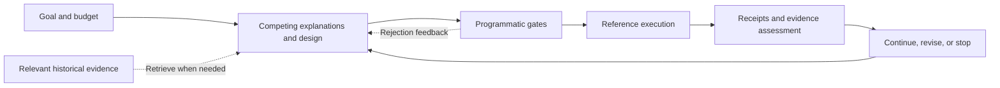

<div align="center">

<picture>
  <source media="(prefers-color-scheme: dark)" srcset=".github/assets/rds-hero-dark.svg">
  
</picture>

**Research direction selection & experiment auditing for Codex**

Give every experiment a clear question, a fair control, and a result that changes the next decision.

[](https://github.com/kongtou20070406/RDS/actions/workflows/test.yml)


[](CONTRIBUTING.md)
[](https://github.com/kongtou20070406/RDS/stargazers)

**English** · [简体中文](README.zh-CN.md) · [日本語](README.ja-JP.md)

[Our goal](#our-goal) · [L1–L4](#l1l4) · [Quick start](#quick-start) · [Validation](#regression-scenarios--verification) · [Contribute](#contribute)

</div>

RDS is a research collaboration skill for Codex with an executable local reference kernel. It connects research goals, competing explanations, past evidence, and programmatic checks to answer: **given the evidence and budget, which experiment is worth doing next?**

The researcher sets the goal and resources, the model designs candidate routes, the program checks execution constraints, and the results inform the next step. Use it for metric plateaus, mechanism ablations, budget allocation, and resuming interrupted research.

> **Two ways to use RDS:** work on a real research project through [SKILL.md](SKILL.md), or run restricted scalar experiments through the reference CLI to inspect budget, data-use, and evidence protocols. Real GPU training stays with your project's trainer.

## Our goal

Help researchers make the next experiment worth its full cost, carry it through an inspectable process, and resume from the evidence when work is interrupted. The long-term goal is a research loop that can improve its decision policy through tested feedback, while the researcher retains control of goals, resources, and interpretation.

Every proposed experiment should answer three questions: **which explanations does it distinguish, what makes the comparison fair and affordable, and what would each possible result change?**

## L1–L4

These are RDS's working levels for explaining its roadmap, not an industry standard or a score for a model's scientific ability.

| Level | Responsibility | Evidence needed |
| --- | --- | --- |
| **L1 · Evidence assistance** | Find and organize literature, code, logs, and prior decisions for a researcher-directed task. | Traceable sources and a clear account of what is known or missing. |
| **L2 · Experiment advice** | Compare routes and propose a scoped, falsifiable experiment with a fair control and a budget. | A design that distinguishes competing explanations and states the next step for either result. |
| **L3 · Bounded execution loop** | Within an authorized contract, admit plans, execute, collect artifacts, assess results, and recover interrupted work. | Engine-produced execution records, protocol-enforced budget and data-use constraints, and reproducible recovery. |
| **L4 · Tested policy improvement** | Use failures and counterexamples to revise scoped decision rules and test whether the revised research policy improves subsequent work. | Prospective comparisons of whole research trajectories at equal total budgets, including independent cases and negative results. |

RDS currently provides **L2 research guidance and building blocks for L3 through its scalar reference kernel**. Its rules, branching, and repair tools are experimental foundations for L4. It has not established an end-to-end GPU research loop or measured a research-policy improvement across independent trajectories. At every level, goals, budgets, authorization, and scientific interpretation remain under the researcher's control.

## Implemented capabilities

| Capability | Implementation | What it contributes |
| --- | --- | --- |
| **Experiments that change a decision** | Skill protocol | Compare causally distinct routes, name competing explanations, and state what positive and negative results would change. |
| **Checks on the actual intervention** | Protocol + scalar gates | Inspect the executed equations and code; explicit scalar threshold claims can use a conditional symbolic probe. |
| **Separate evidence axes** | Reference kernel | Record task gain, mechanism assessment, and run status independently, so a completed run or a better score does not silently become mechanism support. |
| **Budget and data-use gates** | Reference kernel | Reserve reference-run allocations in SQLite transactions, track data exposure, and bind plans, code, data, and verifier versions to execution receipts. |
| **Reuse of existing work** | Scalar cache + history bridge | Cache scalar controls by control AST and dataset SHA-256; retrieve relevant research history through the installed Obelisk CLI. |
| **Feedback for the next proposal** | Advisor + judgment rules | Advisor supplies gate-error hints, loss and log diagnostics; scoped judgment rules help review subsequent proposals. |

## Workflow



The skill turns an open research question into a comparison protocol. The reference kernel turns an explicit plan into an inspectable execution record. Passing a gate satisfies the corresponding program constraints; a scientific conclusion still needs evidence and interpretation matched to its question.

## Quick start

### 1. Use the skill in Codex

Place the complete repository in a skill folder named `research-direction-selector`, keeping its scripts and references. To install in your personal skills directory with PowerShell:

```powershell
New-Item -ItemType Directory -Path "$env:USERPROFILE/.agents/skills" -Force | Out-Null
git clone https://github.com/kongtou20070406/RDS.git "$env:USERPROFILE/.agents/skills/research-direction-selector"
```

You can also place it in your research project's `.agents/skills/research-direction-selector/`. See the [official OpenAI skills documentation](https://learn.chatgpt.com/docs/build-skills) for discovery and invocation.

Then describe your research problem:

> Use RDS to choose our next experiment. We want to beat the current baseline at the same training budget, with limited resources remaining. Read the completed experiments and code first. Recommend a comparison that can decide the next route, and tell us which result would make us stop or change direction.

RDS extracts goals and constraints from the current files and conversation, then returns one recommended direction and at most one serious alternative. The model constructs the experiment forms internally; the researcher can adjust goals, priorities, and resources in ordinary language.

### 2. Run the local reference example

Requires **Python 3.11+**. Ordinary scalar execution uses only the Python standard library and needs no GPU. Live history retrieval separately requires an installed Obelisk CLI.

```powershell
git clone https://github.com/kongtou20070406/RDS.git
Set-Location RDS
python -B scripts/rds_cli.py --version
```

From the repository root, run this example. It uses a fresh temporary directory each time to keep contracts and run state independent:

```powershell
$RdsDemo = Join-Path ([System.IO.Path]::GetTempPath()) ("rds-demo-" + [guid]::NewGuid().ToString("N"))
New-Item -ItemType Directory -Path $RdsDemo | Out-Null
Copy-Item -Path 'examples/reference-run/*.json', 'examples/reference-run/*.csv', 'examples/reference-run/*.py' -Destination $RdsDemo

python -B scripts/rds_cli.py --root $RdsDemo init --contract "$RdsDemo/contract.json"
python -B scripts/rds_cli.py --root $RdsDemo hypothesis add --spec "$RdsDemo/hypothesis.json"
python -B scripts/rds_cli.py --root $RdsDemo gate check --plan "$RdsDemo/plan.json"
python -B scripts/rds_cli.py --root $RdsDemo plan create --spec "$RdsDemo/plan.json"
$RdsRun = python -B scripts/rds_cli.py --root $RdsDemo run execute --id P1 | ConvertFrom-Json
python -B scripts/rds_cli.py --root $RdsDemo decide --run $RdsRun.run_id
python -B scripts/rds_cli.py --root $RdsDemo status
```

The example compares `control(x) = x` with `treatment(x) = 2*x` using paired MSE on development data. Expected results across the steps:

| Command | Output field | Expected value |
| --- | --- | --- |
| `run execute` | `run_status` | `SUCCEEDED` |
| `decide` | `assessment.task_gain` | `EXPLORATORY` |
| `decide` | `assessment.mechanism` | `UNTESTED` |

The reference execution succeeds and produces exploratory gain evidence. `init` preserves existing state; use a new `--root` for a different contract. Put the global `--root` before the subcommand.

### 3. Enable conditional symbolic verification

For explicitly declared algebraic thresholds or contraction boundaries, install the optional dependencies:

```powershell
python -m pip install -r requirements-formal.txt
```

Ordinary experiments use lightweight AST checks and exact rational arithmetic. The symbolic adapter currently checks scalar thresholds over bounded real domains; missing dependencies or unsupported claims return `UNKNOWN` and block admission. See the [executable contract](references/l3-state-machine.md) for declarations.

## Advisor: turn feedback into the next proposal

Advisor converts gate rejections, loss values, log summaries, and branch state into revision hints. After initializing the example above, request strategy advice or provide losses:

```powershell
python -B scripts/rds_cli.py --root $RdsDemo advise
python -B scripts/rds_cli.py --root $RdsDemo advise --train-loss 0.9 --val-loss 1.0 --baseline-loss 1.0
```

The [log summary helper](scripts/rds_compress.py) extracts loss trends, throughput, gradient peaks, and anomaly flags for `advise --telemetry`. Advisor can also extract keyword-matched advice from local documents.

These diagnostics use fixed thresholds, string classification, and suggestion templates. Treat them as hypotheses to check against raw curves, code, and discriminating experiments. Advisor is separate from the symbolic probe that performs declared scalar threshold checks.

## Resume research with Obelisk

When a missing prior decision, rejected route, or experiment setting could change the next step, RDS retrieves relevant history through the installed Obelisk public CLI. Source identities and pagination are retained; current files and instructions take priority.

```powershell
python -B scripts/rds_cli.py history prepare --project-path 'C:\research\my-project' --terms 'baseline' --output 'C:\queries\obq-baseline-unique-token.mjs'
python -B scripts/rds_cli.py history query --query 'C:\queries\obq-baseline-unique-token.mjs'
```

Replace the placeholder paths with real absolute paths and use a new query filename each time. The bridge locates sessions by exact `project_path` and searches within them in one query. Retrieved history grants no new authority and does not automatically write memories. See the [Obelisk bridge](references/obelisk.md).

## Regression scenarios & verification

Five regression scenarios cover recurring research decisions:

| Case | Decision under review |
| --- | --- |
| Fair baseline | Establish a feasible comparison anchor under a limited budget. |
| Confound isolation | Change one factor at a time and keep small development-set gains exploratory. |
| Task pivot | Follow an explicit change of task and audit the reference recipe and comparison cost. |
| Intervention validity | Verify that the executed intervention actually changes the property under test. |
| Budget and confirmation data | Cancel or defer allocations, account for evaluation cost, and track test-set reuse. |

After installing the optional dependencies, run from the repository root:

```powershell
python -B -m unittest discover -s tests -v
python -B benchmark/run.py
python -B benchmark/redteam/runner.py
```

Unit tests check kernel behavior; historical replays check packet integrity and associated gates; the red-team runner checks predefined protocol attacks. [GitHub Actions](https://github.com/kongtou20070406/RDS/actions) runs the unit tests and historical replays on Windows / Ubuntu with Python 3.11 / 3.13.

Historical training scores are session reports, and automated replays use synthetic scalar inputs. These cases have informed skill development. Passing regression checks does not establish autonomous research quality or replace real GPU experiments and independent prospective evaluation. See the [benchmark protocol](benchmark/README.md) for evaluation and information-separation conventions.

## Current scope

| Component | Supported scope |
| --- | --- |
| Research skill | Goal contracts, competing explanations, fair comparisons, budgets, and human intervention. |
| Reference kernel | Restricted `control(x)` / `treatment(x)` rational expressions, paired MSE, budget ledger, data-exposure records, and receipts; at most 60 seconds per allocation. |
| Scalar control cache | Reuse by control AST and dataset-byte hash within a project; real stochastic training needs project-owned seed, checkpoint, and recipe validation. |
| Conditional formal adapter | Bounded scalar algebraic thresholds; `dynamics` currently returns `UNKNOWN`. General matrix, ODE, and neural-network properties require additional adapters. |
| Rules and branches | Review, validate, and apply scoped rules with falsifiers, plus explicit branching; adversarial screening and automatic repair remain experimental. |

The ledger accounts for allocated worker runtime; setup, validation, and control overhead must be counted separately. Use your project's trainer and host scheduler for real long jobs. Hashes and transactions support audit and consistency checks; a local writer can still alter the program and artifacts, so this kernel provides neither an OS security sandbox nor tamper-proof guarantees.

<details>
<summary>Engineering limits in experimental modules</summary>

- `auto-repair` still reads legacy state files and is not connected to the current SQLite execution ledger.
- Alignment screening uses keyword heuristics; its counters are not independent measurements of scientific recommendation accuracy.
- `advise --plan` can encounter nested SQLite write-transaction locks; use `gate check` directly to check plans.
- Rule application uses ordinary file writes without a transaction lock or atomic replacement.

</details>

## Documentation

| Start here | What it covers |
| --- | --- |
| [SKILL.md](SKILL.md) | Research collaboration, direction selection, and evidence interpretation. |
| [Executable contract](references/l3-state-machine.md) | CLI commands, state, data use, formal declarations, and trust boundaries. |
| [Judgment rules](references/judgment-graph.yaml) | Scoped decision rules with competing explanations and falsifiers. |
| [RSI evidence](references/rsi-evidence.md) | Evidence and limits behind revisions to the research process. |
| [Obelisk bridge](references/obelisk.md) | Bounded history retrieval and original evidence. |
| [Reference example](examples/reference-run/) | Runnable contract, hypothesis, plan, and scalar dataset. |
| [Benchmark protocol](benchmark/README.md) | Decision packets, regression checks, and prospective response evaluation. |
| [Kernel tests](tests/test_rds_l3.py) | Execution, budgets, data exposure, formal routing, and receipt regressions. |

## Contribute

Start with a documentation fix, translation improvement, or minimal reproducible example. [CONTRIBUTING.md](CONTRIBUTING.md) explains the **fork → branch → verify → PR** workflow and check commands.

| Contribution | A useful starting point |
| --- | --- |
| Docs & translations | Keep commands, capabilities, and limits aligned across the three READMEs; check links and rendering. |
| Causal judgment rules | Provide original sources, scope, competing explanations, a discriminating experiment, and a falsifier. |
| Kernel & verifiers | Include a minimal reproduction and relevant regression checks; specify types, domains, and `UNKNOWN` behavior. |
| Research cases | Provide shareable information available at the decision time, the question, and an evaluation protocol; separate later outcomes from proposer inputs. |

[Report an issue](https://github.com/kongtou20070406/RDS/issues/new/choose) or [open a PR](https://github.com/kongtou20070406/RDS/compare). For changes to goals, evidence semantics, or major execution interfaces, discuss the design in an issue first. Preserve negative results and evidence limits; keep `.rds/` runtime state, credentials, private sessions, and non-public data out of submissions.

## Ecosystem & design references

- [Obelisk](https://github.com/tommy0103/obelisk) retrieves prior sessions and original evidence. RDS reuses its public CLI.
- [Academic Research Skills](https://github.com/Imbad0202/academic-research-skills) covers research, writing, review, and revision. Its language navigation and contribution structure informed this repository's presentation. The projects can support experiment decisions and manuscript work separately; no automatic handoff adapter is included.

RDS branding and copy are original. These links identify a dependency and design references, and do not imply endorsement.

## Search terms

Research direction selection · AI-assisted research · experiment design · hypothesis testing · reproducible research · agent skills · Codex · CLI · Obelisk.
