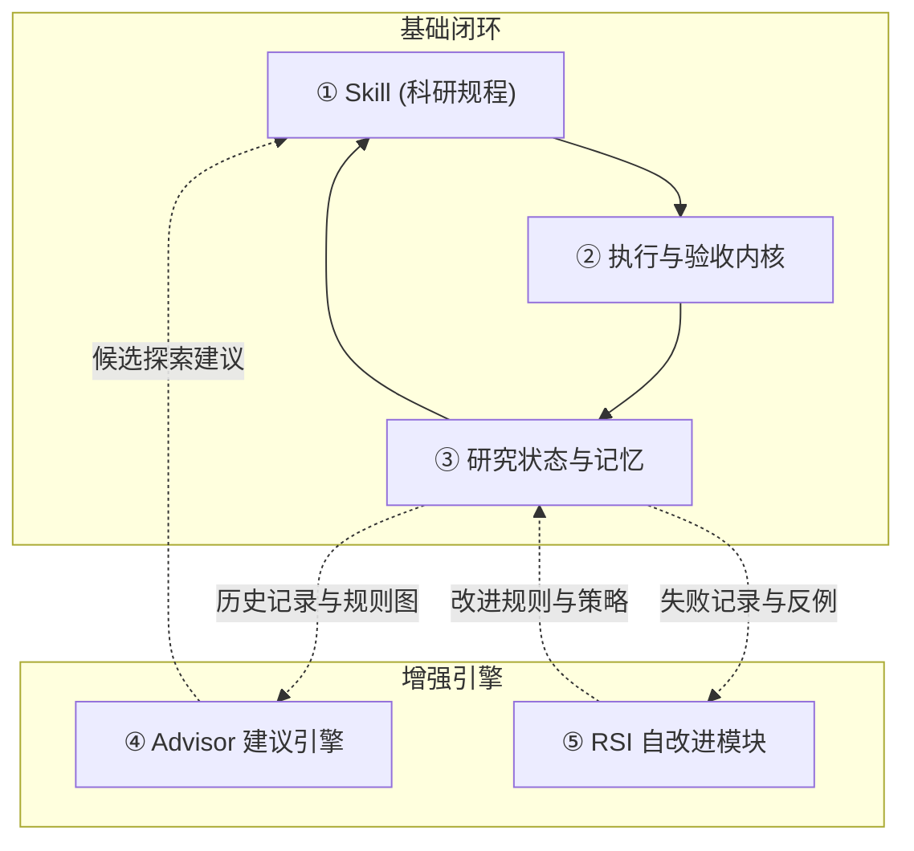

<div align="center">

<picture>
  <source media="(prefers-color-scheme: dark)" srcset=".github/assets/rds-hero-dark.svg">
  
</picture>

# Research Direction Selector (RDS)

[](https://github.com/kongtou20070406/research-direction-selector/stargazers)
[](https://github.com/kongtou20070406/research-direction-selector/releases)
[](LICENSE)
[](tests/)

**把“下一步试什么”变成一个有证据、有对照、有预算、能改变决策的科学实验 —— 由 Agent 引导，由本地内核严格验收。**

[English](README.md) · **简体中文** · [日本語](README.ja-JP.md)

</div>

<br />

## 科研闭环的双面体系

RDS 具备由同一套科研状态驱动的“双面”能力：

**Agent 端** — 智能体规程（`SKILL.md`）教导编码 Agent（如 Codex、Claude Code 等）如何结构化理解研究目标、形式化假说、设计公平对照组，并将门禁拒绝信息转化为具体的下一步探索方案。Agent 通过日常自然语言与研究者对话协同。

**内核端** — 本地确定性参考引擎（`scripts/rds_cli.py`）管理事务级 SQLite 预算账本、AST 与 Lean4 启发的形式化战术证明门禁、基线对照缓存、遥测压缩以及具备因果图先验的 Advisor 建议引擎。

两端共同读取和维护 `.rds/` 状态存储与 `references/judgment-graph.yaml` 因果决策图。

---

## 五大关键组件架构

按职责清晰拆分，RDS 严格归纳为 **5 个关键组件**（3 个基础闭环组件 + 2 个增强组件）：

| 关键组件 | 主要职责 | 它回答的问题 |
| :--- | :--- | :--- |
| **① 科研规程：Skill** | 引导 AI 理解目标、提出假说、设计对照、组织下一步计划 | **这轮研究应该怎样思考和推进？** |
| **② 执行与验收内核** | 管理实验状态、调用运行工具、收集结果，执行预算和证据检查 | **实验怎么跑？结果符合哪些预定条件？** |
| **③ 研究状态与记忆** | 保存目标、配置、结果、失败条件和决策依据，支持跨会话恢复 | **我们已经做过什么、知道什么，为什么走到这里？** |
| **④ Advisor 建议引擎** | 根据当前观测、历史经验和规则，提出诊断线索与候选行动 | **现在遇到这个情况，下一步可以怎么做？** |
| **⑤ 自改进模块：RSI** | 提出规则或策略修改，经过评测后决定是否采用 | **RDS 自己哪些判断和做法需要改进？** |



### 最容易混淆的是这三组关系

- **Skill 和 Advisor：** Skill 规定研究的基本做法，例如要求公平对照、区分指标与机制；Advisor 针对当前情况提供具体建议，例如先检查训练是否充分，或尝试另一条候选路线。
- **记忆和 Advisor：** 记忆保存“发生过什么、有什么依据”；Advisor 利用这些记录判断“接下来值得检查什么”。
- **Advisor 和 RSI：** Advisor 帮你改进正在研究的模型或实验；RSI 尝试改进 **RDS 自身的规则和决策策略**。

### 其他名字算在哪里？

- **预算控制、基线缓存、日志提取、探针、形式化检查**：主要属于 **② 执行与验收内核** 的子模块。
- **`.rds/` 项目记录、Obelisk 历史接口、判断图谱**：主要归入 **③ 研究状态与记忆**，供其他组件读取。
- **L1～L4**：是讨论中的能力层级，不能另算组件。

**前 3 个组件支撑基本科研闭环；Advisor 增加主动建议；RSI 增加对工具自身的改进。** 最清晰的系统构成是：**3 个基础组件＋2 个增强组件，共 5 个。**

---

## Skill: Agent 优先的科研协同

你可以在 Agent 中直接用自然语言唤起 RDS：

```text
/rds 指标不再提升了，用现有日志区分训练问题和容量限制
/rds 这两个消融同时改了好几件事，设计一个最小公平比较来区分解释
/rds 继续这个项目，先检查剩余预算和已完成运行，再提出新工作
/rds 帮我评估当前的收缩性假说，并生成形式化验证证明
```

### 安装

#### 让 Agent 自动安装（推荐）

将此提示直接发给具备终端访问能力的 Codex 或 Claude Code：

```text
Install Research Direction Selector from
https://github.com/kongtou20070406/research-direction-selector
as the research-direction-selector agent Skill.
Keep the whole repository, including scripts, references, and examples.
Use this project's .agents/skills directory and verify the CLI version.
Then read SKILL.md and help me start from my actual research question.
```

#### 手动安装

```powershell
New-Item -ItemType Directory -Path "$env:USERPROFILE/.agents/skills" -Force | Out-Null
git clone https://github.com/kongtou20070406/research-direction-selector.git "$env:USERPROFILE/.agents/skills/research-direction-selector"
```

---

## 确定性执行与验收内核

内核（`scripts/rds_cli.py`）无需任何重型依赖，完全基于 Python 3.11+ 标准库运行：

```powershell
# 1. 从研究契约初始化状态
python -B scripts/rds_cli.py --root ./my-project project init --contract ./my-project/contract.json

# 2. 创建并在事务预算下执行计划
python -B scripts/rds_cli.py --root ./my-project project create --manifest ./my-project/treatment.json
python -B scripts/rds_cli.py --root ./my-project project execute --id treatment

# 3. 查看开销核算与当前状态
python -B scripts/rds_cli.py --root ./my-project project costs
python -B scripts/rds_cli.py --root ./my-project project status
```

---

## Lean4 风格声明式形式化验证

`scripts/rds_probe.py` 将数学边界、深度学习动力学条件与因果判据统一收敛至类似 Lean 4 / Mathlib 的**模块化战术证明引擎**：

- **FormalRuleRegistry** — 预置 28 个规则与引理（`lemma.gershgorin`、`lemma.spectral_radius`、`lemma.residual_contraction`、`lemma.scale_invariance`、`lemma.parameter_box`）。
- **Tactic 战术证明分发** — 以声明式脚本消解形式化证明义务：
  `tactics: [gershgorin, spectral_radius, lipschitz_scaling, scale_invariance, interval_check, linarith, by_rule, lean4]`
- **原生 Lean 4 支持与 2.0s 熔断保护** — 当提供 Lean 源码时直接调用本地 `lean.exe` 验证；所有求解具备严格的 2.0s 超时熔断。

```python
from rds_probe import LeanFormalEngine

cert = LeanFormalEngine({
    "kind": "theorem",
    "theorem": "contraction_boundary",
    "tactics": [
        {"tactic": "gershgorin", "matrix": [[0.4, 0.1], [0.1, 0.4]]},
        {"tactic": "linarith", "claim": "0.5 < 1.0"}
    ]
}).verify()
# 返回: {"status": "PASS", "assurance": "LEAN_TACTIC_PROVED", "proof_trace": [...]}
```

---

## 证据优先的 Advisor 建议引擎

`scripts/rds_advisor.py` 坚持因果严谨性：
- **拒绝无证据单点伪诊断** — 严禁仅凭单一 Loss 数值推断“过拟合”或“欠拟合”，强制要求配对曲线与声明的 `trend_tolerance`。
- **定位先行** — 监测到 NaN/Inf 时，指导优先排查首个非有限值与 FP32 重放，拒绝直接添加 `eps` 掩盖数值缺陷。
- **拓扑剪枝候选生成** — 遍历因果图推荐 Pareto 最优的正交探索分支。

```powershell
python -B scripts/rds_cli.py --root ./my-project advise
```

---

## Obelisk 历史会话集成

RDS 复用 [Obelisk](https://github.com/tommy0103/obelisk) 本地检索能力，无须重复搭建向量数据库：

```powershell
python -B scripts/rds_cli.py history prepare --project-path 'C:\research\project' --terms 'C7' --output 'query.mjs'
python -B scripts/rds_cli.py history query --query 'query.mjs'
```

---

## 验证与测试

```powershell
# 运行全量测试套件
python -m unittest discover -s tests -p "test_*.py" -v

# 运行历史案例重放
python benchmark/run.py

# 运行对抗性红蓝基准测试
python benchmark/redteam/runner.py
```

---

## 仓库结构导航

```text
SKILL.md                         智能体协作规程（组件 ①）
scripts/rds_cli.py               执行内核与预算事务账本（组件 ②）
scripts/rds_probe.py             AST 沙箱与 Lean4 战术证明引擎（组件 ②）
scripts/rds_compress.py          遥测日志提炼与异常特征压缩（组件 ②）
references/judgment-graph.yaml   28 节点因果规则与形式化引理拓扑（组件 ③）
references/                      状态机契约与 RSI 证据（组件 ③）
scripts/rds_obelisk.py           Obelisk 长程历史检索桥接（组件 ③）
scripts/rds_advisor.py           证据优先的 Advisor 建议引擎（组件 ④）
scripts/rds_meta.py              RSI 规则反思与图谱演进（组件 ⑤）
scripts/rds_adversary.py         RSI 对抗测试与自愈机制（组件 ⑤）
benchmark/                       历史案例决策包与红蓝对抗套件
tests/                           全量测试套件
```

---

## 许可证

本项目遵循 [MIT License](LICENSE)。
