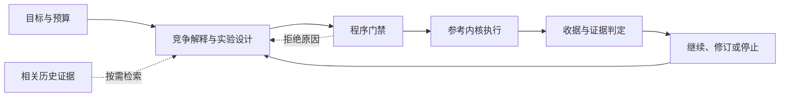

<div align="center">

<picture>
  <source media="(prefers-color-scheme: dark)" srcset=".github/assets/rds-hero-dark.svg">
  
</picture>

# Research Direction Selector

**辅助人类和人类的 AI 持续推进科研**

让下一次实验有明确的问题、公平的对照，以及能改变决策的结果。

[](https://github.com/kongtou20070406/RDS/actions/workflows/test.yml)


[](CONTRIBUTING.zh-CN.md)
[](https://github.com/kongtou20070406/RDS/stargazers)

[English](README.md) · **简体中文** · [日本語](README.ja-JP.md)

[实测结果](#实测结果与具体价值) · [我们的目标](#我们的目标) · [L1–L4](#l1l4) · [快速上手](#快速上手) · [参与贡献](#参与贡献)

</div>

> 本版为从 `main` 发布的 **v5.5.0-rc.2 预发布版**，面向真人及真人交给 AI 使用。[下载版本](https://github.com/kongtou20070406/RDS/releases/tag/v5.5.0-rc.2)。下文固定五组件，[未来计划](docs/roadmap.md)区分当前实现和后续验收。

Research Direction Selector（简称 RDS）是面向 Codex 的科研协作技能，配有可执行的本地参考内核。它把研究目标、竞争解释、历史经验和程序检查连接起来，帮助研究者回答：**在当前证据和预算下，下一步最值得做哪个实验？**

研究者确定目标与投入，模型设计候选路线，程序检查执行约束，结果用于修订下一步。RDS 尤其适合指标停滞、机制消融、预算分配，以及中断后的研究接续。

> **两种使用方式：**通过 [SKILL.md](SKILL.md) 在真实研究项目中协作；通过参考 CLI 运行受限标量实验，验证预算、数据使用和证据判定协议。真实 GPU 训练仍由研究项目自己的训练器执行。

## 实测结果与具体价值

2026-09-30 的版本检查得到以下结果：

| 检查 | 实际结果 | 检查内容 |
| --- | --- | --- |
| [回归套件](tests/) | **204 项通过，4 项可选跳过，共 208 项** | 内核、Advisor、形式化适配器和界面的行为；原生 Lean 未配置，PyTorch 不可用。 |
| [历史回放](benchmark/README.md) | **6/6 通过** | 记录中的决策材料及相关门禁。 |
| [合成攻击场景](benchmark/redteam/) | **4/4 通过** | 四种预先定义的协议攻击。 |
| [公开任务改编组件挑战](docs/advisor-benchmark.md) | **8/8 个案例、28/28 条检查通过** | 显式合同、缺失证据、依赖、成本、预算和来源身份。 |

公开任务挑战采用 ScienceAgentBench、CORE-Bench 的元数据，由人手工改编规则。八个本地 fixture 的处理与结果组装耗时 **83.0743 ms**；这是小型元数据检查的耗时。可查看[原始输入](benchmark/advisor-public/source-facts.json)和[逐项输出](benchmark/advisor-public/results.json)。**端到端科学任务分数与科研质量提升尚未测量**；这些通过数支持表中的具体行为，不能作为与其它系统的排名比较。

这组检查展示了对下一步研究决定的具体帮助：

- **保留证据缺口：**单个训练损失值不会被升级成收敛诊断（C1）；删除事实来源后，候选转为 `NEEDS_EVIDENCE` 并提出查询（C4）。
- **建议随需求和工作流改变：**把 20 项特征合同改成 10 项后，可用候选随之交换（C3）；embedding 证据缺失时，沿两层前置依赖请求补证（C6）。
- **按已知成本与可用预算判断：**成本缺失就保留未知（C5）；零预算阻止有正成本的检查（C7）。
- **核对实际复现来源：**提供另一个 capsule ID 时，阻止所选来源的后续检查（C8）。

在已测范围内，程序能执行并保留这些判断条件和推导过程，便于人和 AI 复核。真实科学结果仍需研究项目自己的实验与评价。

## 我们的目标

RDS 的主体是自动化辅助人类科研：调查证据、生成与筛选实验、安排执行、评估结果、复盘接续。研究者的目标与决定始终居于中心；Lean 兼容服务于这条流程中适合数学检查的子问题。

帮助研究者选择值得付出完整成本的下一次实验，通过可检查的过程完成它，并在工作中断后依据证据继续推进。长期目标是形成能够通过经验证的反馈改进决策策略的研究循环，由研究者掌握目标、资源与解释权。

每个实验提案都应回答三个问题：**它区分哪些竞争解释，怎样保证比较公平且预算可行，以及不同结果会改变什么决定？**

## 给研究者和研究者的 AI

1. 按下文安装 [Skill](SKILL.md)，在 AI 助手中打开你的科研项目。
2. 说明研究问题、指标、当前基线和可投入预算，并指出代码、日志与已有结果。想法尚不明确也可以开始。
3. 审阅推荐实验能区分什么、完整成本是多少；执行后继续追问证据支持哪些结论，以及下一步决定如何改变。

可以将这段起始指令交给 AI：

```text
请用 Research Direction Selector（RDS）协助这个科研项目。
先恢复已有证据和决策。
明确我的目标、指标、基线与预算，复用有效对照和日志。
推荐能区分竞争解释的下一步实验。
说明预期观测、可证伪条件、完整成本及不同结果对应的决定。
分别记录数学检查、真实执行和机制证据。
不要默认追加 seed；只有已观察的不稳定性影响决定且追加预算获授权时才考虑。
```

## 五个关键组件

| 组件 | 职责 |
| --- | --- |
| **① 科研规程 Skill** | 明确目标、组织假说、选择对照、解释证据的研究规程。 |
| **② 执行与验收内核** | 管理运行、检查预算与证据、收集收据、调用支持的数学检查。 |
| **③ 研究状态与记忆** | 通过 `.rds/`、Obelisk 与判断图保存目标、配置、结果及失败条件。 |
| **④ Advisor 建议引擎** | 根据观测与有适用范围的规则给出诊断和候选行动，发展证据驱动的候选生成。 |
| **⑤ RSI 自改进** | 提出并评测 RDS 自身的规则和策略修改，只保留有证据支持的改进。 |

前三个支撑基础科研闭环，Advisor 与 RSI 提供增强。记忆为 Advisor 提供依据，内核检查选定行动；这是功能职责，可以共享本地实现。L1–L4 是工作分级，不另算组件。

## L1–L4

RDS 支持普通对话、单模型协作，按职责分为五个组件：**科研规程 Skill、执行与验收内核、研究状态与记忆、Advisor 建议引擎、RSI 自改进**，即三个基础组件加两个增强组件。L1–L4 描述科研工作流。科研流程是：明确目标 → 选择实验 → 检查设计 → 管理过程 → 判断结果 → 积累接续。每轮应说清**知道什么、不知道什么、下一步做什么、为什么值得做**。当前实际执行范围见下文。

这是 RDS 用于说明发展路线的工作分级，不是行业通用标准，也不是对模型科研能力的评分。

| 层级 | 承担的工作 | 所需证据 |
| --- | --- | --- |
| **L1 · 证据辅助** | 为研究者指定的任务查找和整理论文、代码、日志与旧决定。 | 来源可追溯，明确已知内容和缺失信息。 |
| **L2 · 实验建议** | 比较候选路线，提出有范围、可证伪、有公平对照和预算的实验。 | 设计能区分竞争解释，正负结果都对应明确的下一步。 |
| **L3 · 有界执行闭环** | 在已授权契约内检查计划、执行、收集产物、判断结果，并恢复中断的工作。 | 运行器生成的执行记录，协议内实际生效的预算与数据使用约束，以及可复现的恢复过程。 |
| **L4 · 经验证的策略改进** | 根据失败与反例修订有适用范围的判断规则，并检验新策略是否改善后续研究。 | 等总预算下整条研究轨迹的前瞻比较，包含独立案例和负结果。 |

RDS 当前提供的是 **L2 科研建议，以及通过标量参考内核实现的 L3 基础能力**。规则、分支与修复工具是面向 L4 的实验性基础；当前尚未完成端到端 GPU 科研闭环，也没有在独立研究轨迹上验证策略提升。四级都保留研究者对目标、预算、授权和科学解释的判断权。

## 已实现的功能

| 能力 | 实现位置 | 对研究过程的作用 |
| --- | --- | --- |
| **选择能改变决策的实验** | 技能协议 | 比较因果上不同的路线，明确竞争解释、可区分的预测，以及正负结果各自对应的下一步。 |
| **核对干预是否成立** | 协议与标量门禁 | 从实际执行的方程与代码检查所声称的变化；显式标量阈值命题可调用条件符号探针。 |
| **分开记录不同证据** | 参考内核 | 独立记录任务收益、机制判断与运行状态，避免把“跑完了”或“分数提高了”直接解释成机制成立。 |
| **约束预算与数据使用** | 参考内核 | 以 SQLite 事务预留参考运行预算，记录数据暴露，并将计划、代码、数据和验证器版本绑定到执行收据。 |
| **复用已有结果** | 标量缓存与历史桥接 | 参考内核按对照 AST 与数据 SHA-256 缓存标量对照结果；研究接续按需检索已有 Obelisk 历史。 |
| **将反馈转成修订线索** | Advisor 与判断规则 | Advisor 提供门禁错误提示、损失与日志诊断；带适用范围的判断规则帮助审阅下一轮提案。 |

## 形式化验证与规则义务

架构将显式命题、后端搜索、独立检查与科学评估分开。`main` 已包含标量 AST/SymPy 路径，以及 [PR #2](https://github.com/kongtou20070406/RDS/pull/2) 的声明式注册表、可独立复核的数学证书及窄范围原生 Lean4 接口。Python 适配器报告证书检查；原生 Lean 检查限于支持的闭合有理数义务，并需要配置可执行文件。旧实验性 `LeanFormalEngine`／Tactic 分派器是另一条原型路径：`RULE_ALIGNED` 检查元数据，tactic 成功标识不能证明声明目标。详见[验证范围](docs/formal-verification.zh-CN.md)与[适配器耗时原始测量](benchmark/results/formal-windows-python313.json)。

23 个有范围的判断节点现已分别记录**前置门禁、可证伪判据与可行域表达式**。下表映射的是义务，并不声称已经证明 23 条因果定理。完整变量、证据与候选 tactic 映射见[规则义务指南](docs/rule-obligations.zh-CN.md)；当前分派器尚未强制检查新增元数据。

<details>
<summary>展开全部 23 个规则义务</summary>

| 规则 ID | 前置条件与可行域义务 | 证伪判据 |
| --- | --- | --- |
| [locked-test-selection](docs/rule-obligations.zh-CN.md#locked-test-selection) | 冻结选择与干净确认数据; `clean(T) and selection_data intersect T = empty` | 确认数据被复用或收益证据不足 |
| [deployment-information](docs/rule-obligations.zh-CN.md#deployment-information) | 核对部署输入来源; `inputs(model) subseteq I_deploy` | 需要目标专属输入 |
| [preserve-quantifiers](docs/rule-obligations.zh-CN.md#preserve-quantifiers) | 明确量词与策略类; `fixed-action failure does_not_imply all-policy failure` | 错误扩大否定范围 |
| [computation-graph-identity](docs/rule-obligations.zh-CN.md#computation-graph-identity) | 绑定张量图与检查点; `pool(z1)=pool(z2) => h(pool(z1))=h(pool(z2))` | 声称的信息身份被抹去 |
| [proxy-primary-bridge](docs/rule-obligations.zh-CN.md#proxy-primary-bridge) | 匹配路线干预; `Delta_task and Delta_route are separate` | 删除路线后收益仍在 |
| [short-budget-fidelity](docs/rule-obligations.zh-CN.md#short-budget-fidelity) | 匹配短跑与完整终点协议; `early_rank versus full_rank on measured candidates` | 排序反转 |
| [method-recipe-variance](docs/rule-obligations.zh-CN.md#method-recipe-variance) | 优先已有记录与同 seed 匹配对照；仅已观察到影响决策的不稳定时追加 seed; `Delta_i=s*(M_T(seed_i)-M_C(seed_i))` | 收益由配方或实现解释 |
| [realized-boundary-not-knob](docs/rule-obligations.zh-CN.md#realized-boundary-not-knob) | 有限 S>=0、rho>=0 与精确模型方程; `m=rho*S/(1+S); rho>1: m>=1 iff S>=1/(rho-1)` | 没有实际跨越或源码方程不同 |
| [depth-versus-trajectory](docs/rule-obligations.zh-CN.md#depth-versus-trajectory) | 同一检查点与同一批样本; `M_k=M(F_theta_star^k(X),Y)` | 用不同检查点代替轨迹 |
| [reuse-baseline-control](docs/rule-obligations.zh-CN.md#reuse-baseline-control) | 成功收据与完整对照身份; `H(AST_new)=H(AST_receipt); H(data_new)=H(data_receipt)` | 影响结果的绑定发生变化 |
| [trained-anchor-not-method-win](docs/rule-obligations.zh-CN.md#trained-anchor-not-method-win) | 实测锚点与匹配对照; `feasible(anchor) does_not_imply Delta>delta_min` | 只有锚点完成 |
| [resource-canary-before-campaign](docs/rule-obligations.zh-CN.md#resource-canary-before-campaign) | 实测运行配置与开销; `memory_peak<=limit; makespan+overhead<=B_remaining` | 探针推翻可行性估计 |
| [bundled-change-needs-component-control](docs/rule-obligations.zh-CN.md#bundled-change-needs-component-control) | 分量干预清单; `changed_factors={target_component}` | 多个有效分量同时变化 |
| [ablation-is-intervention-specific](docs/rule-obligations.zh-CN.md#ablation-is-intervention-specific) | 准确的执行消融清单; `manifest_executed=manifest_declared` | 实际干预不同或结论扩大 |
| [transfer-requires-matched-protocol](docs/rule-obligations.zh-CN.md#transfer-requires-matched-protocol) | 匹配目标任务比较; `Delta_target=s*(M_target(T)-M_target(C))` | 匹配后的目标任务收益消失 |
| [protocol-versioned-evidence](docs/rule-obligations.zh-CN.md#protocol-versioned-evidence) | 产物与协议来源; `signatures match except the declared intervention` | 历史结果无法匹配比较 |
| [normalization-removal-confound](docs/rule-obligations.zh-CN.md#normalization-removal-confound) | 保留归一化并匹配初始算子; `rho*raw/(1+S) versus raw changes the equation` | 幅度或优化仍与边界混杂 |
| [executed-manipulation-validity](docs/rule-obligations.zh-CN.md#executed-manipulation-validity) | 源码可行域与实际性质观测; `exists x in D with the declared manipulation` | 实际干预未成立 |
| [learned-support-not-allowed-support](docs/rule-obligations.zh-CN.md#learned-support-not-allowed-support) | 拟合算子与匹配的学习/固定对照; `realized_support differs from allowed_support` | 拟合算子始终未跨界 |
| [hard-budget-reallocation](docs/rule-obligations.zh-CN.md#hard-budget-reallocation) | 核算已花费与预留并保护确认底线; `spent+reserved+new+overhead<=total` | 替代方案超过授权上限 |
| [adaptive-test-reuse](docs/rule-obligations.zh-CN.md#adaptive-test-reuse) | 记录暴露来源并冻结选择; `used_for_choice(T) => exploratory(T)` | 暴露数据被称为独立 |
| [implementation-equivalence-before-speedup](docs/rule-obligations.zh-CN.md#implementation-equivalence-before-speedup) | 声明输入、范数与容差; `forward_error<=eps_f; gradient_error<=eps_g` | 输出或梯度差异超出容差 |
| [source-aware-evaluator-check](docs/rule-obligations.zh-CN.md#source-aware-evaluator-check) | 不看密封后验结果的源码审计; `judge_score does_not_imply source_feasibility` | 声称的区分无法实现 |

</details>

[文档导航](docs/README.zh-CN.md)包含 L1–L4 实验流、双语术语和贡献说明。[Lean4/mathlib 兼容](docs/lean-integration.zh-CN.md)服务于 RDS 自动化辅助人类科研循环中的合适数学子问题。原生适配器在闭合有理数义务上复用 Lean 内核；通用 mathlib 模型翻译仍待实现。C++ 仅用于测量后确认的适配性能瓶颈。

## 工作流程



技能层将开放的研究问题落实为比较协议；参考内核将明确的计划落实为可检查的执行记录。门禁通过代表满足对应程序约束，科学结论仍需匹配问题的证据与解释。

## 快速上手

### 1. 在 Codex 中使用

将完整仓库放入名为 `research-direction-selector` 的技能目录，保留脚本与参考资料。以下 PowerShell 命令安装到个人技能目录：

```powershell
New-Item -ItemType Directory -Path "$env:USERPROFILE/.agents/skills" -Force | Out-Null
git clone --branch v5.5.0-rc.2 https://github.com/kongtou20070406/RDS.git "$env:USERPROFILE/.agents/skills/research-direction-selector"
```

也可以将仓库放到研究项目的 `.agents/skills/research-direction-selector/`。技能目录与调用方式见 [OpenAI 官方技能文档](https://learn.chatgpt.com/docs/build-skills)。

随后直接描述问题，例如：

> 用 RDS 帮我选择下一步。目标是在相同训练预算下超过当前基线，剩余资源有限。先看已完成实验和代码，推荐一个能决定后续路线的比较，并说明什么结果会让我们停止或换方向。

RDS 从当前文件和对话中整理目标与约束，给出一个推荐方向和至多一个重要备选。需要的实验表单由模型内部构造，研究者可以持续用普通语言调整目标、优先级和预算。

### 2. 运行本地参考示例

需要 **Python 3.11+**。普通标量执行仅依赖 Python 标准库，无需 GPU；实时历史检索另需已安装的 Obelisk。

```powershell
git clone --branch v5.5.0-rc.2 https://github.com/kongtou20070406/RDS.git
Set-Location RDS
python -B scripts/rds_cli.py --version
```

在仓库根目录运行以下示例。每次复制到新的临时目录，让契约与运行状态彼此独立：

```powershell
$RdsDemo = Join-Path ([System.IO.Path]::GetTempPath()) ("rds-demo-" + [guid]::NewGuid().ToString("N"))
New-Item -ItemType Directory -Path $RdsDemo | Out-Null
Copy-Item -Path 'examples/reference-run/*.json', 'examples/reference-run/*.csv', 'examples/reference-run/*.py' -Destination $RdsDemo

python -B scripts/rds_cli.py --root $RdsDemo init --contract "$RdsDemo/contract.json"
python -B scripts/rds_cli.py --root $RdsDemo hypothesis add --spec "$RdsDemo/hypothesis.json"
python -B scripts/rds_cli.py --root $RdsDemo gate check --plan "$RdsDemo/plan.json"
python -B scripts/rds_cli.py --root $RdsDemo plan create --spec "$RdsDemo/plan.json"
$RdsRun = python -B scripts/rds_cli.py --root $RdsDemo run execute --id P1 | ConvertFrom-Json
python -B scripts/rds_cli.py --root $RdsDemo decide --run $RdsRun.run_id
python -B scripts/rds_cli.py --root $RdsDemo status
```

示例比较 `control(x) = x` 与 `treatment(x) = 2*x` 在开发数据上的配对 MSE。各步预期结果如下：

| 命令 | 输出字段 | 预期值 |
| --- | --- | --- |
| `run execute` | `run_status` | `SUCCEEDED` |
| `decide` | `assessment.task_gain` | `EXPLORATORY` |
| `decide` | `assessment.mechanism` | `UNTESTED` |

这说明参考执行成功并产生了探索性收益证据。`init` 保留已有状态；更换契约时使用新的 `--root`。所有项目命令的 `--root` 都放在子命令之前。

### 3. 启用条件符号验证

显式声明代数阈值或收缩边界时，安装可选依赖：

```powershell
python -m pip install -r requirements-formal.txt
```

普通实验使用轻量 AST 检查与精确有理数计算。符号适配器当前支持有界实域上的标量阈值检查；缺少依赖或不支持的命题返回 `UNKNOWN` 并阻止准入。完整声明方式见 [执行契约](references/l3-state-machine.md)。

## Advisor：从程序反馈到下一步建议

Advisor 给出观测、竞争解释、最小判别办法、限制和来源。单点 train/validation loss 返回 `INSUFFICIENT_EVIDENCE`；可用 `--fit-telemetry` 输入同口径配对曲线。数值异常先定位原始故障，再考虑改参数。文档摘录保存到独立 WAL 库，保持 `UNREVIEWED` 身份。

有界搜索原型计算三值条件，沿 `prerequisite_for` 判断依赖组合取证与检查候选，并保存推导链。目前五条规则有可执行绑定，其余规则仍供审查。只有带来源、可比的实测成本参与 Pareto 比较；未知成本保留未知，输入来源保持 `INPUT_REPORTED`。程序不执行训练，图路径也不构成机制因果证明。

```powershell
python -B scripts/rds_cli.py --root $RdsDemo advise
python -B scripts/rds_cli.py --root $RdsDemo advise --train-loss 0.9 --val-loss 1.0 --baseline-loss 1.0
python -B scripts/rds_cli.py --root $RdsDemo advise --research-context examples/advisor-search/boundary-context.json
python -B scripts/rds_cli.py --root . advise --literature "lr"
python -B scripts/rds_dashboard.py --root $RdsDemo --output dist/dashboard.html
```

边界示例明确标为合成；工作台导出只读离线 HTML 快照。参见[判断图设计](docs/advisor-graph-design.md)、[文献依据](docs/advisor-evidence.md)、[工作台用法](docs/dashboard.md)和[公开任务组件挑战](docs/advisor-benchmark.md)。科研建议质量提升尚未测量。先复用已有证据与匹配对照；只有已观测 seed 不稳定性可能改变决定时，才考虑追加 seed。

## 历史接续：复用 Obelisk

当旧决定、已否路线或实验设置可能改变下一步，而当前上下文缺失时，RDS 通过已安装的 Obelisk 公共 CLI 检索相关历史。它保留来源身份与分页信息，当前文件和当前指令优先。

```powershell
python -B scripts/rds_cli.py history prepare --project-path 'C:\research\my-project' --terms 'baseline' --output 'C:\queries\obq-baseline-unique-token.mjs'
python -B scripts/rds_cli.py history query --query 'C:\queries\obq-baseline-unique-token.mjs'
```

将占位路径替换为真实绝对路径，并为每次检索使用新的查询文件名。桥接在同一查询中按精确 `project_path` 定位会话并取证；历史结果不产生新授权，也不会自动写入记忆。更多规则见 [Obelisk bridge](references/obelisk.md)。

## 回归场景与验证

五类回归场景覆盖常见的科研决策问题：

| 案例 | 重点问题 |
| --- | --- |
| 公平基线 | 有限预算下，如何建立可行且公平的比较锚点？ |
| 混杂因素隔离 | 如何一次改变一个因素，并将开发集小样本收益保持为探索证据？ |
| 任务转向 | 如何执行明确的任务变化，并重新核对参考配方与比较成本？ |
| 干预有效性 | 如何核验实际执行的干预确实改变了待检验属性？ |
| 预算与确认数据 | 如何取消或延期分配，并计入评估成本与测试集复用？ |

安装可选依赖后，在仓库根目录运行：

```powershell
python -B -m unittest discover -s tests -v
python -B benchmark/run.py
python -B benchmark/redteam/runner.py
```

单元测试核验内核行为；历史回放检查决策包完整性与相关门禁；red-team runner 检查预制协议攻击场景。[GitHub Actions](https://github.com/kongtou20070406/RDS/actions) 在 Windows / Ubuntu、Python 3.11 / 3.13 上运行单元测试与历史回放。

历史训练分数属于会话报告，自动回放使用合成标量输入。这些案例已参与技能开发，通过回归检查不能证明自主科研质量，也不能替代真实 GPU 实验或独立前瞻评估。评测方法与信息隔离约定见 [benchmark/README.md](benchmark/README.md)。

## 本预发布版的能力与边界

| 部分 | 当前范围 |
| --- | --- |
| 科研协作技能 | 目标契约、竞争解释、公平比较、预算与人类干预协议。 |
| 参考运行内核 | 受限 `control(x)` / `treatment(x)` 有理表达式、配对 MSE、预算账本、数据暴露记录与执行收据；单次分配最多 60 秒。 |
| 标量对照缓存 | 同一项目内按对照 AST 与数据字节哈希复用结果；真实随机训练的种子、checkpoint 与训练配方复用需项目自行实现。 |
| 数学适配器 | 有界标量、已支持仿射动力学、Linear/ReLU 盒区间与具体张量；原生 Lean 检查闭合有理数义务。一般 ODE 与任意网络仍未支持。 |
| 规则与分支工具 | 带范围和证伪条件的规则审阅、校验与应用，以及显式分叉；对抗筛查与自动修复仍属实验性模块。 |

预算账本记录分配的 worker runtime，设置、验证与控制开销需另计。真实长时训练使用项目训练器与宿主调度器。哈希和事务用于审计及一致性检查；拥有本地写权限的人仍可修改程序与产物，因此参考内核不提供 OS 安全沙箱或不可篡改保证。

<details>
<summary>实验性模块的工程限制</summary>

- `auto-repair` 读取 SQLite 一致快照并提出启发式规则；提案数量不证明科研决策提高。
- alignment 筛查采用关键词启发式，其计数不能解释为独立实测的科研建议准确率。
- 规则文件应用使用普通文件写入，并无事务锁或原子替换。

</details>

## 文档导航

| 入口 | 内容 |
| --- | --- |
| [中英文文档导航](docs/README.zh-CN.md) | 科研工作流、形式化验证、23 节点义务与统一术语。 |
| [调参原则与义务](references/scientific_tuning_principles.json) | 有范围的诊断假说、形式子命题与实证检查。 |
| [SKILL.md](SKILL.md) | 科研协作、方向选择与证据解释协议。 |
| [执行契约](references/l3-state-machine.md) | CLI 命令、状态、数据使用、形式声明和信任边界。 |
| [判断规则库](references/judgment-graph.yaml) | 带适用范围、竞争解释与证伪条件的决策规则。 |
| [RSI 证据说明](references/rsi-evidence.md) | 研究过程修订所依据的证据与范围。 |
| [Obelisk bridge](references/obelisk.md) | 有界历史检索与原始证据读取。 |
| [参考示例](examples/reference-run/) | 可执行的契约、假说、计划与标量数据。 |
| [历史评测协议](benchmark/README.md) | 决策包、回归检查与前瞻响应评估方法。 |
| [内核测试](tests/test_rds_l3.py) | 执行、预算、数据暴露、形式路由与收据回归。 |

## 未来计划与验收依据

以下是优先顺序，不代表已经完成，也不承诺发布日期。

| 优先项 | 下一里程碑 | 所需证据 |
| --- | --- | --- |
| **Advisor** | 沿观测、判断依赖与有适用范围的规则生成区分性候选，再按总成本筛选。 | 可公开且有来源的案例、竞争解释及决策后果，比较建议质量与成本。 |
| **真实训练观测** | 将支持的训练器配置和日志绑定到干预检查与收据。 | 可复现运行证明预定干预实际发生，明确不支持情况。 |
| **规则回归与 RSI** | 评测规则／策略修改并保留负结果。 | 独立保留案例与等总预算的前瞻研究轨迹比较；历史回放本身不足。 |
| **Lean 协作** | 将审阅中的窄范围原生接口扩展到合适的 mathlib 模型义务。 | 期望定理绑定、公理审计、独立复核，以及单独验证的模型对应关系。 |

## 参与贡献

第一次参与可以从修正文档、改进翻译或增加最小可复现示例开始。完整的 **Fork → 分支 → 验证 → PR** 流程与检查命令见[中文贡献指南](CONTRIBUTING.zh-CN.md)。

| 你想贡献什么 | 建议从哪里开始 |
| --- | --- |
| 文档与翻译 | 同步三版 README 的命令、能力与边界，检查链接和渲染。 |
| 因果判断规则 | 提供原始来源、适用范围、竞争解释、区分性实验和证伪条件。 |
| 内核与验证器 | 提交最小复现与相关回归；明确支持的类型、定义域和 `UNKNOWN` 行为。 |
| 新研究案例 | 提供可公开的当时信息、决策问题和评估协议，将后续结果与提案输入分开。 |

通过 [报告问题](https://github.com/kongtou20070406/RDS/issues/new/choose) 或 [提交 PR](https://github.com/kongtou20070406/RDS/compare) 参与。改变目标、证据语义或主要执行接口前，建议先开 issue 对齐设计。保留负结果与证据限制，避免提交 `.rds/` 运行状态、凭据、私人会话或无法公开的数据。

## 相关生态与设计参考

- [Obelisk](https://github.com/tommy0103/obelisk) 提供已有会话与原始证据的历史检索；RDS 复用它的公共 CLI。
- [Academic Research Skills](https://github.com/Imbad0202/academic-research-skills) 覆盖研究到写作、审稿与修订流程。本仓库参考它的多语导航与贡献结构；两者可分别服务实验决策和论文工作，当前没有自动交接适配器。

品牌图与本仓库文案为 RDS 原创；上述链接说明依赖与设计参考，不代表这些项目为 RDS 背书。

## 检索关键词

科研方向选择 · 人机科研协作 · 实验设计 · 假说检验 · 因果推断 · 可复现研究 · Advisor · 证明义务 · Lean4 兼容 · Agent Skills · Codex · CLI · Obelisk。英文检索词：research direction selection、AI-assisted research、experiment design、hypothesis testing、causal inference、proof obligations、Lean4 interoperability、reproducible research。
