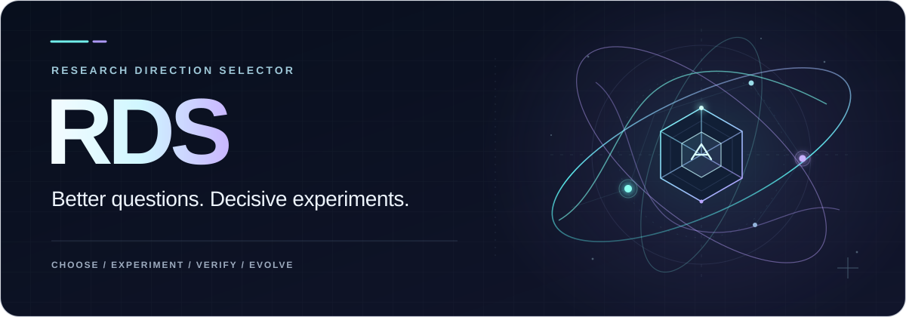
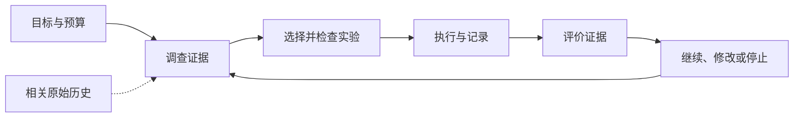

<div align="center">



# Research Direction Selector

**辅助人类和他们的 AI 做科研**

从科研问题、已有证据和有限预算中选出有用的下一次实验，让结果能接续到下一次判断。

[](https://github.com/kongtou20070406/research-direction-selector/actions/workflows/test.yml)

[](https://github.com/kongtou20070406/research-direction-selector/releases)
[](https://github.com/kongtou20070406/research-direction-selector/stargazers)

[English](README.md) · **简体中文** · [日本語](README.ja-JP.md)

[与 AI 一起使用](#与-ai-一起使用) · [本地上手](#本地上手) · [五个组件](#五个组件) · [已验证行为](#已验证行为) · [文档](#文档)

</div>

Research Direction Selector（RDS）帮助科研人员和他们的 AI 调查证据、设计实验、安排执行，并判断接下来做什么。指标停滞、两种解释需要不同干预、剩余预算有限，或中断的项目需要从实际结果接续时，都可以使用它。

用日常语言说明目标和约束。RDS 帮助明确：**下一次实验能区分哪些解释，怎样比较才公平，完整成本是多少，各种结果会改变什么决定**。证据随执行和复盘一起保存，下次对话可以接着做。

当前版本为 **v5.6.0-rc.1**，由 Agent Skill、本地命令行工具和操作性 SQLite 账本组成。当前支持以人为主导的科研流程，以及部分任务的受限自动化。[路线图](docs/roadmap.md)区分了已经实现的行为和待完成工作。

| 入口 | 用途 |
| --- | --- |
| **与 AI 协作** | 通过 [SKILL.md](SKILL.md)讨论真实科研问题、检查代码和证据、选择下一次实验。 |
| **本地工具** | 通过 CLI 导入原始记录、查看 Advisor 候选、执行锁定的项目命令、统计成本和接续当前状态。 |
| **研究者查看** | 阅读结构化 CLI 结果或[离线仪表板](docs/dashboard.md)；仪表板展示只读快照。 |

## 与 AI 一起使用

安装 Skill 后，打开科研项目，给 AI 这样的指令：

```text
用 Research Direction Selector（RDS）推进这个项目。
先查看代码、已完成实验和相关历史决定。
我的目标是［科研问题／主要指标］，可用预算是［预算］。
推荐一个能区分竞争解释的下一步实验。
说明对照、预期观测、反证条件、完整成本和结果对应的下一决定。
把已授权工作推进到执行、证据复盘和接续。
分别记录执行成功、任务增益和机制证据。
只有已观察到的 seed 不稳定性影响这次判断时，再考虑增加 seed。
```

也可以直接从具体问题开始：

- “指标不再提升了，用现有日志区分训练问题和容量限制。”
- “这两个消融同时改了好几件事，设计一个最小公平比较来区分解释。”
- “继续这个项目，先检查剩余预算和已完成运行，再提出新工作。”
- “用 RDS 开发 RDS：执行相关测试、读失败输出、评估下一次规则修改。”

研究者决定方向、预算和科学结果的接受；AI 构造必要的工作记录，你可以继续用日常语言讨论项目。优先使用已有证据和有效对照。额外 seed 的理由应来自影响判断的已观测不稳定性。

### 安装 Skill

可以把这段安装指令交给有本地终端访问能力的编码 Agent：

```text
从 https://github.com/kongtou20070406/research-direction-selector
安装 tag v5.6.0-rc.1，作为 research-direction-selector Agent Skill。
保留完整仓库，包括 scripts、references 和 examples。
放在当前项目的 .agents/skills 目录，验证 CLI 版本。
然后阅读 SKILL.md，从我的实际科研问题开始协作。
```

Windows 个人安装可以手动执行：

```powershell
New-Item -ItemType Directory -Path "$env:USERPROFILE/.agents/skills" -Force | Out-Null
git clone --branch v5.6.0-rc.1 https://github.com/kongtou20070406/research-direction-selector.git "$env:USERPROFILE/.agents/skills/research-direction-selector"
```

项目内安装路径为 `.agents/skills/research-direction-selector/`。保留仓库文件的相对位置，Skill 会使用脚本和参考资料。发现和调用方式取决于 Agent 宿主，其他助手也可以直接阅读 [SKILL.md](SKILL.md)。

## 本地上手

需要 **Python 3.11+**。CPU 项目示例和普通标量运行器只用标准库，无需 GPU。历史检索需要另行安装 Obelisk；适用的符号检查有[可选依赖](requirements-formal.txt)。

```powershell
git clone --branch v5.6.0-rc.1 https://github.com/kongtou20070406/research-direction-selector.git
Set-Location research-direction-selector
python -B scripts/rds_cli.py --version
python -B scripts/rds_cli.py --help
```

以下命令在 RDS 仓库目录执行。`--root` 放在子命令之前，用于选择科研工作区。

### 在新工作区跑真实 CPU 示例

示例在六行记录数据上拟合常数对照和线性处理。`prepare.py` 在新目录生成代码、数据、评价器、协议和绑定实际文件的运行清单。

```powershell
$RdsDemo = Join-Path ([System.IO.Path]::GetTempPath()) ("rds-project-" + [guid]::NewGuid().ToString("N"))
python -B examples/project-runner/prepare.py --root $RdsDemo
python -B scripts/rds_cli.py --root $RdsDemo project init --contract "$RdsDemo/contract.json"
python -B scripts/rds_cli.py --root $RdsDemo project create --manifest "$RdsDemo/control.json"
python -B scripts/rds_cli.py --root $RdsDemo project execute --id control
python -B scripts/rds_cli.py --root $RdsDemo project create --manifest "$RdsDemo/treatment.json"
python -B scripts/rds_cli.py --root $RdsDemo project execute --id treatment
python -B scripts/rds_cli.py --root $RdsDemo project costs
python -B scripts/rds_cli.py --root $RdsDemo project status
```

成功收据的 `run_status` 为 `SUCCEEDED`，保留原始 stdout、stderr、指标和产物身份。`task_gain` 和 `mechanism` 仍为 `UNKNOWN`：这里是实测演示输出，科学接受需要单独评价。wall time 为实测；未测的 CPU／GPU／API 资源保持未知，预估收费单独记账。

契约约束精确 argv、输入、输出路径、资源预留和超时。非零退出、产物缺失、评价器或协议变化均不能成功收尾。恢复只对账已有尝试，不重复启动。获准的项目代码是受信任代码，运行器不提供操作系统安全沙箱。

Windows 上，已授权且需要跨对话持续的命令可使用 `project execute --id <id> --background`，注册唯一的 RDS Task Scheduler 任务，以隐藏 worker 执行并记录 TaskID。需要本机注册和启动任务的权限；实际验收在普通权限失败后，通过提权注册成功。其他平台目前支持前台执行。见[项目示例](examples/project-runner/)和[执行指南](docs/development-loop.md#execute-a-locked-project-command--m04)。

原有受限标量示例保留在 [examples/reference-run/](examples/reference-run/)，[流程指南](docs/research-workflow.zh-CN.md)说明预期输出和证据字段。

## 五个组件

五组件是同一科研流程中的软件职责：

| 组件 | 作用 | 入口 |
| --- | --- | --- |
| **1 · Skill** | 与研究者澄清目标、提出竞争假设、选择公平比较、解释证据。 | [与 AI 一起使用](#与-ai-一起使用) |
| **2 · 执行与验收内核** | 检查执行约束、预留资源、执行受支持命令、收集可检查的收据。 | [本地上手](#本地上手) |
| **3 · 科研状态与记忆** | 保存目标、协议、结果、预算和失败；通过 Obelisk 检索相关原始历史。 | [接续科研](#接续科研) |
| **4 · Advisor** | 从观测和有适用范围的规则生成诊断、证据请求和有限实验候选。 | [Advisor](#advisor) |
| **5 · RSI** | 提议、回放、采用和回退 RDS 自身规则与策略的修改。 | [用 RDS 开发 RDS](#用-rds-开发-rds) |

前三个支撑基本科研过程，Advisor 和 RSI 增强它。操作账本保留科研状态，Obelisk 检索对话历史；这些职责可以共享实现。[组件说明](docs/rds-purpose.md)给出各自边界。



## Advisor

Advisor 读取观测并说明尚不确定的内容。它检索有适用范围的规则，组合有限实验模板，保留对照、竞争解释、观测、停止条件和随结果变化的决策。证据缺口形成请求，未知成本保持未知。候选的 assurance 为 `HEURISTIC_ONLY`，需要在实际科研场景中审阅。

先试仓库内的有限模板示例：

```powershell
python -B scripts/rds_cli.py advise --research-context examples/experiment-templates/context.json --templates examples/experiment-templates/templates.json
```

使用自己的记录时，提供指向原始配置、指标、日志和收据的产物清单：

```text
python -B scripts/rds_cli.py --root <project> artifacts import --manifest <manifest.json>
python -B scripts/rds_cli.py --root <project> advise --artifacts <manifest.json> --templates <templates.json>
```

导入保留字段位置、运行和协议绑定、缺失项与冲突。`DECLARED`、`OBSERVED`、`DERIVED`、`UNKNOWN` 描述事实如何进入报告；从日志读取数值不能证明机制。单个 train/validation loss 对不足以诊断拟合状况。导入的文档摘录在 Advisor 独立 WAL 存储中保持 `UNREVIEWED`。

参考账本可以导出离线 HTML 快照：

```powershell
python -B scripts/rds_dashboard.py --root <reference-project> --output dist/dashboard.html
```

见[记录导入与组合](docs/development-loop.md)、[Advisor 设计](docs/advisor-graph-design.md)、[证据](docs/advisor-evidence.md)和[仪表板范围](docs/dashboard.md)。

## 接续科研

在现有操作账本中保存决策边界，继续时与实时状态比较：

```powershell
python -B scripts/rds_cli.py --root $RdsDemo checkpoint save --id after-fit
python -B scripts/rds_cli.py --root $RdsDemo checkpoint restore --id after-fit
python -B scripts/rds_cli.py --root $RdsDemo project recover --id treatment
```

保存时可用 `--decision <decision.json>` 记录科研问题和待补证据。恢复返回当前预算、数据曝光和运行，报告后续更新或冲突，并检查当前输入绑定；不覆盖账本、不重复已完成工作。普通状态查询不重新 hash 整个项目。

相关历史决定或被否方案不在当前上下文时，已安装的 [Obelisk](https://github.com/tommy0103/obelisk) CLI 可在精确项目范围检索原始历史：

```text
python -B scripts/rds_cli.py history prepare --project-path <absolute-project-path> --terms baseline --output <unique-absolute-query.mjs>
python -B scripts/rds_cli.py history query --query <unique-absolute-query.mjs>
```

使用真实绝对路径，每次请求选择新的查询文件名。检索保留来源身份和分页，以当前文件和指令为准，不产生新授权，也不自动写入记忆。见[实时状态接续](docs/development-loop.md#resume-the-live-research-decision--m06)和 [Obelisk bridge](references/obelisk.md)。

## 用 RDS 开发 RDS

RDS 开发使用自身工具执行真实测试、导入原始输出、查看 Advisor 建议，并评估规则修改。在新的空工作区复现隔离开发循环：

```text
python -B examples/self-development/run.py --workspace <new-empty-workspace>
```

示例保存 CLI 输出、原始测试日志、成本、进程收据和 checkpoint；还在声明的开发／留出案例上回放隔离规则修改，采用合格结果，再演练回退。原仓库判断图保留。提案、回放和采用分别进行，`--force` 不能跳过证据。

这是 RSI 组件的首个人主导的软件反馈循环。有限规则案例通过，只说明所检查的软件行为成立。科研策略改进需要在未使用的独立案例上，按相同完整预算前瞻比较整个研究轨迹，包括失败工作和负结果。这种科学改进仍未测量。见[开发循环](docs/development-loop.md)和 [RSI 证据边界](references/rsi-evidence.md)。

## 已验证行为

**2026-09-30** 本轮完整测试与第二次真实执行器开发循环结果：

| 检查 | 实际记录 | 证据范围 |
| --- | --- | --- |
| [完整回归测试](tests/) | **269 通过，4 跳过，共 273 项**，45.880 秒 | 组件与集成行为；2 项原生 Lean 检查未配置，2 项 PyTorch 检查缺少依赖。 |
| [RDS 执行自身开发测试](examples/self-development/run.py) | **65/65 通过**，无跳过 | 真实项目收据 `SUCCEEDED`，原始记录导入为 `IMPORTED`，Advisor 查看下一改动。 |
| 有限 RSI 开发示例 | **基线 1/4 → 候选 4/4**；声明留出案例 **2 改善、0 回归** | 隔离图 `APPLIED` 后 `ROLLED_BACK`；案例分区由作者声明，不是独立科研策略评分。 |

第一轮 49 案例选择发现了 2 个失败；修正 fixture 和错误断言后，更新后的 65 案例运行通过。这记录了实际开发反馈循环，不代表科研质量增益。

本轮还重新执行了以下回归与组件检查：

| 检查 | 记录结果 | 检查内容 |
| --- | --- | --- |
| [历史回放](benchmark/README.md) | **6/6 通过** | 决策包与相应 gate，执行输入为合成标量。 |
| [合成对抗场景](benchmark/redteam/) | **4/4 通过** | 四个预设协议攻击。 |
| [公开任务改编组件挑战](docs/advisor-benchmark.md) | **8/8 案例，28/28 检查通过** | 改编元数据 fixture 中的契约、证据缺口、依赖、成本、预算和来源身份。 |

组件挑战使用 ScienceAgentBench 和 CORE-Bench 元数据与人工改编规则，记录的 **98.8786 ms** 是八个本地 fixture 的处理和结果组装耗时。[原始输入](benchmark/advisor-public/source-facts.json)和[逐项结果](benchmark/advisor-public/results.json)可查，没有执行相应科学任务。这些检查展示具体行为：证据缺失时发起请求、需求变化时改变候选资格、未知成本不按零处理。

端到端科学任务分数、科研质量收益、独立 RSI 轨迹收益仍然**未测量**。跨 Skill 比较暂缓，[benchmark 说明](docs/benchmark-plan.md)保留候选任务，没有安排比较实验。

## 范围与自主程度目标

近期产品目标是**六个科研环节都有 L2 自动化支持**：澄清目标 → 调查证据 → 选择实验 → 执行 → 评价 → 复盘接续。每个环节提供实用自动化，研究者保留研究方向、关键判断和科学结果接受。这是覆盖目标。

RDS 采用 Kramer 等在 2026 年正式发表的科研发现自动化框架，保留原始 **L0–L5** 编号。L1 辅助科研某一方面；L2 完全自动化一个重要发现环节；L3 自动化限定领域内的完整发现循环；L4 跨多个领域进行发现并有限自主设置目标。长期研究方向是原框架的 **L4、L5**，不是交付日期承诺。见[来源与解释边界](docs/research-autonomy.md)及[路线图](docs/roadmap.md)。

当前 RDS 的参考计算和绑定候选搜索具有**局部 L2 功能**，同时提供面向人的协作规程。完整科研 L3／L4 闭环、端到端 GPU 科研服务尚未证明。已有 `L3` 运行器标识是历史工程名称。自主程度、科学质量、安全认证与 RSI 策略改进是不同维度。

项目运行器已有真实 CPU 验收证据。GPU 科研项目仍需自身训练器、观测工具和科学评价器。成本保留资源单位，wall time 不充当 CPU time；对照复用检查支持的完整协议和产物身份。`run_status`、`task_gain`、`mechanism` 分开记录。

### 数学子问题

Lean4/mathlib 协作适用于科研流程中的数学问题。RDS 复用 Lean 内核验证受支持的闭合有理数义务，并为有限标量、仿射、box 网络和具体张量检查提供独立校验证书。数学成立与实际科学模型对应各自需要证据。通用 mathlib 转换、任意网络和一般 ODE 仍在实现范围之外。

[验证指南](docs/formal-verification.md)、[Lean 接口指南](docs/lean-integration.md)和 [23 个规则义务定义](docs/rule-obligations.md)保留详细类型、假设及 `UNKNOWN` 行为。

## 文档

| 指南 | 内容 |
| --- | --- |
| [文档索引](docs/README.zh-CN.md) | 英中导航与实现范围。 |
| [SKILL.md](SKILL.md) | 科研协作与方向选择。 |
| [开发循环](docs/development-loop.md) | 原始记录、有限组合、成本、项目执行、RSI 和接续。 |
| [科研流程](docs/research-workflow.zh-CN.md) | 证据轴与受限参考示例。 |
| [五组件](docs/rds-purpose.md) · [自主程度](docs/research-autonomy.md) · [路线图](docs/roadmap.md) | 职责、采用的等级与验收条件。 |
| [参考执行契约](references/l3-state-machine.md) | 原有标量 CLI 状态与数据使用约束。 |
| [Advisor 设计](docs/advisor-graph-design.md) · [判断图](references/judgment-graph.yaml) | 有范围的规则、依赖和候选行为。 |
| [Benchmark 协议](benchmark/README.md) | 历史案例、信息隔离和评价边界。 |

## 贡献

欢迎文档、翻译、有适用范围的科研规则和最小复现。阅读 [CONTRIBUTING.zh-CN.md](CONTRIBUTING.zh-CN.md)，按 **fork → 分支 → 检查 → PR** 参与。规则应提供来源、适用范围、竞争解释、判别实验和反证条件。保留负结果和证据边界。

可以[报告问题](https://github.com/kongtou20070406/research-direction-selector/issues/new/choose)或[提交 PR](https://github.com/kongtou20070406/research-direction-selector/compare)。请勿提交私有对话、凭据、未公开数据及 `.rds/` 操作状态。

## 相关项目

- [Obelisk](https://github.com/tommy0103/obelisk) 提供 RDS 复用的公开历史 CLI。其直接用途说明、Agent／人入口和上手组织方式是本 README 的结构参考。
- [Academic Research Skills](https://github.com/Imbad0202/academic-research-skills) 涵盖研究到写作、审稿和修改；其语言导航和贡献结构影响了先前文档。当前没有自动交接适配器。

RDS 文字与品牌素材为原创。这些链接说明依赖和设计参考，不表示相关项目为 RDS 背书。
