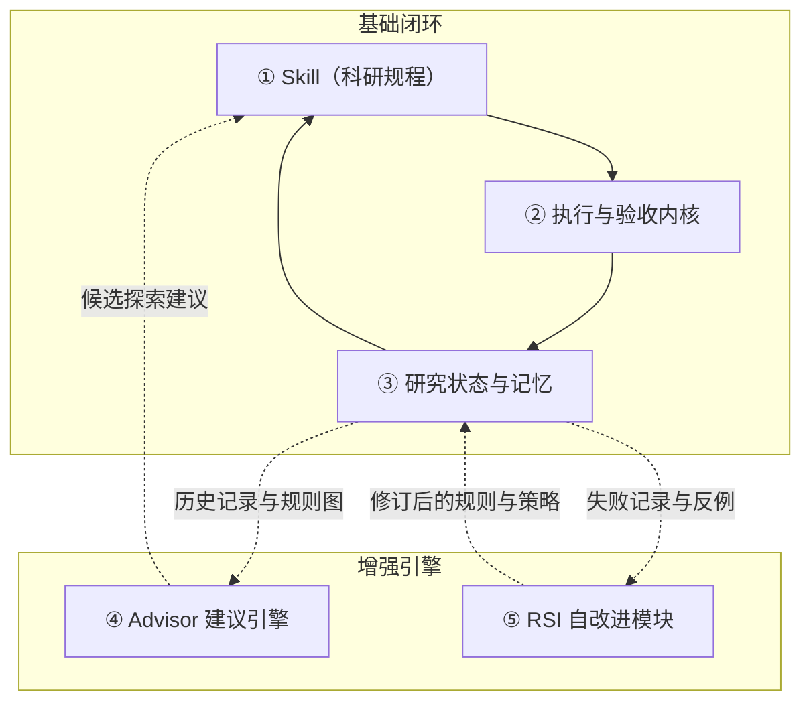

<div align="center">

<picture>
  <source media="(prefers-color-scheme: dark)" srcset=".github/assets/rds-hero-dark.svg">
  
</picture>

# Research Direction Selector

[](https://github.com/kongtou20070406/research-direction-selector/stargazers)
[](https://github.com/kongtou20070406/research-direction-selector/releases)
[](LICENSE)
[](https://github.com/kongtou20070406/research-direction-selector/actions/workflows/test.yml)

把研究问题、已有证据和有限预算转化为能改变决策的实验——由你的 Agent 推进，由本地内核验证。

[English](README.md) · **简体中文** · [日本語](README.ja-JP.md)

</div>

<br />

## 科研闭环的两端

RDS 的两端共享同一套研究状态：

**Agent 端** — `research-direction-selector` 智能体技能（`SKILL.md`）指导编码 Agent（Codex、Claude Code 等）理解研究目标、提出可证伪假说、设计公平对照，并将门禁反馈转化为结构化的下一步计划。Agent 用自然语言交流并规划实验。

**内核端** — 本地参考引擎（`scripts/rds_cli.py`）管理事务级 SQLite 预算、AST 与有限声明式形式化门禁、基线缓存、遥测压缩，以及基于证据的 Advisor 建议引擎。

两端共同读写 `.rds/` 状态存储和 `references/judgment-graph.yaml` 因果规则。

[5.8 完整目标与协作计划](docs/5.8-vision.zh-CN.md)公开目标关联的选路闭环、可检验的转向、按需理论工具库和可分工事项，区分已有实现与待审开发；5.8.0 仍未发布。

---

## 5 个核心功能组件

按职责划分，RDS 有 **5 个核心组件**：3 个基础组件和 2 个增强组件。

| 核心组件 | 主要职责 | 它回答的问题 |
| :--- | :--- | :--- |
| **① 科研规程：Skill** | 引导 Agent 理解目标、提出假说、设计对照并规划下一步 | **这轮研究应该怎样思考和推进？** |
| **② 执行与验收内核** | 管理实验状态、调用运行工具、收集结果，检查预算和证据 | **实验怎么跑？结果满足哪些预定条件？** |
| **③ 研究状态与记忆** | 跨会话保存目标、配置、结果、失败条件和决策依据 | **我们已经做过什么、知道什么，为什么走到这里？** |
| **④ Advisor 建议引擎** | 根据观测、历史和规则，提出诊断线索与候选行动 | **面对当前情况，下一步可以尝试什么？** |
| **⑤ 自改进模块：RSI** | 提出规则或策略修改，并在采用前进行评测 | **RDS 自己哪些判断和做法需要改进？** |



### 容易混淆的三组关系

- **Skill 和 Advisor：** Skill 定义研究的基本做法，例如公平对照，以及指标与机制的区别。Advisor 针对当前情况提出行动建议，例如检查训练是否充分，或尝试另一条候选路线。
- **记忆和 Advisor：** 记忆保存发生过什么及其证据。Advisor 利用这些记录，建议接下来值得检查什么。
- **Advisor 和 RSI：** Advisor 帮助改进正在研究的模型或实验。RSI 尝试改进 **RDS 自身的规则和决策策略**。

### 其他名称属于哪里？

- **预算控制、基线缓存、日志提取、探针和形式化检查**主要属于 **② 执行与验收内核** 的底层模块。
- **`.rds/` 项目记录、Obelisk 历史接口和判断图谱（`judgment-graph.yaml`）**主要属于 **③ 研究状态与记忆**，供其他组件读取。
- **L1–L5** 是研究框架中讨论的[能力层级](docs/research-autonomy.md)，不是额外组件。

**前 3 个组件支撑基本科研闭环；Advisor 增加主动建议；RSI 增加对工具自身的改进。** 系统由 **3 个基础组件 + 2 个增强组件组成，共 5 个**。

---

## Skill：以 Agent 为入口的科研指导

你可以在 Agent 中这样使用 RDS：

```text
用 RDS 检查为什么指标不再提升。利用现有日志区分训练问题和容量限制。
用 RDS 审查这两个同时改变多项因素的消融实验。设计一个最小公平比较，以区分不同解释。
用 RDS 继续这个项目。先检查剩余预算和已完成的运行，再提出新工作。
用 RDS 评估当前的收缩性假说，并为支持的形式化陈述生成经过检查的证据。
```

### 安装

#### 让 Agent 安装（推荐）

将以下配置指令直接交给 Codex、Claude Code 或任何具备终端访问能力的 Agent：

```text
从以下地址安装 Research Direction Selector：
https://github.com/kongtou20070406/research-direction-selector
将其作为 research-direction-selector 智能体 Skill。
保留完整仓库，包括 scripts、references 和 examples。
使用当前项目的 .agents/skills 目录，并验证 CLI 版本。
然后阅读 SKILL.md，从我的实际研究问题开始协作。
```

#### 手动安装

```powershell
New-Item -ItemType Directory -Path "$env:USERPROFILE/.agents/skills" -Force | Out-Null
git clone https://github.com/kongtou20070406/research-direction-selector.git "$env:USERPROFILE/.agents/skills/research-direction-selector"
```

---

## 确定性的执行与验收内核

内核（`scripts/rds_cli.py`）仅使用 Python 3.11+ 标准库：

CLI 默认在本机记录调用。用 `python -B scripts/rds_cli.py usage --days 7` 查看每天的次数，
或用 `usage --since 2026-09-01 --until 2026-10-01` 查看包含起止日期的区间。
加 `--json` 可取得命令分类和逐日统计。开始记录前的日期显示“未记录”；详见
[调用日志](docs/cli-usage.md)。

从仓库根目录运行以下 CPU 演示，并使用全新的空目录 `./my-project`。准备步骤会为对照组和实验组创建绑定契约及清单；本演示不构成科学结论的确认。执行与回执细节见[项目执行器示例](examples/project-runner/README.md)。

```powershell
# 0. 准备示例契约、数据和清单
python -B examples/project-runner/prepare.py --root ./my-project

# 1. 根据契约初始化研究状态
python -B scripts/rds_cli.py --root ./my-project project init --contract ./my-project/contract.json

# 2. 在事务级预算管理下创建并执行两组
python -B scripts/rds_cli.py --root ./my-project project create --manifest ./my-project/control.json
python -B scripts/rds_cli.py --root ./my-project project execute --id control
python -B scripts/rds_cli.py --root ./my-project project create --manifest ./my-project/treatment.json
python -B scripts/rds_cli.py --root ./my-project project execute --id treatment

# 3. 检查成本和状态
python -B scripts/rds_cli.py --root ./my-project project costs
python -B scripts/rds_cli.py --root ./my-project project status
```

内核会从账本记录状态推导活动的下一步。任意时刻运行
`python -B scripts/rds_cli.py --root ./my-project project next`，
即可打印当前应做的一步（注册、执行、恢复、对比或记录决定）及其可运行命令；
智能体重复这一步即可驱动整个循环，无需记住上面的命令序列。

---

## Lean4 风格的声明式形式化验证

`scripts/rds_verify.py` 提供有限声明式陈述、已注册的领域规则和独立证书检查。其有限战术接口借鉴了 Lean 风格的证明工作流；它不是通用的 Lean 或 Mathlib 证明器。

- **可信规则注册表** — 注册了 15 条原子数学规则，覆盖有理数标量阈值、仿射动力学、适用范围明确的矩阵谱检查、支持的 Linear/ReLU 性质、具体张量、精确单位圆盘几何覆盖，以及原生 Lean 证明义务（封闭有理数关系与一项范围明确的统计义务）。有限定理模块组合这些陈述。该注册表与包含 23 个节点的方法论判断图谱彼此独立。
- **有限战术分派器** — `LeanFormalEngine().verify(spec, tactics)` 接受 `rule`、`gershgorin`、`spectral_radius`、`scale_invariance`、`interval` 和 `lean4`。战术选择兼容的已注册检查；不支持或无法确定的输入返回 `UNKNOWN`。
- **原生 Lean 4 适配器** — 配置原生 Lean 可执行程序后，固定模板的封闭有理数 `eq`、`lt` 或 `le` 证明义务，经原生复检及空公理审计后获得 `LEAN_KERNEL_CHECKED`。它不接受任意 Lean 源码或用户战术。

从仓库根目录运行以下 Python 示例：

```python
import json
import sys
from pathlib import Path

sys.path.insert(0, "scripts")
from rds_verify import LeanFormalEngine, check_certificate

spec = json.loads(Path("examples/formal/theorem_module.json").read_text(encoding="utf-8"))
result = LeanFormalEngine().verify(spec, tactics=("rule",))
assert result["status"] == "PASS"
assert result["assurance"] == "CERTIFICATE_CHECKED"
assert check_certificate(spec, result["certificate"])
```

同一声明也可通过 CLI 验证：

```powershell
python -B scripts/rds_cli.py --root . formal verify --spec examples/formal/theorem_module.json --output proof.json --no-cache
python -B scripts/rds_cli.py --root . formal check --spec examples/formal/theorem_module.json --certificate proof.json
```

经过检查的数学陈述不能证明任务性能、因果隔离，或其与实际执行的训练图一致。数据结构、保证等级标签和支持范围见[形式化验证](docs/formal-verification.md)。

---

## Advisor：基于证据的建议

[程序持有证据的工作流](docs/program-owned-advisor.md)先固定目标、允许的路线和结果读取规则。RDS 自动将运行收据与输出纳入当前证据图，选择有界的下一步，并在执行前核查。这限制了调用方在已声明工作流内挑选信息的权限，但不证明科研结论正确，也不管控 RDS 外部的命令。

`scripts/rds_advisor.py` 利用已记录的证据和方法论图谱提出下一步建议：
- **先有证据，再做诊断** — 单个 loss 值不足以支持过拟合或欠拟合诊断。成对曲线或可比较的观测为候选解释提供背景。
- **先定位，再干预** — 遇到 NaN/Inf 时，建议优先定位第一个非有限值，并检查精度或更新路径，再调整数值保护措施。
- **图谱引导候选方案** — 方法论规则组织诊断线索和探索候选方案。候选排序不能证明因果效应、帕累托最优性，或某项实验满足所有规则义务。

```powershell
python -B scripts/rds_cli.py --root ./my-project advise
```

---

## Obelisk 历史集成

推荐可选记忆增强：[Obelisk](https://github.com/tommy0103/obelisk)。轻量决策图用于防止科研打转；需要过去会话的精确信息时使用 Obelisk，不重复建立历史存储：

```powershell
python -B scripts/rds_cli.py history prepare --project-path 'C:\research\project' --terms 'C7' --output 'C:\queries\obq-c7-unique-token.mjs'
python -B scripts/rds_cli.py history query --query 'C:\queries\obq-c7-unique-token.mjs'
```

---

## 验证与测试

```powershell
# 运行完整测试套件
python -m unittest discover -s tests -p "test_*.py" -v

# 运行历史案例回放
python benchmark/run.py

# 运行对抗性红队压力测试
python benchmark/redteam/runner.py
```

---

## 仓库结构

```text
SKILL.md                         Agent 协作规程（组件 ①）
scripts/rds_cli.py               执行内核与事务级预算账本（组件 ②）
scripts/rds_probe.py             受限 AST 与标量形式化准入检查（组件 ②）
scripts/rds_verify.py            声明式规则、有限战术与证书检查（组件 ②）
scripts/rds_compress.py          遥测日志压缩与尖峰监测（组件 ②）
references/judgment-graph.yaml   23 节点的方法论判断图谱（组件 ③）
references/                      状态机契约与 RSI 证据（组件 ③）
scripts/rds_obelisk.py           Obelisk 会话历史桥接（组件 ③）
scripts/rds_advisor.py           基于证据的 Advisor 引擎（组件 ④）
scripts/rds_meta.py              RSI 规则反思与图谱修改（组件 ⑤）
scripts/rds_adversary.py         RSI 对抗性变体与评测候选方案（组件 ⑤）
benchmark/                       历史决策包与红队基准
tests/                           完整回归测试套件
```

---

## Star 趋势

<a href="https://www.star-history.com/#kongtou20070406/research-direction-selector&Date">
  <picture>
    <source media="(prefers-color-scheme: dark)" srcset="https://api.star-history.com/svg?repos=kongtou20070406/research-direction-selector&type=Date&theme=dark">
    
  </picture>
</a>

该图表由公开的 Star History 服务加载，仅反映 GitHub star 随时间的变化，不含科研含义。

---

## 许可证

Apache License 2.0。详情见 [LICENSE](LICENSE)。
