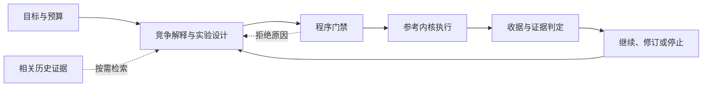

<div align="center">

<picture>
  <source media="(prefers-color-scheme: dark)" srcset=".github/assets/rds-hero-dark.svg">
  
</picture>

**Research Direction Selector · 科研方向选择与实验审计**

让下一次实验有明确的问题、公平的对照，以及能改变决策的结果。

[](https://github.com/kongtou20070406/RDS/actions/workflows/test.yml)


[](CONTRIBUTING.md)
[](https://github.com/kongtou20070406/RDS/stargazers)

[English](README.md) · **简体中文** · [日本語](README.ja-JP.md)

[快速上手](#快速上手) · [工作流程](#工作流程) · [历史案例](#历史案例与验证) · [参与贡献](#参与贡献) · [文档导航](#文档导航)

</div>

RDS 是面向 Codex 的科研协作技能，配有可执行的本地参考内核。它把研究目标、竞争解释、历史经验和程序检查连接起来，帮助研究者回答：**在当前证据和预算下，下一步最值得做哪个实验？**

研究者确定目标与投入，模型设计候选路线，程序检查执行约束，结果用于修订下一步。RDS 尤其适合指标停滞、机制消融、预算分配，以及中断后的研究接续。

> **两种使用方式：**通过 [SKILL.md](SKILL.md) 在真实研究项目中协作；通过参考 CLI 运行受限标量实验，验证预算、数据使用和证据判定协议。真实 GPU 训练仍由研究项目自己的训练器执行。

## 核心能力

| 能力 | 对研究过程的作用 |
| --- | --- |
| **选择能改变决策的实验** | 比较因果上不同的路线，明确竞争解释、可区分的预测，以及正负结果各自对应的下一步。 |
| **核对干预是否成立** | 从实际执行的方程与代码检查所声称的变化；显式标量阈值命题可调用条件符号探针。 |
| **分开记录不同证据** | 独立记录任务收益、机制判断与运行状态，避免把“跑完了”或“分数提高了”直接解释成机制成立。 |
| **约束预算与数据使用** | 以 SQLite 事务预留参考运行预算，记录数据暴露，并将计划、代码、数据和验证器版本绑定到执行收据。 |
| **复用已有结果** | 参考内核按对照 AST 与数据 SHA-256 缓存标量对照结果；研究接续按需检索已有 Obelisk 历史。 |
| **将反馈转成修订线索** | Advisor 提供门禁错误提示、损失与日志诊断；带适用范围的判断规则帮助审阅下一轮提案。 |

## 工作流程



技能层将开放的研究问题落实为比较协议；参考内核将明确的计划落实为可检查的执行记录。门禁通过代表满足对应程序约束，科学结论仍需匹配问题的证据与解释。

## 快速上手

### 1. 在 Codex 中使用

将完整仓库放入名为 `research-direction-selector` 的技能目录，保留脚本与参考资料。以下 PowerShell 命令安装到个人技能目录：

```powershell
New-Item -ItemType Directory -Path "$env:USERPROFILE/.agents/skills" -Force | Out-Null
git clone https://github.com/kongtou20070406/RDS.git "$env:USERPROFILE/.agents/skills/research-direction-selector"
```

也可以将仓库放到研究项目的 `.agents/skills/research-direction-selector/`。技能目录与调用方式见 [OpenAI 官方技能文档](https://learn.chatgpt.com/docs/build-skills)。

随后直接描述问题，例如：

> 用 RDS 帮我选择下一步。目标是在相同训练预算下超过当前基线，剩余 48 小时。先看已完成实验和代码，推荐一个能决定后续路线的比较，并说明什么结果会让我们停止或换方向。

RDS 从当前文件和对话中整理目标与约束，给出一个推荐方向和至多一个重要备选。需要的实验表单由模型内部构造，研究者可以持续用普通语言调整目标、优先级和预算。

### 2. 运行本地参考示例

需要 **Python 3.11+**。普通标量执行仅依赖 Python 标准库，无需 GPU；实时历史检索另需已安装的 Obelisk。

```powershell
git clone https://github.com/kongtou20070406/RDS.git
Set-Location RDS
python -B scripts/rds_cli.py --version
```

在仓库根目录运行以下示例。每次复制到新的临时目录，让契约与运行状态彼此独立：

```powershell
$RdsDemo = Join-Path ([System.IO.Path]::GetTempPath()) ("rds-demo-" + [guid]::NewGuid().ToString("N"))
New-Item -ItemType Directory -Path $RdsDemo | Out-Null
Copy-Item -Path 'examples/reference-run/*.json', 'examples/reference-run/*.csv', 'examples/reference-run/*.py' -Destination $RdsDemo

python -B scripts/rds_cli.py --root $RdsDemo init --contract "$RdsDemo/contract.json"
python -B scripts/rds_cli.py --root $RdsDemo hypothesis add --spec "$RdsDemo/hypothesis.json"
python -B scripts/rds_cli.py --root $RdsDemo gate check --plan "$RdsDemo/plan.json"
python -B scripts/rds_cli.py --root $RdsDemo plan create --spec "$RdsDemo/plan.json"
$RdsRun = python -B scripts/rds_cli.py --root $RdsDemo run execute --id P1 | ConvertFrom-Json
python -B scripts/rds_cli.py --root $RdsDemo decide --run $RdsRun.run_id
python -B scripts/rds_cli.py --root $RdsDemo status
```

示例比较 `control(x) = x` 与 `treatment(x) = 2*x` 在开发数据上的配对 MSE。各步预期结果如下：

| 命令 | 输出字段 | 预期值 |
| --- | --- | --- |
| `run execute` | `run_status` | `SUCCEEDED` |
| `decide` | `assessment.task_gain` | `EXPLORATORY` |
| `decide` | `assessment.mechanism` | `UNTESTED` |

这说明参考执行成功并产生了探索性收益证据。`init` 保留已有状态；更换契约时使用新的 `--root`。所有项目命令的 `--root` 都放在子命令之前。

### 3. 启用条件符号验证

显式声明代数阈值或收缩边界时，安装可选依赖：

```powershell
python -m pip install -r requirements-formal.txt
```

普通实验使用轻量 AST 检查与精确有理数计算。符号适配器当前支持有界实域上的标量阈值检查；缺少依赖或不支持的命题返回 `UNKNOWN` 并阻止准入。完整声明方式见 [执行契约](references/l3-state-machine.md)。

## Advisor：从程序反馈到下一步建议

Advisor 将门禁拒绝、损失数值、日志摘要与分支状态转为修订线索。完成上面的初始化后，可以读取策略建议或传入损失：

```powershell
python -B scripts/rds_cli.py --root $RdsDemo advise
python -B scripts/rds_cli.py --root $RdsDemo advise --train-loss 0.9 --val-loss 1.0 --baseline-loss 1.0
```

[日志摘要工具](scripts/rds_compress.py) 可提取损失趋势、吞吐量、梯度峰值和异常标记，供 `advise --telemetry` 使用。Advisor 也支持从本地文档按关键词摘录建议条目。

这些诊断采用固定阈值、字符串分类与建议模板，应作为待验证的线索，结合原始曲线、代码和区分性实验审阅。Advisor 与负责正式标量阈值检查的符号探针是不同模块。

## 历史接续：复用 Obelisk

当旧决定、已否路线或实验设置可能改变下一步，而当前上下文缺失时，RDS 通过已安装的 Obelisk 公共 CLI 检索相关历史。它保留来源身份与分页信息，当前文件和当前指令优先。

```powershell
python -B scripts/rds_cli.py history prepare --project-path 'C:\research\my-project' --terms 'C7' --output 'C:\queries\obq-c7-unique-token.mjs'
python -B scripts/rds_cli.py history query --query 'C:\queries\obq-c7-unique-token.mjs'
```

将占位路径替换为真实绝对路径，并为每次检索使用新的查询文件名。桥接在同一查询中按精确 `project_path` 定位会话并取证；历史结果不产生新授权，也不会自动写入记忆。更多规则见 [Obelisk bridge](references/obelisk.md)。

## 历史案例与验证

仓库提供五个追溯决策包，将真实科研协作中容易混淆的问题转为可审阅案例：

| 案例 | 重点问题 |
| --- | --- |
| July 8 · 基线建立 | 有限预算下，如何建立可行且公平的比较锚点？ |
| Aug 2 · 编译器消融 | 如何隔离字典与路由因素，避免把开发集小样本收益当作确认？ |
| Aug 30 · GoPro 转向 | 如何执行研究者的明确转向，并重新核对官方配方与比较成本？ |
| Sep 13 · C7 边界 | 如何区分缩紧安全余量与实际跨越机制边界？ |
| Sep 14 · 48h 预算 | 如何取消或延期已有分配，并计入评估成本与测试集复用？ |

安装可选依赖后，在仓库根目录运行：

```powershell
python -B -m unittest discover -s tests -v
python -B benchmark/run.py
python -B benchmark/redteam/runner.py
```

单元测试核验内核行为；历史回放检查决策包完整性与相关门禁；red-team runner 检查预制协议攻击场景。[GitHub Actions](https://github.com/kongtou20070406/RDS/actions) 在 Windows / Ubuntu、Python 3.11 / 3.13 上运行单元测试与历史回放。

历史训练分数属于会话报告，自动回放使用合成标量输入。这些案例已参与技能开发，通过回归检查不能证明自主科研质量，也不能替代真实 GPU 实验或独立前瞻评估。评测方法与信息隔离约定见 [benchmark/README.md](benchmark/README.md)。

## 当前能力与边界

| 部分 | 当前范围 |
| --- | --- |
| 科研协作技能 | 目标契约、竞争解释、公平比较、预算与人类干预协议。 |
| 参考运行内核 | 受限 `control(x)` / `treatment(x)` 有理表达式、配对 MSE、预算账本、数据暴露记录与执行收据；单次分配最多 60 秒。 |
| 标量对照缓存 | 同一项目内按对照 AST 与数据字节哈希复用结果；真实随机训练的种子、checkpoint 与训练配方复用需项目自行实现。 |
| 条件形式适配器 | 有界标量代数阈值；当前 `dynamics` 返回 `UNKNOWN`，一般矩阵、ODE 与神经网络性质需额外适配器。 |
| 规则与分支工具 | 带范围和证伪条件的规则审阅、校验与应用，以及显式分叉；对抗筛查与自动修复仍属实验性模块。 |

预算账本记录分配的 worker runtime，设置、验证与控制开销需另计。真实长时训练使用项目训练器与宿主调度器。哈希和事务用于审计及一致性检查；拥有本地写权限的人仍可修改程序与产物，因此参考内核不提供 OS 安全沙箱或不可篡改保证。

<details>
<summary>实验性模块的工程限制</summary>

- `auto-repair` 仍读取旧状态文件，尚未贯通当前 SQLite 运行账本。
- alignment 筛查采用关键词启发式，其计数不能解释为独立实测的科研建议准确率。
- `advise --plan` 存在嵌套 SQLite 写事务的锁冲突风险；计划检查请直接使用 `gate check`。
- 规则文件应用使用普通文件写入，并无事务锁或原子替换。

</details>

## 文档导航

| 入口 | 内容 |
| --- | --- |
| [SKILL.md](SKILL.md) | 科研协作、方向选择与证据解释协议。 |
| [执行契约](references/l3-state-machine.md) | CLI 命令、状态、数据使用、形式声明和信任边界。 |
| [判断规则库](references/judgment-graph.yaml) | 带适用范围、竞争解释与证伪条件的决策规则。 |
| [RSI 证据说明](references/rsi-evidence.md) | 研究过程修订所依据的证据与范围。 |
| [Obelisk bridge](references/obelisk.md) | 有界历史检索与原始证据读取。 |
| [参考示例](examples/reference-run/) | 可执行的契约、假说、计划与标量数据。 |
| [历史评测协议](benchmark/README.md) | 决策包、回归检查与前瞻响应评估方法。 |
| [内核测试](tests/test_rds_l3.py) | 执行、预算、数据暴露、形式路由与收据回归。 |

## 参与贡献

第一次参与可以从修正文档、改进翻译或增加最小可复现示例开始。完整的 **Fork → 分支 → 验证 → PR** 流程与检查命令见 [CONTRIBUTING.md](CONTRIBUTING.md)。

| 你想贡献什么 | 建议从哪里开始 |
| --- | --- |
| 文档与翻译 | 同步三版 README 的命令、能力与边界，检查链接和渲染。 |
| 因果判断规则 | 提供原始来源、适用范围、竞争解释、区分性实验和证伪条件。 |
| 内核与验证器 | 提交最小复现与相关回归；明确支持的类型、定义域和 `UNKNOWN` 行为。 |
| 新研究案例 | 提供可公开的当时信息、决策问题和评估协议，将后续结果与提案输入分开。 |

通过 [报告问题](https://github.com/kongtou20070406/RDS/issues/new/choose) 或 [提交 PR](https://github.com/kongtou20070406/RDS/compare) 参与。改变目标、证据语义或主要执行接口前，建议先开 issue 对齐设计。保留负结果与证据限制，避免提交 `.rds/` 运行状态、凭据、私人会话或无法公开的数据。

## 相关生态与设计参考

- [Obelisk](https://github.com/tommy0103/obelisk) 提供已有会话与原始证据的历史检索；RDS 复用它的公共 CLI。
- [Academic Research Skills](https://github.com/Imbad0202/academic-research-skills) 覆盖研究到写作、审稿与修订流程。本仓库参考它的多语导航与贡献结构；两者可分别服务实验决策和论文工作，当前没有自动交接适配器。

品牌图与本仓库文案为 RDS 原创；上述链接说明依赖与设计参考，不代表这些项目为 RDS 背书。
