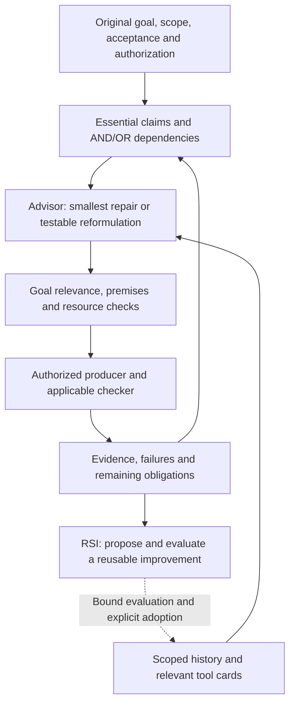

# RDS 5.8: goals, architecture and collaboration plan

[简体中文](5.8-vision.zh-CN.md) · [Documentation](README.md) · [Earlier roadmap](roadmap.md) · [Contributing](../CONTRIBUTING.md)

**Design and delivery review, 2026-10-02.** The checked implementation baseline is `2202f04` on `main`, including merged #18, #25, #24/#27, #30 and #32. The table below separates that delivered behavior from remaining work. This document publishes the intended 5.8 scope so contributors can work together; it changes no runtime or research acceptance standard. Source metadata uses 5.8.0, but the latest published release remains [5.7.0](https://github.com/kongtou20070406/research-direction-selector/releases/tag/v5.7.0). 5.8.0 is **Unreleased** and publication requires the maintainer's approval.

## The result we want

RDS should help an agent choose a useful next research step, notice when that step no longer serves the original goal, and propose a testable alternative. Reliable records and checks support that decision; creating more records is not itself research progress.

The five components remain **Skill, execution and acceptance kernel, research state and memory, Advisor, and RSI**. Theory, empirical research and mixed work share these components, the existing ledger and resource accounting. Domain solvers remain optional. RDS must work without a private mathematics Skill, a container, a second memory service or a paid model endpoint.

For 5.8, success means a researcher can inspect **what remains open, why this action addresses it, what result would change the next decision, and what the action costs**. It does not mean every problem is solvable, every trajectory improves monotonically, or software regressions establish scientific superiority.

The [evidence-grounded jump contract](evidence-grounded-jump.md) specifies the next implementation steps: propose a changed assumption, representation, intervention or method; compare its consequence with a minimal repair; consume the check result in the next action. It binds evidence to graph support and revises invalidated dependencies while preserving valid alternatives. These consumers are proposed work, not capabilities established by the current declared-label hypergraph.

## One decision loop, three acceptance contracts

| Mode | What the next step can settle | What must remain separate |
| --- | --- | --- |
| **Theory** | A stated obligation, a checked counterexample, or a precise unresolved part. | Numerical discovery, exact verification, local optimality and global proof. No invented ML metric or mandatory competing hypothesis. |
| **Empirical** | A task comparison, a discriminating observation or an intervention check. | Score change, mechanism support and search-policy benefit; missing or incomparable measurements remain unknown. |
| **Mixed** | A conditional theorem and its application to executed code/data. | The theorem's validity and whether its premises hold in the experiment. Empirical failure can expose a correspondence error without refuting the conditional theorem. |

Keep the original statement, quantifiers, domain, assumptions and completion standard visible to the consumer. For an experimental objective, retain its metric, eligible data, comparison and resource scope. A smaller intermediate result is useful only with an explicit connection to that objective. A construction upper bound does not satisfy a request for a matching global lower bound or an exact optimum.

Material method ambiguity needs a short clarification before dependent work. For example, “no numerical search” can restrict heuristic candidate generation while allowing exact interval verification; RDS must not choose that interpretation silently. External challenge rules do not expand the user's authorization. Continue unaffected work while clarification is pending.

## Make the hypergraph part of selection

The dependency graph should contain the **decision-relevant claims**, not every algebraic operation or audit file. Give nodes their exact scoped claim and source; give each hyperedge its premises, conclusion and justification. An AND edge needs every premise. OR edges represent genuinely different sufficient routes. Proposed edges carry their own proof obligations.

The intended integration is:

1. Preserve the original completion predicates as graph goals; explicitly map local questions to them.
2. Pass the actual dependency map into Advisor before selecting an action, instead of constructing it after the computation.
3. Compute bounded blockers and ready obligations. Keep cycles, missing sources and search truncation visible.
4. Require the selected action to identify its target and an inspectable declared dependency path to an original goal; retain each premise/edge's evidence state and revisit the current map at admission and continuation. A producer can address a ready unresolved obligation or proposed reduction; it need not start with a fully proved path.
5. After new evidence, revisit affected dependencies and show how the next selection changes. Do not treat a `SUPPORTED` input label or graph reachability as a proof.

Candidate interface names being developed include `dependency_map`, `goal_contribution` and `require_goal_link`. These are **implementation proposals**, not supported public-main flags in this document. Public examples and migration guidance must accompany their implementation. The prospective guard must preserve ordinary operational-wrapper compatibility while making the stricter goal-bound workflow explicit.

The graph cannot determine that an arbitrary claimed lemma is true or that every necessary branch has been represented. Claim correspondence, reduction completeness and checker soundness remain explicit scientific obligations. A dependency path through an already settled lemma must not authorize doing the same work again while the actual missing premise is ignored.

Goal-bound research must use an enforced execution route, not just a Skill reminder. The integration must bind the actual action target to the first path obligation in **every mode**, reject stale objective/revision bindings, and retain the configured policy at continuation. A maintenance label or a plausible path to a different target cannot grant admission.

Deliver two enforcement layers: the native RDS controller owns admitted processes and budget reservations; a host command hook restricts research computation to that controller. The hook checks a bound request/admission identity, not merely whether the command string contains `rds`. Unmanaged computation is rejected before dispatch in strict host mode. Read-only inspection and authorized code editing remain separate operations. This requires no Docker, VM or OS sandbox.

Publish a capability/coverage check for the selected host. Where no command hook exists, report `HOST_GUARD_MISSING` and do not claim protection against direct shell execution; Skill instructions alone cannot supply that guarantee. A public bypass attempt must exercise the installed hook, while a controller-only test must report its narrower coverage. These are proposed host-integration requirements, not capabilities already delivered by this documentation PR.

## Hard admission and stopping policy

Research judgment and execution policy are different. An uncertain scientific conclusion can still accompany a definite refusal to spend outside the agreed policy. The controller must return a machine-consumed admission decision; a model's prose acknowledgement cannot override a refusal.

| Trigger | Required execution consequence | Reopening condition |
| --- | --- | --- |
| Frozen goal/method mismatch, invalid target/path or contradictory required premise | Reject the proposed job before reservation or launch. | Repair the affected input, close the premise, or obtain an explicit authorized change. |
| Exhausted allowance, hard deadline, or configured runtime/memory cap | Reject new work; terminate the controller-owned job at its applicable cap and preserve partial output, failure reason and spent resources. | New authority/allowance when needed; changing a job name is insufficient. |
| Same valid completed check, or an identical job already running | Reuse its result or observe its live state; reject a duplicate launch. | Changed bound inputs, an unresolved new obligation, or replication justified within the allowed protocol. |
| Configured same-route attempt limit or measured progress condition is reached | Suspend further expensive dispatch on that route and require a changed discriminating check or an authorized policy revision. | A checkable change in the intervention, evidence, scope or method; a renamed proposal is insufficient. |

Attempt limits and progress predicates belong to the bound project policy, with their scope, source and reset/reopening conditions. They are operational stopping rules, not claims that a theory is false after two failures. Missing observations produce a bounded evidence-repair step or `NEEDS_EVIDENCE`, not another unrestricted training/enumeration job. The controller must also specify which stop predicates it can observe during an ongoing process; unavailable telemetry cannot masquerade as a working watchdog.

## What “help the AI jump” means

A useful jump changes a premise, representation, intervention, reduction or computational method **and changes a consequence we can check**. Giving the old route a new name, selecting a fashionable theory or increasing a model's size does not establish that change.

Advisor should compare one serious reformulation with the smallest plausible repair of the current route:

- Identify the observation or obstruction the current route does not explain.
- State what changes, what stays fixed and which original goal the alternative serves.
- Identify a consequence that distinguishes the alternatives; specify required evidence and a stopping or revision condition.
- Select a bounded check within existing method and resource authorization, or identify the exact missing reduction, input or backend.
- Use its result to continue, revise or defer. An unresolved check stays unresolved.

This covers both an **explanatory change** and a **computational change**. Switching from repetitive symbolic expansion to certificate-producing computation can help without changing the theorem. Changing a dynamical model can be a hypothesis without proving that the new model will work. Neither switch automatically improves the scientific result.

Stagnation review should detect unchanged rejected mechanisms, repeat checks whose valid result already exists, oscillation without new evidence, and actions disconnected from the goal. Compare structured interventions, premises, relevant observations and scope; ID/hash equality alone cannot recognize all semantic paraphrases. Changed evidence and legitimate replication must remain possible.

Use the hard policy above to stop unchanged spending; Advisor then proposes a deciding alternative or smallest repair. Do not encode “two failures imply a capacity limit”, a fixed hierarchy of universally superior theories, or a forced SSM/SOS conversion. A measured plateau does not establish a mathematical lower bound. Replanning cannot grant new resources, delete evidence or change the objective.

## A conditional theory and method library

Deliver two linked layers: compact, sourced **tool cards** for retrieval, and **native executable operators/templates** for supported methods. An executable entry must identify its input/output schemas, preconditions, callable example, checker, resource estimate and verified/counterexample/unresolved branches or empirical comparison outcomes. A guidance-only card must be labelled as such. Lookup does not silently install a backend; the selected compatible operator can run through normal admission without the agent rebuilding it from a paper.

Start with coverage of recurring failure patterns, expand from observed gaps, and remove redundant cards. Card count is not a release criterion. Default retrieval should return a small shortlist, normally one to three cards, with detail available by locator. Load specialized packs only when requested; keep large derivations and assets outside the conversation.

The initial executable delivery should include small public examples for: fixed-horizon refinement versus longer-time dynamics; a dimension-checked, controlled contracting state update with explicit time step; an exact finite-domain counterexample/certificate check; and actual Lean axiom inspection for a supported encoded claim. Bind operator code and inputs to the request, keep full outputs in CAS, and provide a consumer that changes the next choice. A toy state update is a manipulation-check scaffold, not a production SSM replacement or a guarantee about ReFRM. Missing optional backends return an actionable unavailable result.

| Coverage area | Useful operations to expose | Boundary that must travel with the card |
| --- | --- | --- |
| Goal and intervention checks | Objective-bias review, causal alternatives, actual-entrypoint preflight. | A proxy improvement or renamed loss does not verify the intended intervention. |
| Dynamics and representations | Local Jacobian/residual checks, horizon scaling, state augmentation, distribution transport. | Local estimates do not prove global stability; a fixed horizon and the chosen state need justification. |
| Learning and generalization | Equivariance, information bottlenecks, width parameterization, description length, algorithmic alignment. | Symmetry, compression and scaling assumptions must fit the task; none is a universal recipe for better accuracy. |
| Exact computation and proof | Symbolic constraints, finite reductions, interval certificates, relaxation/duality, proof decomposition. | Candidate generation, checked feasibility and global exhaustiveness are distinct. A numerical solver requires an exact certificate for an exact claim. |
| Number theory and algebra | Generate exact objects and invariants, inspect small groups, form conjectures, search for counterexamples. | Finite samples and a database search do not prove a universal theorem or establish novelty. |
| Foundations and metamathematics | Audit axioms and encodings; inspect proof structure, bounded models and known logical-strength results. | Independence or minimal-axiom claims need a specified base theory and actual proof, not a classification guessed from prose. |
| Transfer between formulations | Quotients, invariants, dualities, functors or explicit translations with transport obligations. | A translation must preserve the relevant statement and premises; it need not make the target problem easier. |

The metamathematics delivery is a set of concrete operations, not a tour of eight discipline names:

| Operator | Bound input and retained output | How it affects the next choice |
| --- | --- | --- |
| Actual axiom audit | Supported encoded statement, original-objective mapping, selected compiler/environment and allowed axioms → actual theorem/axiom list, code/environment hashes and checker outcome. | An unallowed dependency blocks promotion; locate the missing premise or try a smaller-premise proof. |
| Bounded exact model/counterexample check | Explicit finite domain, operations and proposition → independently replayable witness, exhaustive finite result or unresolved branches. | A checked witness revises the scoped conjecture; finite success cannot close its unbounded form. |
| Explicit reduction/transport check | Original and target statements, concrete maps, preserved property and finite/exact certificate → checked implication or remaining transport obligations. | Admit work on an open reduction, then decide whether the new representation is usable; do not apply its result before the needed implication is closed. |

Known logical-strength results can guide a sourced base-theory/equivalence obligation; an unsupported request remains unresolved. Cutting proof structure, guessing a quantifier class or naming a functor is not an independence test or a shortest-proof engine. Lean checks the encoded claim under its actual axioms, so the first operator must retain the correspondence to the original question. See [Lean axioms](https://lean-lang.org/doc/reference/latest/Axioms/), [proof validation](https://lean-lang.org/doc/reference/latest/ValidatingProofs/), the [GAP group library](https://gap-packages.github.io/smallgrp/doc/chap1.html) and [Simpson's text](https://sgslogic.net/t20/sosoa/promo.html) for supported operations and prerequisites.

## Prevent goal evasion and audit theatre

Retain the minimum evidence needed to support or reproduce a decision. Reuse a compatible frozen certificate or completed run before generating another wrapper. Revalidate changed sources, affected dependencies and actual trust boundaries; do not repeatedly audit unchanged bytes for visibility.

Distinguish three kinds of progress: operational reliability, scientific evidence and progress toward the original completion standard. A damaged-certificate regression can improve a checker while leaving the requested theorem open. A reliability repair is legitimate when it removes a concrete blocker; it must be reported as that repair, with its cost and the next scientific step.

Before costly enumeration or training, inspect a bounded representative workload when authorized. Report measured throughput, remaining work or frontier growth, expression/memory growth, uncertainty and the available time window. An unexplored or growing frontier is not a known denominator. A scoped ETA may trigger a **configured admission/stop predicate**; the controller must enforce that policy rather than merely suggest reconsideration. Without such a predicate, uncertain extrapolation cannot invent authority to kill an existing run; actual runtime/resource caps still apply. Preserve the measurement and the exact policy reason in either case. Failure of a feasibility policy is not a mathematical impossibility theorem.

A maintenance reason alone is **not** an exemption from the original-goal guard. Within a goal-bound budget, maintenance must name a concrete current blocker, the affected original-goal obligation, a bounded repair and its acceptance condition. Use a maintenance allowance only if it already exists in the bound policy; otherwise obtain authorization for material extra investment. Reuse a valid check instead of another audit, and record the repair separately from scientific progress. Generic extensibility, more supported problem sizes or more audit files supply none of these conditions.

Moving from the requested problem to another size, easier metric or weaker statement requires an applicable separate authorization; reject such dispatch when it is absent. Block unadmitted work before it starts rather than deleting its files afterward. Retain genuinely useful lemmas and existing evidence. Do not forbid all lower-bound work until an exact candidate polynomial exists: either can be useful when its action addresses an open original-goal obligation.

## Reduce entry friction and context cost

Reuse `exec`, scoped checkpoints and existing source bindings. Complete deterministic bookkeeping—protocol identity, timestamps, file hashes, existing question/scope and operational IDs—inside the program. Preserve the original user-facing name if an operational backend needs a shorter ID. Normalize documented aliases and compatible record shapes at the shared entry point, with actionable field-level repair messages.

Never autocomplete authorization, a budget, a scientific claim, a falsifier or missing evidence. An ambiguous or malformed explicit action must not be replaced silently with an executable guess. Preserve original rejection records and ensure rejected dispatch starts no computation and charges no new execution allowance.

Full raw results, certificates and reasons stay in the existing CAS/ledger. Return a bounded digest with a usable locator; status does not rehash every historical asset. A meaningful advance or blocker can produce one factual line such as `RDS｜选路✓→执行✓｜证明?｜<sha8>`. Report only evidenced stages, explain the concrete advance when needed, and avoid cards on every tool call. Invocation counts measure use, not scientific effectiveness.

Measure output bytes, latency and retrieval/parse work separately. Do not convert byte reductions into token savings without a specified tokenizer. A larger theory library must not require loading the entire library into every request.

## General-purpose core and initial acceptance coverage

RDS is a general-purpose research direction selector. Initial delivery priority is **deep learning, software/tool development, then mathematics**; these are the first acceptance settings, not an exhaustive list of supported fields. Test the same mechanisms across them. The recurring problem is mistaking a passed local operation for progress toward the original goal, or spending again without a changed decision. Domain algorithms and acceptance predicates stay with optional declared adapters; do not hardcode a dataset, problem size, model, step count or metric threshold into the core.

The repository must not ship a solution, training recipe or special-case policy for a particular research project, including in optional tool packs. Admit reusable parameterized methods with explicit applicability and independent checks. Keep private project solutions outside RDS; turn relevant failures into minimal public or synthetic regression cases rather than importing the project itself.

The [cross-task delivery checks](cross-task-acceptance.md) refine V1–V6 around typed gate evidence, diagnostic probes, vector-valued outcomes, identity-bound reuse, interruption recovery and compact feedback. They include positive, negative and changed-condition cases for all three settings. A private historical summary motivates a check; it cannot establish an implementation defect or a scientific result without the corresponding original evidence.

## Status at the checked main baseline

| Layer | Status and evidence | Remaining 5.8 work |
| --- | --- | --- |
| Goal/assets and dependencies | [Native records](native-research.md) and merged #25 consume the current AND/OR map and bound objective at configured admission. #32 reduces repeated graph work while preserving witnesses and blockers. | Exercise original-goal obligations through theoretical, empirical and maintenance consumers; graph closure is not a scientific verdict. |
| Theory/empirical/mixed entry | On baseline: [entry workflow](agent-entry.md), obligation checks, scoped choice, [method limits](../scripts/rds_methods.py) and [capability checks](../scripts/rds_capabilities.py). | Repair verified format/operational-ID friction at shared boundaries; keep malformed/history-integrity rejection meaningful. |
| Selection and reformulation | Merged #18 provides scoped reformulation, next-move guidance, tool lookup and compact diagnostics; #32 reuses one graph analysis per Advisor operation. | Check that diagnostics and alternatives change the next executable choice. Structural comparison and renamed proposals do not establish a causal distinction. |
| Executable methods | Merged #24/#27 provides four runnable examples with scoped numerical or interval checks. Native/EGraph #26/#31 and metamathematics #28 remain under review. | Bind applicable probes to real runner inputs and consume their outcomes. Assess native acceleration against current Python on the same complete workload before choosing it. |
| Execution, evidence and recovery | The [runner](development-loop.md), [cost/resource accounting](resource-planning.md) and brief failure reports exist. Merged #30 repairs source-inventory/scalar-identity import; #11 previously repaired manual cost merging. | Frozen attempt policy, host coverage, configured stop consumers and interruption recovery still need final integrated acceptance; historical defects already fixed are regression cases, not new features. |
| RSI | On baseline: [native local tools](native-research.md) and [bound replay/adoption/rollback](rsi-evolution.md). | Adopt only evaluated scoped improvements; tool validation and finite replay must not be relabelled as independent policy gain. |

Unmerged development candidates do not become installed capabilities because this document names them. This plan supplements the dated M01–M10 roadmap; it does not rewrite its historical delivery claims. Priority is the observed direction-selection, goal-relevance and usability defects. A new external benchmark campaign or autonomy-level claim is not a prerequisite for these repairs.

## Focused work packages and acceptance

The design discussion is [issue #22](https://github.com/kongtou20070406/research-direction-selector/issues/22). Claim a package before editing shared boundaries; assign file ownership and link dependencies. Develop and submit one focused package per PR so collaborators can review or take another package without inheriting an undocumented combined diff. Keep proposals, implementation and validation distinct. A package is complete when its real entry-point behavior and documentation satisfy its stated checks, not when its file count grows.

| Package | Primary responsibility / dependency | Reviewable deliverable and essential acceptance |
| --- | --- | --- |
| **V1 Goal and dependency consumer** | Advisor, hypergraph integration, native objective flow. Uses baseline records. | Real CLI scoped AND/OR fixture; all modes reject mismatched actual targets, stale objective bindings, disconnected goals and circular support before dispatch/charge. Node/rule identity collisions cannot misroute an action. Unknown/proposed obligations, valid alternatives and valid multi-step routes remain researchable. |
| **V2 Stagnation and alternative selection** | Advisor history/next-move review and policy consumer. Coordinate with V1/V4. | Reject unchanged duplicate launches/reuse valid results; enforce configured attempt/progress limits. New evidence, changed scope and justified replication can reopen; unrelated old warnings do not derail a healthy route. Test the next executable consequence, not only a warning label. |
| **V3 Conditional tool packs and operators** | Tool-card data, bounded loader, native templates, checkers and primary sources. | Relevant lazy lookup with real locators/dates/digest bounds. Execute the four initial examples above through the real runner and consume their outputs in the next choice. Axiom/model/transport requests have bound input and checkable output; unsupported cases remain unresolved. Distinguish guidance-only, executable and unavailable entries. |
| **V4 Low-friction enforced entry and continuation** | Common CLI/quick entry, checkpoint adapters, controller and supported-host command hook. | Long safe names and compatible legacy shapes work; unsafe/ambiguous/corrupt inputs fail before dispatch. Actual host bypass attempts are rejected, or missing host coverage is explicit. Recovery retains policy, real attempts and budget; no duplicate launch or evidence overwrite. |
| **V5 Proportionate evidence and feasibility** | Resource/evidence consumers, owned-process stopping and compact status. | Changed-source checks/raw failures remain inspectable; unchanged valid results are reused. Test budget/deadline/configured progress termination with partial output and spent resources retained. Forecasts bind scope and unknown remaining work; maintenance without a concrete original-goal blocker/allowance cannot pass. |
| **V6 Skill, public examples and release review** | Skill and guides; consumes the validated interfaces of V1–V5. | Theory, empirical and mixed examples reach real CLI behavior. Ambiguous method limits ask briefly. Original completion obligations remain visible, and summaries distinguish execution, scoped evidence and full completion. |

Contributors should include a minimal public or labelled synthetic reproducer, the affected requirement, actual command/result, relevant failure and compatibility checks, and material limits. Keep private research histories, `.rds/` records, credentials and large datasets out of PRs. Use the existing ledger/CAS instead of introducing a second status system. See [contribution checks](../CONTRIBUTING.md).

Release review should confirm the final integrated behavior, supported interfaces, package resources, migration boundaries and relevant CI/optional-backend coverage. Explain skips and unresolved defects. Follow the maintainer's merge authorization and [versioning policy](versioning.md); release approval remains separate. Acceptance of this plan does not make its pending consumers delivered. The planned N=11 model comparison starts only after 5.8 delivery, not as a prerequisite for these repairs.
