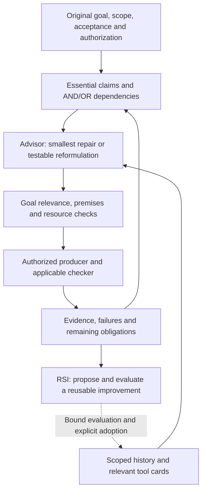

# RDS 5.8: goals, architecture and collaboration plan

[简体中文](5.8-vision.zh-CN.md) · [Documentation](README.md) · [Earlier roadmap](roadmap.md) · [Contributing](../CONTRIBUTING.md)

**Design proposal, 2026-10-02.** The implementation baseline is `ca02983` on `main`; [PR #18](https://github.com/kongtou20070406/research-direction-selector/pull/18) contains additional work under review. This document publishes the intended 5.8 scope so contributors can work together. It changes no runtime, installed Skill, release tag or acceptance standard. Source metadata already uses 5.8.0, but the latest published release is [5.7.0](https://github.com/kongtou20070406/research-direction-selector/releases/tag/v5.7.0); 5.8.0 remains **Unreleased**. Publication requires the maintainer's approval.

## The result we want

RDS should help an agent choose a useful next research step, notice when that step no longer serves the original goal, and propose a testable alternative. Reliable records and checks support that decision; creating more records is not itself research progress.

The five components remain **Skill, execution and acceptance kernel, research state and memory, Advisor, and RSI**. Theory, empirical research and mixed work share these components, the existing ledger and resource accounting. Domain solvers remain optional. RDS must work without a private mathematics Skill, a container, a second memory service or a paid model endpoint.

For 5.8, success means a researcher can inspect **what remains open, why this action addresses it, what result would change the next decision, and what the action costs**. It does not mean every problem is solvable, every trajectory improves monotonically, or software regressions establish scientific superiority.

## One decision loop, three acceptance contracts

| Mode | What the next step can settle | What must remain separate |
| --- | --- | --- |
| **Theory** | A stated obligation, a checked counterexample, or a precise unresolved part. | Numerical discovery, exact verification, local optimality and global proof. No invented ML metric or mandatory competing hypothesis. |
| **Empirical** | A task comparison, a discriminating observation or an intervention check. | Score change, mechanism support and search-policy benefit; missing or incomparable measurements remain unknown. |
| **Mixed** | A conditional theorem and its application to executed code/data. | The theorem's validity and whether its premises hold in the experiment. Empirical failure can expose a correspondence error without refuting the conditional theorem. |

Keep the original statement, quantifiers, domain, assumptions and completion standard visible to the consumer. For an experimental objective, retain its metric, eligible data, comparison and resource scope. A smaller intermediate result is useful only with an explicit connection to that objective. A construction upper bound does not satisfy a request for a matching global lower bound or an exact optimum.

Material method ambiguity needs a short clarification before dependent work. For example, “no numerical search” can restrict heuristic candidate generation while allowing exact interval verification; RDS must not choose that interpretation silently. External challenge rules do not expand the user's authorization. Continue unaffected work while clarification is pending.

## Make the hypergraph part of selection

The dependency graph should contain the **decision-relevant claims**, not every algebraic operation or audit file. Give nodes their exact scoped claim and source; give each hyperedge its premises, conclusion and justification. An AND edge needs every premise. OR edges represent genuinely different sufficient routes. Proposed edges carry their own proof obligations.

The intended integration is:

1. Preserve the original completion predicates as graph goals; explicitly map local questions to them.
2. Pass the actual dependency map into Advisor before selecting an action, instead of constructing it after the computation.
3. Compute bounded blockers and ready obligations. Keep cycles, missing sources and search truncation visible.
4. Require the selected action to identify its target and an inspectable declared dependency path to an original goal; retain each premise/edge's evidence state and revisit the current map at admission and continuation. A producer can address a ready unresolved obligation or proposed reduction; it need not start with a fully proved path.
5. After new evidence, revisit affected dependencies and show how the next selection changes. Do not treat a `SUPPORTED` input label or graph reachability as a proof.

Candidate interface names being developed include `dependency_map`, `goal_contribution` and `require_goal_link`. These are **implementation proposals**, not supported public-main flags in this document. Public examples and migration guidance must accompany their implementation. The prospective guard must preserve ordinary operational-wrapper compatibility while making the stricter goal-bound workflow explicit.

The graph cannot determine that an arbitrary claimed lemma is true or that every necessary branch has been represented. Claim correspondence, reduction completeness and checker soundness remain explicit scientific obligations. A dependency path through an already settled lemma must not authorize doing the same work again while the actual missing premise is ignored.

Admission checks cover the integrated RDS entry points. An agent can still bypass them with a direct shell command, so Skill guidance and observable evidence consumption are part of the delivery; the existence of a guard does not establish that a research conversation used it.

## What “help the AI jump” means

A useful jump changes a premise, representation, intervention, reduction or computational method **and changes a consequence we can check**. Giving the old route a new name, selecting a fashionable theory or increasing a model's size does not establish that change.

Advisor should compare one serious reformulation with the smallest plausible repair of the current route:

- Identify the observation or obstruction the current route does not explain.
- State what changes, what stays fixed and which original goal the alternative serves.
- Identify a consequence that distinguishes the alternatives; specify required evidence and a stopping or revision condition.
- Select a bounded check within existing method and resource authorization, or identify the exact missing reduction, input or backend.
- Use its result to continue, revise or defer. An unresolved check stays unresolved.

This covers both an **explanatory change** and a **computational change**. Switching from repetitive symbolic expansion to certificate-producing computation can help without changing the theorem. Changing a dynamical model can be a hypothesis without proving that the new model will work. Neither switch automatically improves the scientific result.

Stagnation review should detect unchanged rejected mechanisms, repeat checks whose valid result already exists, oscillation without new evidence, and actions disconnected from the goal. Compare structured interventions, premises, relevant observations and scope; ID/hash equality alone cannot recognize all semantic paraphrases. Changed evidence and legitimate replication must remain possible.

Do not encode “two failures imply a capacity limit”, a fixed hierarchy of universally superior theories, or a forced SSM/SOS conversion. A measured plateau does not establish a mathematical lower bound. Suggestions cannot grant new resources, delete evidence or change the objective.

## A conditional theory and method library

Preload compact, sourced **tool cards**, then retrieve only those relevant to the current obstruction. Each card needs applicability conditions, required inputs, a concrete checking method, limitations, a dated primary source and the next decision it could change. A card describes a method; lookup does not install a backend or run it.

Start with coverage of recurring failure patterns, expand from observed gaps, and remove redundant cards. Card count is not a release criterion. Default retrieval should return a small shortlist, normally one to three cards, with detail available by locator. Load specialized packs only when requested; keep large derivations and assets outside the conversation.

| Coverage area | Useful operations to expose | Boundary that must travel with the card |
| --- | --- | --- |
| Goal and intervention checks | Objective-bias review, causal alternatives, actual-entrypoint preflight. | A proxy improvement or renamed loss does not verify the intended intervention. |
| Dynamics and representations | Local Jacobian/residual checks, horizon scaling, state augmentation, distribution transport. | Local estimates do not prove global stability; a fixed horizon and the chosen state need justification. |
| Learning and generalization | Equivariance, information bottlenecks, width parameterization, description length, algorithmic alignment. | Symmetry, compression and scaling assumptions must fit the task; none is a universal recipe for better accuracy. |
| Exact computation and proof | Symbolic constraints, finite reductions, interval certificates, relaxation/duality, proof decomposition. | Candidate generation, checked feasibility and global exhaustiveness are distinct. A numerical solver requires an exact certificate for an exact claim. |
| Number theory and algebra | Generate exact objects and invariants, inspect small groups, form conjectures, search for counterexamples. | Finite samples and a database search do not prove a universal theorem or establish novelty. |
| Foundations and metamathematics | Audit axioms and encodings; inspect proof structure, bounded models and known logical-strength results. | Independence or minimal-axiom claims need a specified base theory and actual proof, not a classification guessed from prose. |
| Transfer between formulations | Quotients, invariants, dualities, functors or explicit translations with transport obligations. | A translation must preserve the relevant statement and premises; it need not make the target problem easier. |

The metamathematics idea is incorporated as **checkable operations**. Proof theory, model theory, reverse mathematics, set theory, computability, category theory, type theory and algorithmic information can motivate cards when an applicable procedure exists. They are not an exhaustive taxonomy or eight compulsory gates.

In particular, cut elimination does not promise shorter proofs, general logical-strength recognition is not an instant decision procedure, and type equivalence does not automatically transfer arbitrary scientific results. Lean checks a proposition encoded in its environment with its actual axioms; correspondence to the researcher's original question still needs review. See the [Lean axioms](https://lean-lang.org/doc/reference/latest/Axioms/), [proof validation](https://lean-lang.org/doc/reference/latest/ValidatingProofs/), [GAP group library](https://gap-packages.github.io/smallgrp/doc/chap1.html) and [Simpson's reverse-mathematics text](https://sgslogic.net/t20/sosoa/promo.html) for the respective boundaries.

## Prevent goal evasion and audit theatre

Retain the minimum evidence needed to support or reproduce a decision. Reuse a compatible frozen certificate or completed run before generating another wrapper. Revalidate changed sources, affected dependencies and actual trust boundaries; do not repeatedly audit unchanged bytes for visibility.

Distinguish three kinds of progress: operational reliability, scientific evidence and progress toward the original completion standard. A damaged-certificate regression can improve a checker while leaving the requested theorem open. A reliability repair is legitimate when it removes a concrete blocker; it must be reported as that repair, with its cost and the next scientific step.

Before costly enumeration or training, inspect a bounded representative workload when authorized. Report measured throughput, remaining work or frontier growth, expression/memory growth, uncertainty and the available time window. An ETA is only as reliable as its denominator and stationarity assumptions. An unexplored or growing frontier must not be presented as a known finite amount of remaining work. Enforce actual resource limits; use an uncertain forecast to recommend reconsideration, not to manufacture an impossibility theorem or silently kill a legitimate run.

Side tasks need a dependency connection to the active objective or an explicit maintenance justification. Moving to another problem size, easier metric or weaker statement needs separate authorization if it changes the goal or material investment. Do not delete such work automatically. Do not forbid all lower-bound work until an exact candidate polynomial exists: either can be a useful route under an appropriate proof plan.

## Reduce entry friction and context cost

Reuse `exec`, scoped checkpoints and existing source bindings. Complete deterministic bookkeeping—protocol identity, timestamps, file hashes, existing question/scope and operational IDs—inside the program. Preserve the original user-facing name if an operational backend needs a shorter ID. Normalize documented aliases and compatible record shapes at the shared entry point, with actionable field-level repair messages.

Never autocomplete authorization, a budget, a scientific claim, a falsifier or missing evidence. An ambiguous or malformed explicit action must not be replaced silently with an executable guess. Preserve original rejection records and ensure rejected dispatch starts no computation and charges no new execution allowance.

Full raw results, certificates and reasons stay in the existing CAS/ledger. Return a bounded digest with a usable locator; status does not rehash every historical asset. A meaningful advance or blocker can produce one factual line such as `RDS｜选路✓→执行✓｜证明?｜<sha8>`. Report only evidenced stages, explain the concrete advance when needed, and avoid cards on every tool call. Invocation counts measure use, not scientific effectiveness.

Measure output bytes, latency and retrieval/parse work separately. Do not convert byte reductions into token savings without a specified tokenizer. A larger theory library must not require loading the entire library into every request.

## Status at the proposal baseline

| Layer | Status and evidence | Remaining 5.8 work |
| --- | --- | --- |
| Goal/assets and local tools | On baseline: [native objective binding, assets and tool extraction/validation/registration](native-research.md). Storage does not certify a theorem. | Connect original goal obligations to prospective selection; preserve bound objectives through continuation. |
| Dependencies | On baseline: bounded [AND/OR analysis](../scripts/rds_hypergraph.py) and [dependency tests](../tests/test_hypergraph.py). | Consume the actual map in Advisor/admission; reject goal-disconnected and circular support without rejecting valid multi-step routes. |
| Theory/empirical/mixed entry | On baseline: [entry workflow](agent-entry.md), obligation checks, scoped choice, [method limits](../scripts/rds_methods.py) and [capability checks](../scripts/rds_capabilities.py). | Repair verified format/operational-ID friction at shared boundaries; keep malformed/history-integrity rejection meaningful. |
| Selection and reformulation | Baseline has research-choice review. [PR #18](https://github.com/kongtou20070406/research-direction-selector/pull/18) adds scoped reformulation, next-move guidance, initial tool cards and compact diagnostics. **Not merged.** | Complete goal linkage, repeat-check review and conditional library coverage with public positive/negative examples. |
| Execution, evidence and recovery | On baseline: [runner/development loop](development-loop.md), [costs and resources](resource-planning.md), receipts and checkpoints. PR #18 improves brief failure visibility. | Preserve live-run reuse, failures, parent budgets and precise errors across every affected entry point. |
| RSI | On baseline: [native local tools](native-research.md) and [bound replay/adoption/rollback](rsi-evolution.md). | Adopt only evaluated scoped improvements; tool validation and finite replay must not be relabelled as independent policy gain. |

Unmerged development candidates do not become installed capabilities because this document names them. This plan supplements the dated M01–M10 roadmap; it does not rewrite its historical delivery claims. Priority is the observed direction-selection, goal-relevance and usability defects. A new external benchmark campaign or autonomy-level claim is not a prerequisite for these repairs.

## Parallel work packages and acceptance

Claim a package in an issue or PR before editing shared boundaries; assign file ownership and link dependencies. Keep proposals, implementation and validation distinct. A package is complete when its real entry-point behavior and documentation satisfy its stated checks, not when its file count grows.

| Package | Primary responsibility / dependency | Reviewable deliverable and essential acceptance |
| --- | --- | --- |
| **V1 Goal and dependency consumer** | Advisor, hypergraph integration, native objective flow. Uses baseline records. | Public scoped AND/OR fixture; disconnected goal, missing AND premise, proposed edge and circular support remain unresolved/blocked as appropriate; a valid alternative, valid multi-step route and ready action to prove a proposed reduction remain selectable without promoting unproved claims. |
| **V2 Stagnation and alternative selection** | Advisor history/next-move review. Coordinate with V1. | Unchanged rejected route and repeated settled check get actionable review; relevant new evidence, changed scope and justified replication can reopen; unrelated old warnings do not derail a healthy route. |
| **V3 Conditional tool packs** | Tool-card data, bounded loader and primary sources. Depends on the consumer contract, not V1's entire implementation. | Relevant lookup with real locators, dated applicability and digest bounds; specialized packs are not loaded for unrelated requests. Include a public metamathematics workflow, such as auditing the actual axioms of a specified encoded claim/environment when the supported backend is available; invalid sources or unsupported requests stay unresolved. Label guidance-only cards separately from executable capabilities. No unsupported theorem or mandatory theory hierarchy. |
| **V4 Low-friction entry and continuation** | Common CLI/quick entry, checkpoint adapters and runner handoff. Coordinate shared edits with V1/V2. | Long safe names and compatible legacy shapes work; unsafe/ambiguous/corrupt inputs still fail before dispatch. Existing runs are reused; no budget reset, duplicate launch or evidence overwrite. |
| **V5 Proportionate evidence and feasibility** | Resource/evidence consumers and compact status. Reuse existing records. | Changed-source checks and raw failures remain inspectable; no audit rerun for an unchanged valid result. Forecasts identify measurement scope and unknown remaining work; maintenance is not reported as goal completion. |
| **V6 Skill, public examples and release review** | Skill and guides; consumes the validated interfaces of V1–V5. | Theory, empirical and mixed examples reach real CLI behavior. Ambiguous method limits ask briefly. Original completion obligations remain visible, and summaries distinguish execution, scoped evidence and full completion. |

Contributors should include a minimal public or labelled synthetic reproducer, the affected requirement, actual command/result, relevant failure and compatibility checks, and material limits. Keep private research histories, `.rds/` records, credentials and large datasets out of PRs. Use the existing ledger/CAS instead of introducing a second status system. See [contribution checks](../CONTRIBUTING.md).

Release review should confirm the final integrated behavior, supported interfaces, package resources, migration boundaries and relevant CI/optional-backend coverage. Explain skips and unresolved defects. Obtain maintainer approval before merging/publishing according to [versioning policy](versioning.md). This documentation PR can be reviewed independently of PR #18; accepting the plan does not accept that implementation or authorize a release.
