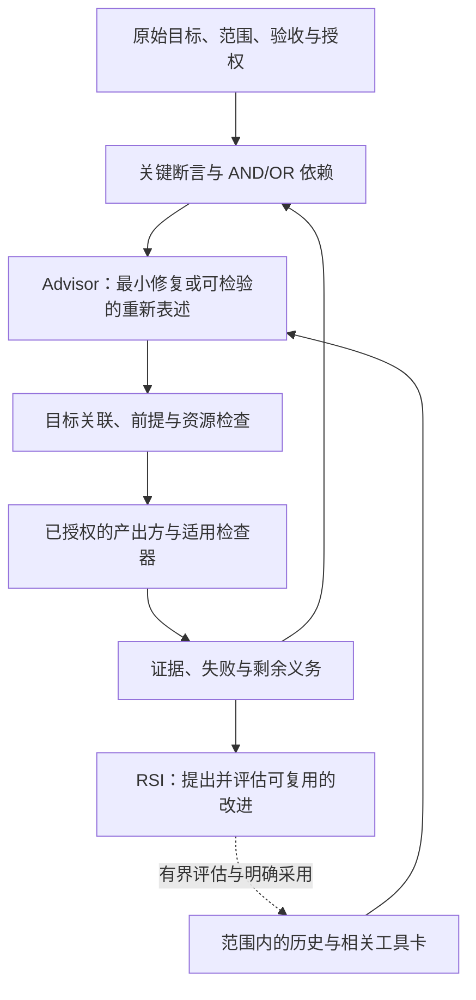

# RDS 5.8：目标、架构与协作计划

[English](5.8-vision.md) · [文档索引](README.zh-CN.md) · [此前的路线图](roadmap.md) · [贡献指南](../CONTRIBUTING.zh-CN.md)

**设计提案，2026-10-02。** 实现基线为 `main` 上的 `ca02983`；[PR #18](https://github.com/kongtou20070406/research-direction-selector/pull/18) 包含正在审查的后续工作。本文公开 5.8 的预期范围，便于贡献者协作。它不改变运行时、已安装的 Skill、发布标签或验收标准。源码元数据已使用 5.8.0，但最新已发布版本为 [5.7.0](https://github.com/kongtou20070406/research-direction-selector/releases/tag/v5.7.0)；5.8.0 仍为 **Unreleased（未发布）**。发布需要维护者批准。

## 我们希望得到的结果

RDS 应帮助智能体选择有用的下一步研究行动，发现这一步何时已无法服务原始目标，并提出可检验的替代方案。可靠记录和检查为决策提供支撑；增加记录本身不等于研究进展。

五个组件仍为 **Skill、执行与验收内核、研究状态与记忆、Advisor、RSI**。理论、实证和混合研究共用这些组件、现有账本与资源记账。领域求解器保持可选。RDS 必须能在没有私有数学 Skill、容器、第二套记忆服务或付费模型端点的情况下工作。

对 5.8 而言，成功意味着研究者能够检查：**还有什么未解决、为什么这个行动能处理它、什么结果会改变下一次决策，以及行动的成本是多少**。这不意味着每个问题都可解、每条研究轨迹都单调改善，或软件回归测试能证明科学上的优越性。

## 一个决策循环，三类验收契约

| 模式 | 下一步可以解决什么 | 必须区分什么 |
| --- | --- | --- |
| **理论** | 一项明确的义务、一个经过检查的反例，或一个精确界定的未解决部分。 | 数值发现、精确验证、局部最优与全局证明。不得编造机器学习指标，也不强制要求竞争假设。 |
| **实证** | 一次任务比较、一项能区分方案的观察，或一次干预检查。 | 分数变化、机制支持与搜索策略收益；缺失或不可比的测量仍应记为未知。 |
| **混合** | 一个条件定理，以及它对实际执行的代码或数据的应用。 | 定理本身的有效性，以及实验是否满足其前提。实证失败可以暴露对应关系错误，而不一定推翻条件定理。 |

让使用方始终能看到原始命题、量词、定义域、假设和完成标准。对于实验目标，保留其指标、符合条件的数据、比较对象和资源范围。较小的中间结果只有在明确连接到原目标时才有用。构造给出的上界不能满足关于匹配的全局下界或精确最优值的要求。

方法上的歧义若会产生实质影响，必须先简短澄清，再进行依赖该解释的工作。例如，“不做数值搜索”可能只限制启发式候选生成，而仍允许精确区间验证；RDS 不得默默选择这种解释。外部挑战规则不能扩大用户授权。等待澄清时，继续不受影响的工作。

## 让超图参与选路

依赖图应包含**影响决策的断言**，而非每项代数操作或审计文件。每个节点都应给出范围精确的断言及其来源；每条超边都应给出前提、结论与理由。AND 边需要满足所有前提。OR 边表示确实不同的充分路径。拟议边也有自己的证明义务。

预期的集成方式是：

1. 将原始完成判据保留为图中的目标，并明确把局部问题映射到这些目标。
2. 在选定行动之前，将实际依赖图交给 Advisor，而不是在计算完成后才构图。
3. 在有界范围内计算阻塞项和已具备条件的义务。明确保留环、缺失来源和搜索截断信息。
4. 要求所选行动指出其目标节点，以及所声明的、通向原始目标的可检查依赖路径；保留每项前提和每条边的证据状态，并在准入和继续执行时重新检查当前依赖图。产出方可以处理已具备执行条件但尚未解决的义务，或拟议的归约；不必先有一条全部证明完毕的路径。
5. 获得新证据后，重新检查受影响的依赖，并展示下一次选路如何变化。不得把输入中的 `SUPPORTED` 标签或图上的可达性当作证明。

正在开发的候选接口名包括 `dependency_map`、`goal_contribution` 和 `require_goal_link`。这些是**实现提案**，本文不将其列为公开 `main` 已支持的参数。实现时必须同时提供公开示例和迁移说明。拟议的门禁应保留普通运行包装器的兼容性，同时明确说明更严格、绑定目标的工作流。

依赖图无法判定任意声称的引理是否为真，也无法判定所有必要分支是否都已表示出来。断言对应关系、归约完备性和检查器的可靠性仍是明确的科学义务。经过已解决引理的依赖路径，不能在忽略实际缺失前提的同时授权重复相同工作。

准入检查覆盖已集成的 RDS 入口。智能体仍可以用直接 shell 命令绕过它们，因此 Skill 指导和可观察的证据使用也是交付的一部分；门禁存在并不能证明某次研究对话实际使用了它。

## “帮助 AI 跳出来”意味着什么

有用的跳转会改变前提、表示、干预、归约或计算方法，**并改变一个我们可以检查的后果**。给旧路线换个名字、选用流行理论，或增大模型规模，都不能证明出现了这种变化。

Advisor 应将一个认真的重新表述方案，与当前路线最小且合理的修复方案进行比较：

- 找出当前路线无法解释的观察或障碍。
- 说明什么改变、什么保持不变，以及替代方案服务于哪个原始目标。
- 找出能区分方案的后果，明确所需证据，以及停止或修订条件。
- 在现有方法与资源授权内选择有界检查，或指出具体缺少的归约、输入或后端。
- 根据结果继续、修订或暂缓。尚未解决的检查仍应保持未解决状态。

这既包括**解释方式的变化**，也包括**计算方式的变化**。从反复符号展开转向可产出证书的计算，可以在不改变定理的情况下提供帮助。改变动力学模型可以构成一个假设，但不能证明新模型一定有效。两种转换都不会自动改善科学结果。

停滞审查应识别：未改变的已拒绝机制、已有有效结果却重复进行的检查、没有新证据的来回切换，以及与目标脱节的行动。应比较结构化的干预、前提、相关观察和范围；仅凭 ID 或哈希相等无法识别所有语义改写。必须允许证据变化和正当复现。

不得编码“失败两次就意味着达到能力上限”、普遍更优理论的固定层级，或强制转向 SSM/SOS。测得的平台期不能确立数学下界。建议不能授予新资源、删除证据或改变目标。

## 带适用条件的理论与方法库

预载简洁、有来源的**工具卡**，再只检索与当前障碍有关的卡片。每张卡都需要适用条件、所需输入、具体检查方法、局限、注明日期的一手来源，以及它可能改变的下一次决策。卡片描述一种方法；查阅卡片不等于安装后端或执行方法。

先覆盖反复出现的失败模式，再根据实际发现的空白扩展，并移除冗余卡片。卡片数量不是发布标准。默认检索应返回少量候选，通常为一至三张，并提供可定位的详细内容。仅在当前请求需要时加载专门工具包；大型推导和资产留在对话之外。

| 覆盖领域 | 可提供的有用操作 | 必须随卡片保留的边界 |
| --- | --- | --- |
| 目标与干预检查 | 目标偏置审查、因果替代解释、实际入口预检。 | 代理指标改善或损失函数改名，不能验证预期干预。 |
| 动力学与表示 | 局部 Jacobian/残差检查、时间跨度缩放、状态扩展、分布传输。 | 局部估计不能证明全局稳定性；固定时间跨度和所选状态都需要依据。 |
| 学习与泛化 | 等变性、信息瓶颈、宽度参数化、描述长度、算法对齐。 | 对称性、压缩与缩放假设必须适合任务；它们都不是普遍提高准确率的配方。 |
| 精确计算与证明 | 符号约束、有限归约、区间证书、松弛与对偶、证明分解。 | 候选生成、经过检查的可行性与全局穷尽性是不同的。数值求解器需要精确证书，才能支持精确断言。 |
| 数论与代数 | 生成精确对象与不变量、检查小群、形成猜想、搜索反例。 | 有限样本和数据库检索不能证明全称定理，也不能确立新颖性。 |
| 基础与元数学 | 审查公理与编码；检查证明结构、有界模型和已知逻辑强度结果。 | 独立性或最小公理断言需要明确的基础理论和实际证明，不能从文字描述猜测分类。 |
| 表述之间的迁移 | 商、不变量、对偶、函子，或附带迁移义务的明确翻译。 | 翻译必须保留相关命题与前提，但未必会让目标问题更容易。 |

元数学思路以**可检查的操作**纳入。存在适用程序时，证明论、模型论、逆向数学、集合论、可计算性、范畴论、类型论和算法信息可以启发工具卡。它们不是穷尽分类，也不是八道必经门禁。

具体而言，割消去不保证证明更短，一般性的逻辑强度识别不是即时判定程序，类型等价也不会自动迁移任意科学结果。Lean 在其环境和实际公理下检查所编码的命题；它与研究者原始问题的对应关系仍需要审查。相关边界参见 [Lean 公理](https://lean-lang.org/doc/reference/latest/Axioms/)、[证明验证](https://lean-lang.org/doc/reference/latest/ValidatingProofs/)、[GAP 群库](https://gap-packages.github.io/smallgrp/doc/chap1.html)和 [Simpson 的逆向数学教材](https://sgslogic.net/t20/sosoa/promo.html)。

## 防止绕开目标和表演式审计

保留支撑或复现决策所需的最少证据。在生成另一个包装器之前，先复用兼容的冻结证书或已完成运行。重新验证发生变化的来源、受影响的依赖和实际信任边界；不要为了展示工作而反复审计未变的字节。

区分三种进展：运行可靠性、科学证据，以及向原始完成标准的推进。损坏证书的回归测试可以改善检查器，但用户要求的定理仍可能未解。可靠性修复若能消除具体阻塞就是正当工作；报告时应明确它是这项修复，说明成本和下一步科学行动。

在高成本枚举或训练前，若已获授权，应检查一个有界且有代表性的工作负载。报告实测吞吐量、剩余工作或搜索前沿增长、表达式和内存增长、不确定性，以及可用时间窗口。ETA 的可靠程度取决于其分母和平稳性假设。未探索或持续增长的前沿，不能被描述为已知有限的剩余工作量。执行实际资源限制；用不确定预测建议重新考虑，而不是制造不可能性定理，或默默终止正当运行。

支线任务需要与当前目标有依赖连接，或有明确的维护理由。若改换问题规模、更容易的指标或更弱的命题会改变目标或实质投入，就需要另行授权。不要自动删除此类工作。也不要在精确候选多项式出现前禁止所有下界工作：在适当的证明计划下，两者都可能是有用路线。

## 降低入口摩擦与上下文成本

复用 `exec`、限定范围的检查点和现有来源绑定。在程序内部完成确定性的记录工作：协议标识、时间戳、文件哈希、已有问题与范围，以及运行 ID。如果运行后端需要更短的 ID，仍应保留面向用户的原始名称。在公共入口统一处理已文档化的别名与兼容记录格式，并提供字段级、可操作的修复信息。

绝不自动补全授权、预算、科学断言、证伪条件或缺失证据。明确给出的行动若有歧义或格式错误，不能被默默替换成一个可执行的猜测。保留原始拒绝记录，并确保被拒绝的派发不会启动计算，也不会扣除新的执行额度。

完整原始结果、证书和理由保留在现有 CAS/账本中。返回有大小限制的摘要和可用定位信息；状态输出不应重新哈希全部历史资产。实质进展或阻塞可以用一行事实表示，例如 `RDS｜选路✓→执行✓｜证明?｜<sha8>`。只报告有证据支持的阶段，必要时解释具体进展，避免每次工具调用都输出卡片。调用次数衡量使用量，不衡量科学有效性。

分别测量输出字节数、延迟，以及检索和解析工作量。没有指定 tokenizer 时，不得把字节减少换算为 token 节省。理论库扩展不应要求每次请求都加载整个库。

## 提案基线上的状态

| 层 | 状态与证据 | 剩余的 5.8 工作 |
| --- | --- | --- |
| 目标、资产与本地工具 | 基线已有：[原生目标绑定、资产和工具提取、验证、注册](native-research.md)。存储不等于定理认证。 | 将原始目标义务接入后续选路；继续执行时保留已绑定目标。 |
| 依赖 | 基线已有：有界 [AND/OR 分析](../scripts/rds_hypergraph.py)和[依赖测试](../tests/test_hypergraph.py)。 | 在 Advisor/准入中使用实际依赖图；拒绝与目标脱节和循环支撑，同时允许有效的多步路线。 |
| 理论、实证与混合入口 | 基线已有：[入口工作流](agent-entry.md)、义务检查、限定范围的选择、[方法限制](../scripts/rds_methods.py)和[能力检查](../scripts/rds_capabilities.py)。 | 在公共边界修复已确认的格式和运行 ID 摩擦；保留格式错误与历史完整性拒绝的实际作用。 |
| 选路与重新表述 | 基线已有研究选择审查。[PR #18](https://github.com/kongtou20070406/research-direction-selector/pull/18) 增加了限定范围的重新表述、下一步指导、初版工具卡和简洁诊断。**尚未合并。** | 完成目标连接、重复检查审查和有条件的方法库覆盖，并提供公开的正反例。 |
| 执行、证据与恢复 | 基线已有：[运行器与开发循环](development-loop.md)、[成本与资源](resource-planning.md)、回执和检查点。PR #18 改善简要输出中的失败可见性。 | 在所有受影响入口保留正在运行任务的复用、失败、上级预算和精确错误。 |
| RSI | 基线已有：[原生本地工具](native-research.md)和[有界回放、采用、回滚](rsi-evolution.md)。 | 只采用经过评估、适用范围明确的改进；工具验证和有限回放不能改称为独立的策略收益。 |

尚未合并的开发候选，不会因为本文提到它们就成为已安装能力。本计划补充注明日期的 M01–M10 路线图，不改写其历史交付声明。优先处理已观察到的方向选择、目标关联与易用性缺陷。新的外部基准测试项目或自主等级声明，不是修复这些问题的前提。

## 并行工作包与验收

编辑公共边界之前，在 issue 或 PR 中认领工作包；明确文件归属并链接依赖。区分提案、实现与验证。工作包完成的标准是实际入口行为和文档满足所列检查，而非文件数量增加。

| 工作包 | 主要职责与依赖 | 可审查交付物与必要验收 |
| --- | --- | --- |
| **V1 目标与依赖消费方** | Advisor、超图集成、原生目标流程。使用基线记录。 | 公开的限定范围 AND/OR 样例；目标脱节、缺失 AND 前提、拟议边和循环支撑按情况保持未解决或阻塞；有效替代方案、有效多步路线，以及已具备条件、用于证明拟议归约的行动仍可选择，同时不将未证明断言升级为已证明。 |
| **V2 停滞与替代方案选择** | Advisor 历史和下一步审查。与 V1 协调。 | 未改变的已拒绝路线和重复的已解决检查得到可操作的审查；相关新证据、范围变化和有依据的复现可以重新开启；不相关的旧警告不会干扰健康路线。 |
| **V3 有条件的工具包** | 工具卡数据、有界加载器和一手来源。依赖消费方契约，而非 V1 的全部实现。 | 相关检索提供实际定位信息、注明日期的适用条件和摘要大小限制；不为无关请求加载专门工具包。包含一个公开元数学工作流，例如在受支持后端可用时，审查指定的已编码断言及其环境所实际使用的公理；无效来源或不受支持的请求保持未解决。仅提供指导的卡片与可执行能力分别标注。不包含无依据的定理或强制理论层级。 |
| **V4 低摩擦入口与继续执行** | 公共 CLI/快捷入口、检查点适配器和运行器交接。与 V1/V2 协调共享编辑。 | 安全的长名称和兼容旧格式能够工作；不安全、有歧义或损坏的输入仍在派发前失败。复用现有运行；不重置预算、不重复启动、不覆盖证据。 |
| **V5 适度的证据与可行性检查** | 资源与证据消费方、简洁状态。复用现有记录。 | 变化来源的检查和原始失败仍可查看；不为未变的有效结果重跑审计。预测指出测量范围和未知剩余工作；维护不被报告为目标完成。 |
| **V6 Skill、公开示例与发布审查** | Skill 与指南；使用 V1–V5 已验证的接口。 | 理论、实证与混合示例达到实际 CLI 行为。方法限制有歧义时简短询问。原始完成义务保持可见，摘要区分执行、范围内证据与完整完成。 |

贡献者应提供最小公开复现材料或注明为合成的复现材料、受影响要求、实际命令与结果、相关失败和兼容性检查，以及实质限制。私有研究历史、`.rds/` 记录、凭据和大型数据集不要放入 PR。使用现有账本/CAS，不引入第二套状态系统。参见[贡献检查](../CONTRIBUTING.zh-CN.md)。

发布审查应确认最终集成行为、受支持接口、打包资源、迁移边界，以及相关 CI 和可选后端覆盖。说明跳过项和未解决缺陷。按[版本策略](versioning.md)在合并或发布前取得维护者批准。此文档 PR 可以独立于 PR #18 审查；接受计划不等于接受该实现，也不授权发布。
