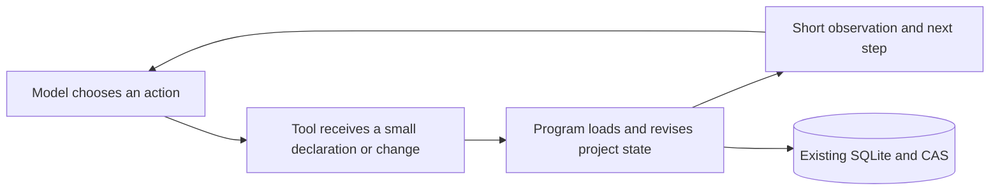

# TMS in Codex and Pi agent loops

Sources checked on **2026-10-02**. Local binaries report Codex CLI **0.160.0** and Oh My Pi **18.4.3**. Upstream pages describe current interfaces; they are not a claim that every installed binary implements every upstream hook.

## Evidence and design choices

| Primary source | Observed contract | RDS choice inferred from it |
| --- | --- | --- |
| [OpenAI Codex app-server](https://developers.openai.com/codex/app-server/) | The host executes client tools and returns content; the harness owns thread continuation/compaction. Dynamic tools remain experimental. | Use the existing shell entry or an explicit host wrapper. Keep project state in the application; return a brief observation rather than injecting a table into history. |
| [Pi agent core](https://github.com/earendil-works/pi/blob/main/packages/agent/README.md) | Tool results precede the next model turn. Model-facing messages pass through `transformContext`/`convertToLlm`; `finishTurn` can otherwise keep requesting responses indefinitely. | One declaration/change calls one reducer. Do not force a maintenance subloop or an always-continue hook. |
| [Oh My Pi tool types](https://github.com/can1357/oh-my-pi/blob/main/packages/agent/src/types.ts) | Tool results distinguish model-facing `content` and UI/log `details`. | Put only the short RDS observation in content; store detailed tables in CAS and pass a locator to UI/logs. Check a custom converter before relying on details remaining outside model context. |
| [Anthropic tool engineering](https://www.anthropic.com/engineering/writing-tools-for-agents) | Relevant bounded responses, clear identifiers and actionable errors help agents; excessive tool decomposition adds work. | Combine input repairs, dependency update, analysis and persistence in one tool call. Return bounded ambiguity diagnostics once; do not add separate mandatory format/audit/repair calls. |

These are interface decisions, not evidence of lower live-model cost. The CLI and provider-independent Python adapter are implemented; no Codex/Pi plugin, SDK dependency, model invocation or harness configuration change is installed by this PR.



The harness supplies the root from local context. TMS runs when meaningful evidence/dependencies change or an explanation is needed. It does not infer scientific entailment from arbitrary tool output, mark a timeout as a refutation, or use stored labels as proof. A method's construction, transfer and feasibility may be relevant research questions with declared scopes; they are not a universal three-stage gate. Receipt-to-refutation/checker integration remains scoped follow-up work.

## Reproducible serialized-byte comparison

```powershell
python -B examples/tms-agent-loop/run.py
```

The scripted application trace starts with 50 claims and one AND rule, then withdraws and restores one claim. Both observations have the expected goal status (`UNKNOWN`, `DECLARED_SUPPORTED`), with two program tool calls. It compares delta arguments with serializing the whole stored map at each continuation, and brief observations with the exact full CAS results.

| Continuation traffic | Whole-map/full-result comparator | Delta/brief |
| --- | ---: | ---: |
| Input UTF-8 bytes | 13,433 | 127 |
| Output UTF-8 bytes | 31,076 | 1,445 |

Observed locally on Windows, Python 3.13.5. Output byte counts vary with temporary path length. Initial declarations/setup are excluded, and the whole-map path is a serialization comparator, not a measured competing LLM implementation. These numbers do **not** establish billed-token savings, end-to-end latency, decision quality or scientific gain. A live-model comparison would need the same tasks, model/harness versions, initial inputs, total budgets and decision acceptance.

The regression suite checks real CLI continuation without passing a table/record path, app-side Advisor/exec context injection, immutable provenance, atomic clarification failures, scope/limit conflicts, concurrency and blob integrity. The transport simulation uses scripted actions, not a paid model.
