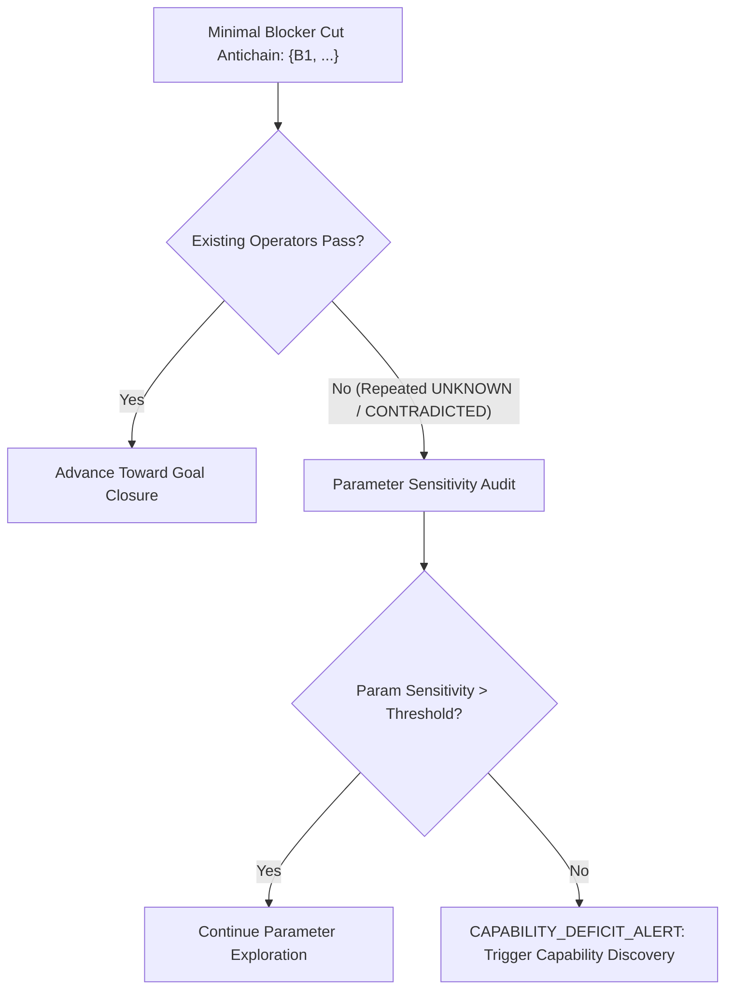
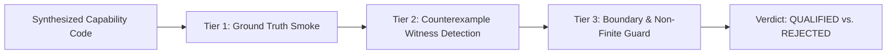

# Capability Discovery, Mastery Verification, and Operator Crystallization

[简体中文](capability-mastery-loop.zh-CN.md) · [Documentation](README.md) · [5.8 Vision](5.8-vision.md) · [Compass & TMS](compass-tms-specification.md) · [Issue #40](https://github.com/kongtou20070406/research-direction-selector/issues/40)

## 1. Motivation and Problem Statement

In autonomous scientific research, the greatest bottleneck is neither compute scale nor deductive fluency:

> **The model lacks the meta-cognitive mechanism to discover when it suffers from a capability deficit, and the disciplined methodology to synthesize, verify, and master that capability.**

### 1.1 The Two Pathological Traps of LLM Capabilities
1. **The "Planet Vulcan" Optimization Trap (Failure to Discover):**
   When an AI hits an epistemological impasse—demonstrated by 8,633 tool calls in disk-covering ($r_D(100) \in [0.113, 0.115]$) and 113 rounds of ReFRM deep learning optimization (NFE-128 Lyapunov energy divergence)—it naively assumes its existing tool palette is sufficient. It burns hours perturbing continuous parameters, oblivious to the fact that it lacks an essential qualitative capability (e.g. rational Voronoi dual-cell reduction or multi-step contractive energy dissipation monitoring).
2. **The Ephemeral Code Illusion (Failure to Master):**
   When an LLM attempts to fill a tool gap, it typically writes an ad-hoc 50-line Python snippet in working memory. Such scripts lack explicit schemas, fail-closed boundaries, and counterexample falsification fixtures. When the task or session terminates, the code evaporates. Subsequent agents re-enter the same blind search, perpetually reinventing brittle, unverified wheels.

### 1.2 Epistemological Connection to the Abductive "Jump"
As established in *Position: LLMs can't jump* (Tom Zahavy et al., ICML 2025/2026), conceptual leaps ($E \xrightarrow{\text{Jump}} A$) require cognitive instruments. Einstein could not complete General Relativity until he discovered the gap in his mathematical repertoire (non-Euclidean geometry) and spent three grueling years in the *Zurich Notebook* mastering Riemann tensor calculus.

**Without capability acquisition, the "Jump" degenerates into ungrounded hallucination.**

---

## 2. Pillar 1: Capability Deficit Detection (The Discovery Trigger)

A research system must distinguish between parameter optimization problems and capability gaps.



### 2.1 Formal Discovery Criteria
A `CAPABILITY_DEFICIT_ALERT` is emitted when:
1. Every existing operator intersecting the Minimal Blocker Cut $\mathcal{B}(P_{\text{north}})$ outputs `UNKNOWN` or `CONTRADICTED` across $K \ge 3$ consecutive rounds;
2. Local parameter perturbation gradients $\|\nabla_\theta \mathcal{M}\| < \epsilon$, indicating a flat or disconnected manifold;
3. The advisor halts further hyperparameter manipulation and prompts the model to formalize a new operator specification.

---

## 3. Pillar 2: Formal Capability Specification Schema

Dynamic capability candidates must be defined as formal contract objects (Schema 1):

```json
{
  "schema": 1,
  "capability_id": "rational_voronoi_dual_cover",
  "domain": "discrete_geometry",
  "objective_relevance": "Certify covering boundary on unit disk without floating-point drift",
  "contract": {
    "inputs": {
      "centers": "List[Tuple[Rational, Rational]]",
      "radius_squared": "Rational"
    },
    "outputs": {
      "certified_covered": "bool",
      "counterexample_witness": "Optional[Tuple[Rational, Rational]]"
    },
    "preconditions": [
      "len(centers) >= 1",
      "radius_squared > 0"
    ],
    "fail_closed": "Output UNKNOWN on non-finite, out-of-bound, or timeout inputs"
  },
  "fixtures": {
    "tier1_smoke_pass": {
      "centers": [[0, 0]],
      "radius_squared": 1,
      "expected_status": "PASS"
    },
    "tier2_counterexample_witness": {
      "centers": [[0, 0]],
      "radius_squared": "1/4",
      "expected_status": "CONTRADICTED",
      "expected_witness_present": true
    },
    "tier3_boundary_stress": [
      {"centers": [], "radius_squared": 1, "expected_status": "UNKNOWN"},
      {"centers": [[0, 0]], "radius_squared": -1, "expected_status": "UNKNOWN"}
    ]
  }
}
```

---

## 4. Pillar 3: Three-Tier Mastery Proving Ground

Writing code is not mastery. A candidate capability must earn its qualification through an isolated, fail-closed three-tier evaluation:



### Tier 1: Ground Truth Smoke Pass (Positive Soundness)
The operator must reproduce known analytic results on minimal ground truth instances (e.g., $N=1$ disk covering of unit disk with radius 1, or 1-step linear ODE contraction). Failure to pass indicates immediate syntactic or semantic malformation.

### Tier 2: Counterexample Witness Detection (Negative Completeness)
The operator must demonstrate discrimination power: when provided an invalid or falsifying input (e.g., radius $1/2$ attempting to cover the unit disk), it must not silently return `PASS` or generic `FAIL`. It must detect the failure and emit a structured witness tuple $\mathcal{W} = \langle \text{condition}, \text{witness}, \text{context} \rangle$.

### Tier 3: Fail-Closed Boundary & Non-Finite Guard (Robustness)
The operator must remain deterministic and robust under adversarial conditions:
- Empty inputs, negative radii, or dimension mismatches;
- Floating-point non-finites (`NaN`, `+Inf`, `-Inf`);
- Explicit timeout and memory caps.
It must return `UNKNOWN` or a structured error without unhandled process termination or memory leaks.

---

## 5. Pillar 4: Operator Crystallization & Hypergraph Elevation

Once an operator achieves `mastery_status == "QUALIFIED"`:
1. **Cryptographic Hashing:** Compute the canonical SHA-256 digest of the implementation source and its verification fixtures.
2. **Registration in Toolchain:** Register the operator in `scripts/rds_operators.py` or the project's local tool ledger (`.rds/capabilities/`).
3. **Execution Receipt Binding:** The operator is bound to the Cryptographic Receipt Schema, emitting auditable execution proofs upon each run.
4. **Hypergraph Elevation:** The hypergraph engine adds a new hyperedge corresponding to the operator's input/output contract:
   $$\text{premises}(\text{inputs}) \xrightarrow{\text{rule:new\_op}} \text{conclusion}(\text{output}).$$
5. **Blocker Cut Dissolution:** The new hyperedge provides the missing bridge across the minimal blocker cut, enabling the agent to execute the verified abductive jump.

---

## 6. Pillar 5: RSI Knowledge Accumulation

Crystallized capabilities permanently evolve the system's baseline:
- **Zero Wheel-Reinvention:** Subsequent agents inherit the qualified operator directly from the repository, avoiding redundant generation.
- **Regression Ingestion:** If a qualified operator is later refuted or modified, its historical test fixtures are ingested into `examples/rsi/cases.json`, permanently guarding against capability regressions.
