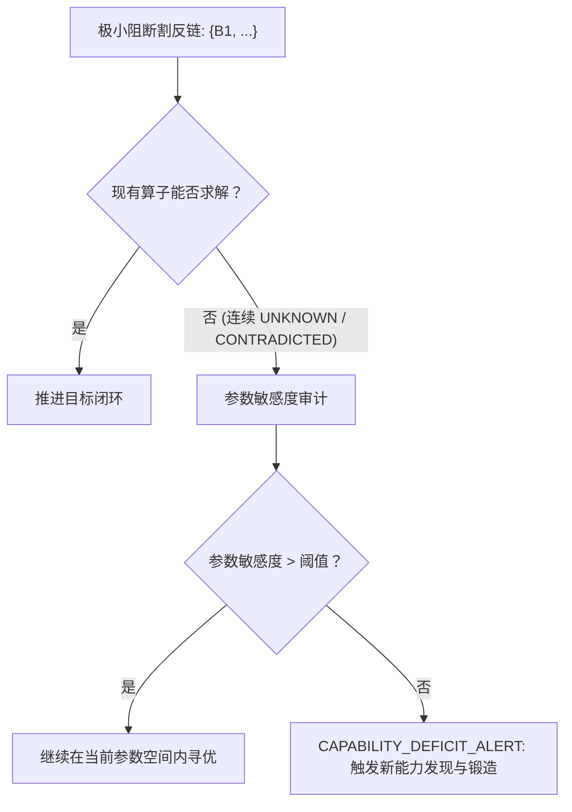

# 能力发现、掌握核验与算子固化闭环规范

[English](capability-mastery-loop.md) · [文档目录](README.zh-CN.md) · [5.8 愿景](5.8-vision.zh-CN.md) · [指南针与 TMS](compass-tms-specification.zh-CN.md) · [Issue #40](https://github.com/kongtou20070406/research-direction-selector/issues/40)

## 1. 背景与核心问题

在自主科学研究中，最大的瓶颈既不是算力规模，也不是形式化演绎的流利度：

> **核心困境在于：模型缺乏元认知机制去发现自己到底缺失了什么能力，并且缺乏严格的科学方法论去合成、核验并彻底掌握这种新能力。**

### 1.1 大模型能力演进的两大病态陷阱
1. **“祝融星”优化陷阱（无法发现能力缺失）：**
   当 AI 陷入认知僵局时——正如盘覆盖问题中的 8,633 次工具调用（卡死在 $r_D(100) \in [0.113, 0.115]$）以及深度学习 ReFRM 的 113 轮调优（NFE 128 李雅普诺夫能量发散）所暴露的——模型天真地假定现有的工具箱是完备的。它耗费数十小时微调连续参数，完全意识不到自己正在遭受**定性的能力缺失**（例如缺失有理 Voronoi 对偶胞腔规约能力，或缺失多步收缩能量耗散监测能力）。
2. **“临时代码”虚假幻觉（无法真正掌握能力）：**
   当大模型试图填补工具空白时，通常会在上下文里临时拼凑一段 50 行的 Python 代码。这类临时脚本缺乏显式契约、缺乏故障闭锁边界，更没有反例证伪用例。随着会话结束或任务切换，这些代码瞬间蒸发。下一个 Agent 进场时，被迫重蹈覆辙，陷入永无休止的“重复造劣质轮子”死循环。

### 1.2 与溯因跃迁（Abductive Jump）的深层关联
正如 ICML 论文《Position: LLMs can't jump》（Tom Zahavy et al., 2025/2026）所揭示，概念的溯因跃迁（$E \xrightarrow{\text{Jump}} A$）必须依托于全新的认知工具。爱因斯坦在构想广义相对论时，若没有敏锐察觉自己在非欧几何上的能力鸿沟，并耗费整整三年在《苏黎世笔记》中彻底掌握黎曼张量微积分算子，他绝不可能写出场方程。

**缺乏能力的发现与掌握，所谓的“跃迁（Jump）”就只能沦为空中楼阁式的符号幻觉。**

---

## 2. 支柱一：能力缺失诊断（发现触发机制）

科研系统必须具备区分“参数优化问题”与“能力缺失断崖”的判别能力。



### 2.1 形式化发现准则
系统在满足以下条件时发出 `CAPABILITY_DEFICIT_ALERT` 警报：
1. 极小阻断割 $\mathcal{B}(P_{\text{north}})$ 上的所有已知物理算子在连续 $K \ge 3$ 轮搜索中均输出 `UNKNOWN` 或 `CONTRADICTED`；
2. 局部参数扰动梯度 $\|\nabla_\theta \mathcal{M}\| < \epsilon$，表明当前流形已进入平坦或断裂状态；
3. 顾问决策器全面拦截无意义的超参数微调，强行驱动模型 formalize 一份全新的算子需求规范。

---

## 3. 支柱二：形式化能力规范模式（Schema 1）

候选能力必须被定义为具备严密契约的规范对象（Schema 1）：

```json
{
  "schema": 1,
  "capability_id": "rational_voronoi_dual_cover",
  "domain": "discrete_geometry",
  "objective_relevance": "在无浮点漂移的前提下完成单位圆盘覆盖边界的精确证书核验",
  "contract": {
    "inputs": {
      "centers": "List[Tuple[Rational, Rational]]",
      "radius_squared": "Rational"
    },
    "outputs": {
      "certified_covered": "bool",
      "counterexample_witness": "Optional[Tuple[Rational, Rational]]"
    },
    "preconditions": [
      "len(centers) >= 1",
      "radius_squared > 0"
    ],
    "fail_closed": "在非有限数值、超出定义域或超时情况下统一输出 UNKNOWN"
  },
  "fixtures": {
    "tier1_smoke_pass": {
      "centers": [[0, 0]],
      "radius_squared": 1,
      "expected_status": "PASS"
    },
    "tier2_counterexample_witness": {
      "centers": [[0, 0]],
      "radius_squared": "1/4",
      "expected_status": "CONTRADICTED",
      "expected_witness_present": true
    },
    "tier3_boundary_stress": [
      {"centers": [], "radius_squared": 1, "expected_status": "UNKNOWN"},
      {"centers": [[0, 0]], "radius_squared": -1, "expected_status": "UNKNOWN"}
    ]
  }
}
```

---

## 4. 支柱三：三重掌握试金石（Mastery Proving Ground）

编写代码不等于掌握能力。候选算子必须在独立的沙箱环境中通过严格的三重试金石考核：


### 第一重：基准真值烟测（Positive Soundness）
算子必须在已知的极小解析解基准用例上重现正确结论（如 $N=1$ 半径 1 覆盖单位圆盘，或 1 步线性 ODE 收缩）。若在此类极简用例上失败，说明存在语法或核心语义缺陷，立即淘汰。

### 第二重：反例证人捕获能力（Negative Completeness）
算子必须展现出强大的反例鉴别力：当输入伪造或无法覆盖的输入时（如用半径 $1/2$ 覆盖单位圆盘），绝对不得静默返回 `PASS` 或笼统的 `FAIL`。它必须准确检测到反例，并提取结构化证人元组 $\mathcal{W} = \langle \text{condition}, \text{witness}, \text{context} \rangle$。

### 第三重：故障闭锁与异常防御（Robustness）
算子必须在对抗性输入下保持确定性与鲁棒性：
- 空输入、负半径或张量形状错位；
- 浮点非有限数值（`NaN`、`+Inf`、`-Inf`）；
- 显式超时与内存限制。
算子必须以结构化方式干净利落地输出 `UNKNOWN`，坚决禁止未处理的进程崩溃或内存泄露。

---

## 5. 支柱四：算子固化与超图跃迁

一旦新算子达成 `mastery_status == "QUALIFIED"`：
1. **源码加密哈希：** 计算该算子实现源码与验证固件的规范 SHA-256 指纹。
2. **工具链永久注册：** 将算子登记至 `scripts/rds_operators.py` 或项目本地工具清单（`.rds/capabilities/`）。
3. **加密收据绑定：** 算子绑定加密执行收据模式，每次运行均输出可被审计的执行证据。
4. **超图层级跃迁：** 超图引擎将该算子的输入/输出契约正式提升为超图中的一条可用超边（Hyperedge）：
   $$\text{premises}(\text{inputs}) \xrightarrow{\text{rule:new\_op}} \text{conclusion}(\text{output}).$$
5. **打通极小阻断割：** 新生成的超边直接架起了跨越原阻断割的桥梁，使后续 Agent 能够基于确凿的物理算子完成溯因跃迁（Jump）。

---

## 6. 支柱五：持续性 RSI 资产沉淀

固化后的能力将永久提升系统的基线能力：
- **杜绝重复造轮子：** 后续的所有 Agent 直接继承已合格的算子，不再浪费宝贵的推理配额进行重复合成。
- **回归防御用例沉淀：** 若已掌握的算子在后续更复杂的真实任务中被证伪，其失败用例将被无缝打包并入 `examples/rsi/cases.json`，永久防止未来算法退化。
