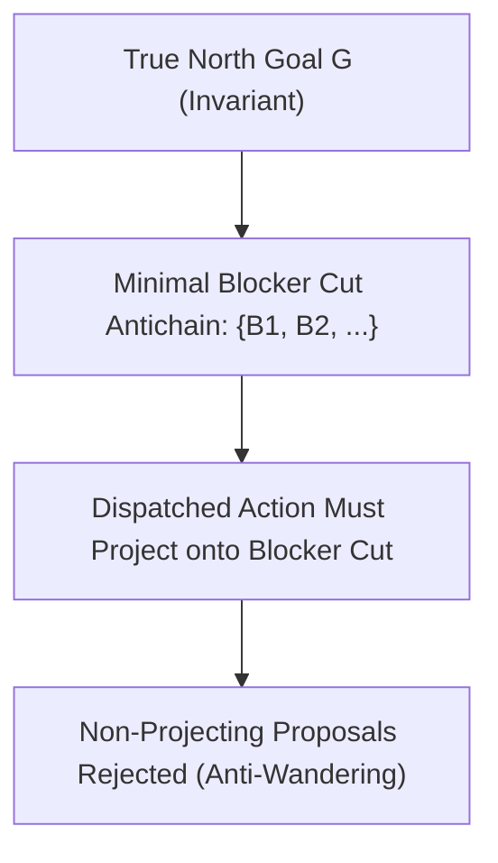

# Grounding the Research Hypergraph: Compass & Truth Maintenance System (TMS) Specification

[简体中文](compass-tms-specification.zh-CN.md) · [Documentation](README.md) · [Rule proof obligations](rule-obligations.md) · [Advisor graph design](advisor-graph-design.md) · [Issue #36](https://github.com/kongtou20070406/research-direction-selector/issues/36)

## 1. Context, Historical Evidence, and Problem Statement

The RDS dependency engine (`scripts/rds_hypergraph.py`) computes exact, deterministic topological closures and minimal blocker sets (verified across pure Python and Rust C-ABI backends in PR #26/#31). However, as explicitly declared in the engine assurance banner:

```text
ASSURANCE = "INPUT_REPORTED_DEPENDENCY_ANALYSIS_NOT_PROOF"
```

A hypergraph evaluates the logical consequence of *declared* status labels and *reported* hyperedges; it does not independently establish physical or mathematical reality.

### 1.1 Empirical Analysis: 8,633 Tool Calls and 113 ReFRM Rounds

Real-world deployment logs across mathematical discrete geometry and multi-GPU deep learning optimization exposed the systemic limitations of an ungrounded, monotonic hypergraph:

1. **The 8,633 Mathematical Tool Calls (Helmholtz, Bohr, Aquinas):**
   - Three primary agents ran continuously for nearly 15 hours (53,000,000 ms), spawning 217 Windows scheduled tasks and accumulating 25.34 GB of execution artifacts.
   - Despite immense compute expenditure, the search stagnated at the interval $0.112977 \le r_D(100) \le 0.1156303$, and $N=40$ halted indefinitely at the PREP phase.
   - **Root Cause:** The agents engaged in micro-parametric perturbations and local coordinate descent. Because the system lacked an abductive jump mechanism, the agents could not transition to dual representations (such as rational Voronoi covering cells or Delaunay triangulation bounds).

2. **The 113 Multi-GPU Deep Learning Rounds (ReFRM R001~R113):**
   - At step 1, the local Lipschitz contraction condition $\kappa < 1$ held solidly. Agents marked the contraction lemma as `SUPPORTED`.
   - At multi-step integration (NFE 128), numerical discretization error accumulated, causing Lyapunov energy explosion ($\rho > 1$) and a catastrophic drop of $-2.0\text{ dB}$ on the locked evaluation set.
   - **The Monotonic Trap:** Because standard Horn-clause engines cannot retract truth non-monotonically, the system treated the 1-step contraction lemma as permanently true. Agents responded with "Vulcan planet" epicycles—tweaking learning rates and loss weights—rather than blaming and revoking the foundational contraction assumption.

### 1.2 The Epistemological Bottleneck: Why LLMs Can't Jump

As formulated by Tom Zahavy et al. (*Position: LLMs can't jump*, ICML 2025/2026), scientific invention is governed by Charles Sanders Peirce's triad of inference:

```text
Inference Mode     Structure                                Status in AI
---------------------------------------------------------------------------------------------
1. Deduction       Rule + Case  → Result                    AlphaProof / Lean 4 (Mechanized)
2. Induction       Case + Result → Rule                     LLM Compression / Pretraining (Mastered)
3. Abduction       Rule + Result → Case / New Axioms        【Structural Void: AI Cannot "Jump"】
```

1. **Creativity is Not Mere Data Compression:** When Einstein conceived General Relativity, Newtonian gravity had an experimental precision of $10^{-9}$. The sole anomaly (Mercury's perihelion precession) was dismissed as an undiscovered planet ("Vulcan"). A compression-driven inductive AI finds the Newtonian error near zero and lacks the gradient required to fundamentally restructure spacetime geometry.
2. **Deduction is Downstream Verification:** Given Einstein's postulates, modern automated provers can deduce the field equations and Mercury's orbit ($A \to S$). But formulating the axioms ($E \xrightarrow{\text{Jump}} A$) required an embodied thought experiment (simulating an observer in a falling elevator).
3. **The Role of RDS:** RDS does not replace Lean 4 (which does Deduction) nor Foundation Models (which do Induction). **RDS is the operating system for Abduction**: it provides the apparatus, the triggers, the counterfactual thought experiment laboratory, and the safety net for the AI to execute the abductive **"Jump"**.

---

## 2. Pillar 1: True North Invariance & Minimal Blocker Cut

A research compass must navigate toward a precommitted destination rather than wandering across arbitrary solvable subproblems.



### 2.1 Formal Invariant
1. **True North Declaration:** Every research project registers an immutable target property $P_{\text{north}}$ (e.g. locked test metric gain $\Delta \ge \tau$, or global covering certificate $D_N \le r_D$).
2. **Antichain Blocker Computation:** The hypergraph computes the minimal blocker sets $\mathcal{B}(P_{\text{north}}) = \{B_1, \dots, B_k\}$, where each $B_i \subseteq \mathcal{V}_{\text{nodes}} \cup \mathcal{E}_{\text{rules}}$ is an inclusion-minimal set of missing evidence items whose joint satisfaction establishes $P_{\text{north}}$.
3. **Action Projection Gate:** The selector rejects any action proposal $a$ whose expected output token does not belong to $\bigcup_{B \in \mathcal{B}(P_{\text{north}})} B$. Proving peripheral lemmas outside this cut is classified as exploratory diversion, not primary progress.

---

## 3. Pillar 2: Physical Operator Grounding ("No Receipt, No Status")

Natural language claims, unverified self-assessments, and heuristic agent logs cannot transition a node to `SUPPORTED`.

### 3.1 Cryptographic Execution Receipt Schema
A node $v$ or rule $e$ transitions to `SUPPORTED` if and only if accompanied by an immutable cryptographic receipt matching schema version 1:

```json
{
  "schema": 1,
  "receipt_id": "sha256:d8a4...",
  "operator": {
    "name": "eval_locked_test",
    "version": "1.4.0",
    "commit": "8d6eb66..."
  },
  "inputs": [
    {"role": "dataset", "sha256": "3f82...", "file": "data/test_locked.bin"},
    {"role": "checkpoint", "sha256": "9b1c...", "file": "checkpoints/epoch_40.pt"}
  ],
  "execution": {
    "exit_code": 0,
    "wall_seconds": 142.8,
    "device": "NVIDIA_H100_SXM5",
    "seed": 20261002
  },
  "verdict": {
    "status": "PASS",
    "metrics": {
      "psnr": 34.21,
      "ssim": 0.941,
      "delta_over_baseline": 0.82
    },
    "witness_digest": "sha256:e1a0..."
  }
}
```

### 3.2 Audit Constraints
- **Byte Verification:** `audit_sources` checks literal byte sizes and SHA-256 digests.
- **Fail-Closed Gate:** If receipt parsing fails, file digests mismatch, exit code is non-zero, or reproduction seeds differ, the corresponding node status remains `UNKNOWN`.

---

## 4. Pillar 3: Negative Witness Steering

Empirical failure is not scalar silence; it is structured direction. When a physical operator disproves a hypothesis, it generates an explicit counterexample witness.

```text
W = ⟨Condition, Counterexample, BoundaryContext⟩
```

### 4.1 Domain Witness Taxonomy
- **Deep Learning:** A non-convergent step index $t=128$, an energy explosion ratio $\rho = 1.04 > 1.0$, or a negative test delta $\Delta = -0.42\text{ dB}$.
- **Discrete Geometry:** A concrete unassigned point $(x_0, y_0) \notin \bigcup_{i=1}^N D_i$, violating covering feasibility.
- **Algebraic / Formal:** A non-associative triple $(a, b, c) \in S^3$ with $(a \cdot b) \cdot c \ne a \cdot (b \cdot c)$ in a Cayley table.
- **Software / Tools:** A reproducible CLI exit code with standard error trace and malformed output signature.

### 4.2 Hypergraph Refutation
Injecting witness $\mathcal{W}$ into hypergraph $\mathcal{H}$ causes:
1. Immediate status transition: target edge $e$ or node $v \to \text{CONTRADICTED}$.
2. Refutation witness archiving in the knowledge ledger.
3. Active pruning of all exploration branches relying exclusively on $e$ or $v$.

---

## 5. Pillar 4: Non-Monotonic Truth Maintenance System (TMS)

Scientific exploration is inherently non-monotonic: new empirical measurements can falsify earlier assumptions. The research hypergraph incorporates a Justification-Based Truth Maintenance System (JTMS).

### 5.1 Justification Structure
Each derived node $h \in \text{closure}$ is associated with its active derivation rule:

$$h \leftarrow \langle e, \text{premises}(e), \text{receipt}(e) \rangle$$

The **Support Cone** of node $h$, denoted $\text{Cone}(h)$, is the reflexive transitive closure of premises supporting $h$ in the active derivation DAG:

$$\text{Cone}(h) = \{h\} \cup \bigcup_{p \in \text{premises}(\text{rule}(h))} \text{Cone}(p)$$

### 5.2 Dependency-Directed Blame Attribution
When a top-level verification $G$ fails or is marked `CONTRADICTED` by an empirical counterexample:
1. Trace upstream support cone $\text{Cone}(G)$.
2. Intersect with the set of open/hypothetical candidate rules:
   $$\text{BlameCandidates}(G) = \text{Cone}(G) \cap \mathcal{E}_{\text{proposed}}.$$
3. Rank candidates by empirical sensitivity, identifying the minimal assumption set whose revocation resolves the contradiction.

### 5.3 Cascade Revocation Algorithm
When premise $u$ or rule $r$ is retracted or marked `CONTRADICTED`:

```text
Algorithm: Cascade-Revoke(H, RetractedNodes, RetractedRules)
1. Invalidate: Mark RetractedNodes as CONTRADICTED (or UNKNOWN) and RetractedRules as CONTRADICTED.
2. Queue Q := RetractedNodes ∪ {head(r) | r ∈ RetractedRules}
3. While Q is not empty:
     Pop node n from Q.
     For every hyperedge e where n ∈ premises(e):
       head := conclusion(e)
       If head is in closure:
         Check alternative justifications for head:
           alt := {e' | conclusion(e') == head, e' is SUPPORTED, premises(e') ⊆ closure}
         If alt is empty:
           Evict head from closure.
           Reset head status to UNRESOLVED (or UNKNOWN).
           Clear derivation rule for head.
           Push head to Q.
         Else:
           Update derivation rule for head to choice(alt).
4. Return updated closure and list of revoked derived nodes.
```

This guarantees that downstream deductions collapse immediately when foundational assumptions fail, eliminating monotonic delusion.

---

## 6. Pillar 5: Continuous RSI Ingestion (Failure Harvesting)

In tandem with [Issue #33](https://github.com/kongtou20070406/research-direction-selector/issues/33) and [research-record-handoff.md](research-record-handoff.md), every exploration cycle exports its failure evidence:

1. **Failure Extraction:** Collect every rejected candidate, gate collision, and contradicted node.
2. **Regression Packaging:** Synthesize minimal reproducible fixtures into `examples/rsi/cases.json`.
3. **Rule Calibration:** Update heuristic advisor weights and add hard pruning constraints to the hypergraph specification.

---

## 7. Cross-Domain Operational Matrix

| Dimension | Deep Learning | Software & Tooling | Discrete Mathematics |
| :--- | :--- | :--- | :--- |
| **True North Goal** | Generalization on locked test distribution ($\Delta \ge +0.8\text{ dB}$) | Deterministic CLI contract & zero-failure test suite | Global certificate ($D_N \le r_D$) or Lean 4 Q.E.D. |
| **Physical Operator** | PyTorch / JAX multi-step integration on frozen hardware | Python / Rust compiler test runner with timeout | Interval arithmetic bound checker / Cayley solver |
| **Execution Receipt** | Model weight SHA-256, test log hash, seed digest | Git commit, binary hash, exit code 0 | Lean 4 `#print axioms` log digest, arithmetic trace |
| **Negative Witness** | Step-128 gradient NaN, energy ratio $\rho \ge 1.0$ | Exit code 139 (SIGSEGV), stdout divergence | Coordinate $(x_0, y_0)$ outside union of Voronoi disks |
| **TMS Revocation** | Retract 1-step contraction lemma when 128-step drifts | Retract API contract when caller ABI breaks | Retract local boundary cover when global overlap fails |

---

## 8. Summary & Implementation Alignment

The Research Hypergraph is not an infallible oracle; it is a deterministic logical calculator. By coupling it with:
- **Pillar 1:** Minimal Blocker Cut focusing (Issue #25, PR #32),
- **Pillar 2:** Physical Operator Receipts (Issue #30, #36),
- **Pillar 3:** Negative Counterexample Steering (Issue #36),
- **Pillar 4:** Non-Monotonic Truth Maintenance (`cascade_revoke`, Issue #36),
- **Pillar 5:** Continuous RSI Failure Harvesting (Issue #33, PR #34),

the hypergraph becomes a genuine, unyielding **Research Compass** that prevents speculative hallucination and rigorously converges on verified scientific discovery.
