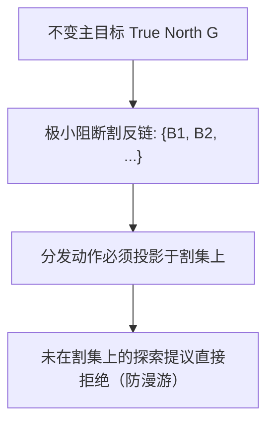

# 锚定科研超图：科研指南针与非单调真值维护系统（TMS）规范

[English](compass-tms-specification.md) · [文档目录](README.zh-CN.md) · [规则证明义务](rule-obligations.zh-CN.md) · [顾问图设计](advisor-graph-design.md) · [Issue #36](https://github.com/kongtou20070406/research-direction-selector/issues/36)

## 1. 背景、历史实证证据与核心问题

RDS 依赖推导引擎（`scripts/rds_hypergraph.py`）计算确定性的拓扑闭包与极小阻断割集（在 PR #26/#31 中已通过 Python 与 Rust C-ABI 双后端对齐验证）。然而，正如引擎显式声明的保证标识所言：

```text
ASSURANCE = "INPUT_REPORTED_DEPENDENCY_ANALYSIS_NOT_PROOF"
```

超图本质上是根据**已声明的状态标签**与**已上报的超边**进行纯形式化的逻辑推导；它本身不检验物理世界与数学真值的客观实在性。

### 1.1 历史调用实证分析：8,633 次工具调用与 113 轮 ReFRM 调优

在数学离散几何与多 GPU 深度学习优化的真实运行记录中，未锚定物理实体的单调超图暴露出了致命的系统性瓶颈：

1. **数学领域的 8,633 次真实调用（Helmholtz、Bohr、Aquinas）：**
   - 三大主力 Agent 连续运行近 15 个小时（5300 万毫秒），创建了 217 个 Windows 计划任务，生成了 25.34 GB 的过程数据。
   - 尽管耗费了巨大算力，求解过程最终卡死在 $0.112977 \le r_D(100) \le 0.1156303$ 的狭窄数值区间，且 $N=40$ 的任务永久停滞在 PREP 阶段。
   - **深层根因：** Agent 陷入了微观参数扰动与局部坐标下降的死循环。由于系统缺乏溯因跃迁（Abductive Jump）机制，Agent 无法跳出局部几何，跃迁到对偶表示（如有理 Voronoi 胞腔覆盖界或 Delaunay 三角剖分）。

2. **深度学习的 113 轮多卡调优（ReFRM R001~R113）：**
   - 在第 1 步时，局部 Lipschitz 收缩条件 $\kappa < 1$ 表现优异，Agent 欣喜地将收缩引理标记为 `SUPPORTED`。
   - 然而在多步数值积分（NFE 128）下，微小的局部截断误差非线性累积，导致李雅普诺夫能量发散（$\rho > 1$），在锁定测试集上遭遇了 $-2.0\text{ dB}$ 的雪崩式暴跌。
   - **单调性假设陷阱：** 由于传统的 Horn 子句超图只能单调累积结论，系统把第 1 步收缩当成不可动摇的永恒真理。Agent 只能像当年为牛顿力学打补丁的学者一样，不断提出“祝融星假设”——疯狂微调学习率与损失权重，却不敢也无法溯源撤销最底层的收缩引理。

### 1.2 认识论瓶颈：为什么当代大模型无法完成“跃迁”（Can't Jump）

正如 Tom Zahavy 等人在立场论文（*Position: LLMs can't jump*, ICML 2025/2026）中所论证，人类科学发现受皮尔士（Charles Sanders Peirce）经典三元推理体系的支配：

```text
推理维度         公式/结构                           当前 AI 现状
---------------------------------------------------------------------------------------------
1. 演绎 (Deduction)   规则 (Rule) + 案例 (Case)  → 结果 (Result)   AlphaProof / Lean 4 (已自动化)
2. 归纳 (Induction)   案例 (Case) + 结果 (Result) → 规则 (Rule)     大模型预训练/统计压缩 (已掌握)
3. 溯因 (Abduction)   规则 (Rule) + 结果 (Result) → 案例/新公理     【结构性缺失：AI 无法做出 Jump (J)】
```

1. **创造力绝非单纯的数据压缩：** 爱因斯坦提出广义相对论时，牛顿引力定律拥有高达 $10^{-9}$ 的实验精度，唯一的异常（水星近日点进动）被当成未发现的“祝融星”参数。基于压缩与归纳的 AI 会发现牛顿损失接近于零，根本没有重构时空弯曲的梯度驱动力。
2. **演绎推导只是下游验证环节：** 给定爱因斯坦的七大公理后，现代自动证明器完全可以推导出引力场方程与水星轨道（$A \to S$）。但提出等效原理公理（$E \xrightarrow{\text{Jump}} A$）本身，源于封闭电梯自由下落的具身思想实验。
3. **RDS 的战略定位：** RDS 不是去替代 Lean 4（负责演绎 Deduction），也不是替代大模型（负责归纳 Induction）。**RDS 是专门掌控溯因跃迁（Abduction / Jump）的科研操作系统**：它提供起跳的物理反例跳板、反事实思想实验场、极小阻断割导向罗盘以及真值维护安全网，驱动 AI 完成科学创造中的跃迁。

---

## 2. 支柱一：主目标不变性与极小阻断割聚焦

科研指南针必须始终指向预先承诺的研究终点，杜绝智能体在漫无边际的边缘子问题中打转。



### 2.1 形式化不变量
1. **主目标注册（True North）：** 每个科研项目必须注册不可篡改的目标属性 $P_{\text{north}}$（例如锁定测试集增益 $\Delta \ge \tau$，或全局覆盖证书 $D_N \le r_D$）。
2. **反链阻断割计算（Antichain Blocker Cut）：** 超图求解极小阻断割集合 $\mathcal{B}(P_{\text{north}}) = \{B_1, \dots, B_k\}$，其中每个 $B_i \subseteq \mathcal{V}_{\text{nodes}} \cup \mathcal{E}_{\text{rules}}$ 均为缺失证据项的包含极小子集，其联合满足即可打通到 $P_{\text{north}}$ 的推导闭包。
3. **动作投影拦截门禁（Action Projection Gate）：** 顾问决策器直接拒绝任何输出不在 $\bigcup_{B \in \mathcal{B}(P_{\text{north}})} B$ 中的探索提议。对割集之外的琐碎节点进行证明，一律归类为非关键漫游，不计入核心进度。

---

## 3. 支柱二：物理算子锚定（“无收据，无状态”）

任何自然语言描述、智能体自评或启发式日志，均不得将节点状态翻转为 `SUPPORTED`。

### 3.1 加密执行收据模式（Cryptographic Receipt Schema）
节点 $v$ 或规则 $e$ 跃迁至 `SUPPORTED`，当且仅当附带符合 Schema 1 规范的不可伪造执行收据：

```json
{
  "schema": 1,
  "receipt_id": "sha256:d8a4...",
  "operator": {
    "name": "eval_locked_test",
    "version": "1.4.0",
    "commit": "8d6eb66..."
  },
  "inputs": [
    {"role": "dataset", "sha256": "3f82...", "file": "data/test_locked.bin"},
    {"role": "checkpoint", "sha256": "9b1c...", "file": "checkpoints/epoch_40.pt"}
  ],
  "execution": {
    "exit_code": 0,
    "wall_seconds": 142.8,
    "device": "NVIDIA_H100_SXM5",
    "seed": 20261002
  },
  "verdict": {
    "status": "PASS",
    "metrics": {
      "psnr": 34.21,
      "ssim": 0.941,
      "delta_over_baseline": 0.82
    },
    "witness_digest": "sha256:e1a0..."
  }
}
```

### 3.2 审计约束
- **字节级校验：** `audit_sources` 对物理文件的实际字节大小与 SHA-256 哈希进行硬比对。
- **故障闭锁门禁（Fail-Closed）：** 解析失败、哈希不一致、退出码非 0 或随机种子偏差时，对应节点严格保持 `UNKNOWN` 状态。

---

## 4. 支柱三：负证据证人反向引导（击碎幻觉）

经验探索的失败并非无声的空白，而是高度结构化的导航路标。物理算子证伪假设时，必须输出显式的反例证人元组：

```text
W = ⟨Condition, Counterexample, BoundaryContext⟩
```

### 4.1 领域证人分类
- **深度学习：** 不收敛步数 $t=128$、能量发散比 $\rho = 1.04 > 1.0$，或锁定测试集指标下滑 $\Delta = -0.42\text{ dB}$。
- **离散几何：** 具体的未覆盖坐标点 $(x_0, y_0) \notin \bigcup_{i=1}^N D_i$。
- **代数与形式化：** 凯莱表中的非结合三元组 $(a, b, c) \in S^3$（满足 $(a \cdot b) \cdot c \ne a \cdot (b \cdot c)$）。
- **软件与工具：** 确凿的 CLI 报错退出码、stderr 堆栈跟踪与畸形输出指纹。

### 4.2 超图证伪注入
将反例证人 $\mathcal{W}$ 注入超图 $\mathcal{H}$ 时触发：
1. 状态瞬时翻转：目标超边 $e$ 或节点 $v \to \text{CONTRADICTED}$。
2. 证人归档至事实账本，永久阻断后续智能体重复提交相同无效假设。
3. 动态修剪所有完全依赖该失效节点的探索分支。

---

## 5. 支柱四：非单调真值维护系统（TMS）

科学探索本质上是非单调的：后验的物理观测常常推翻先前的理论假设。超图必须内建基于理由的真值维护系统（JTMS）。

### 5.1 理由结构与支撑锥
闭包中每个派生节点 $h \in \text{closure}$ 均绑定其当前生效的推导规则：

$$h \leftarrow \langle e, \text{premises}(e), \text{receipt}(e) \rangle$$

节点 $h$ 的**支撑锥（Support Cone）**，记作 $\text{Cone}(h)$，定义为推导 DAG 中为 $h$ 提供支撑的所有前置节点与规则的传递自反闭包：

$$\text{Cone}(h) = \{h\} \cup \bigcup_{p \in \text{premises}(\text{rule}(h))} \text{Cone}(p)$$

### 5.2 基于依赖的归因诊断（Blame Attribution）
当顶层目标 $G$ 在全局评测中失败或被标记为 `CONTRADICTED` 时：
1. 向上回溯支撑锥 $\text{Cone}(G)$。
2. 与当前采用的候选假设规则集合取交集：
   $$\text{BlameCandidates}(G) = \text{Cone}(G) \cap \mathcal{E}_{\text{proposed}}.$$
3. 按经验敏感度排序，定位出导致矛盾的最小假设集合。

### 5.3 级联撤销算法（Cascade Revocation）
当某个前置条件 $u$ 或规则 $r$ 被撤回或标记为 `CONTRADICTED` 时：

```text
算法: Cascade-Revoke(H, RetractedNodes, RetractedRules)
1. 标记失效: 将 RetractedNodes 标记为 CONTRADICTED (或 UNKNOWN), RetractedRules 标记为 CONTRADICTED。
2. 初始化队列 Q := RetractedNodes ∪ {head(r) | r ∈ RetractedRules}。
3. 循环直至 Q 为空:
     从 Q 弹出节点 n。
     遍历所有以 n 为前提的前提超边 e (n ∈ premises(e)):
       head := conclusion(e)
       若 head 位于 closure 中:
         检查 head 是否存在其他独立的有效支撑规则:
           alt := {e' | conclusion(e') == head, e' 为 SUPPORTED, 且 premises(e') ⊆ closure}
         若 alt 为空:
           将 head 移出 closure。
           将 head 重置为 UNRESOLVED (或 UNKNOWN)。
           清除 head 的当前推导规则。
           将 head 压入 Q。
         否则:
           将 head 的推导规则更新为 alt 中的备选规则。
4. 返回更新后的闭包与被撤销的派生节点清单。
```

此算法保证基础假设一旦破灭，下游衍生的虚妄结论将立即被连根拔起，杜绝单调性幻觉。

---

## 6. 支柱五：持续性 RSI 失败经验回收

结合 [Issue #33](https://github.com/kongtou20070406/research-direction-selector/issues/33) 与 [research-record-handoff.md](research-record-handoff.md)，每次探索周期均自动归档失败证据：

1. **失败萃取：** 提取每一次被拦截的提议、门禁冲突与被反驳节点。
2. **回归用例打包：** 提炼最小可复现用例并固化至 `examples/rsi/cases.json`。
3. **规则迭代自进化：** 动态更新顾问权重，向超图注入硬性剪枝约束，确保踩过的坑不再重入。

---

## 7. 跨领域操作矩阵

| 评估维度 | 深度学习（Deep Learning） | 软件与工具链（Tools） | 离散数学（Mathematics） |
| :--- | :--- | :--- | :--- |
| **主目标（True North）** | 锁定测试分布上的泛化性能（$\Delta \ge +0.8\text{ dB}$） | 确定性 CLI 契约与零缺陷测试套件 | 全局覆盖界（$D_N \le r_D$）或 Lean 4 Q.E.D. |
| **物理算子** | PyTorch / JAX 冻结硬件上的多步积分评测器 | Python / Rust 编译与测试执行器（带超时控制） | 区间算术边界验证器 / 凯莱表求解器 |
| **执行收据** | 权重哈希、独立评测日志哈希、确定性随机种子 | Git 提交哈希、构建产物哈希、进程退出码 0 | Lean 4 `#print axioms` 证据日志指纹 |
| **反例证人** | 128 步梯度爆炸 NaN、积分能量比 $\rho \ge 1.0$ | 进程崩溃退出码 139 (SIGSEGV)、输出不匹配 | 覆盖遗漏坐标 $(x_0, y_0)$、凯莱表非结合三元组 |
| **TMS 级联撤销** | 128 步发散时，立即撤销单步收缩引理及派生结论 | 接口 ABI 破坏时，立即撤销兼容性保证 | 局部覆盖破坏时，立即撤销全局半径上界结论 |

---

## 8. 总结与实施对齐

科研超图不是万能的预言机，而是确定性的逻辑推导器。通过系统性集成：
- **支柱一：** 极小阻断割聚焦（Issue #25, PR #32），
- **支柱二：** 物理算子收据门禁（Issue #30, #36），
- **支柱三：** 反例证人反向引导（Issue #36），
- **支柱四：** 非单调真值维护与级联撤销（`cascade_revoke`, Issue #36），
- **支柱五：** 持续 RSI 失败经验回收（Issue #33, PR #34），

超图方能蜕变为真正不可动摇的**科研指南针**，坚决斩断符号幻觉，指引科学探索严谨收敛至客观真理。
