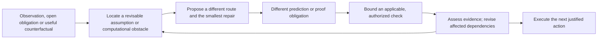

# From a blocked route to a testable alternative

[简体中文](evidence-grounded-jump.zh-CN.md) · [5.8 vision](5.8-vision.md) · [Cross-task acceptance](cross-task-acceptance.md)

**Proposed implementation contract, 2026-10-02; baseline `c4506ed`.** This refines V1–V6 in [issue #22](https://github.com/kongtou20070406/research-direction-selector/issues/22). It adds no runtime enforcement. Existing behavior and missing consumers are distinguished below.

RDS is a **general-purpose research direction selector**. Its purpose here is to help an agent propose and test a consequential change of direction. Evidence checks and the hypergraph serve that purpose. Initial acceptance priority is deep learning, software/tool development, then mathematics; these are test settings, not the product's domain boundary. Use reusable parameterized methods and declared adapters, without importing project-specific solutions, training recipes or fixed scientific thresholds into RDS or optional packs.

## A jump must become a research action

Keep the original goal and acceptance fixed. A candidate may change a model assumption, representation, intervention or computational method. State what would differ from the smallest plausible repair, and how an allowed check could distinguish them. The candidate need not already be proved or improve the final metric before investigation. A method change is not necessarily an axiom change.

The model/researcher proposes the semantic change; computing a graph closure does not generate an explanation. Advisor must consume the proposal and check result through existing `selection_review.next_move`, candidate actions, checkpoints and the runner. Reuse the [reformulation workflow](theory-reformulation.md), without a second jump ledger or an autonomous goal generator.

The next-decision consumer must:

1. Identify the original open obligation and separate researcher constraints from agent-introduced assumptions. Missing measurements, implementation failures, conflicting observations and checked counterexamples need different responses.
2. When reformulation is warranted, propose a concrete alternative alongside the smallest viable repair. Name the changed assumption/representation/intervention/method and a different same-scope prediction or proof obligation. Retrieve only applicable tool summaries. A new name, more nodes or another receipt is insufficient.
3. Bind a discriminating check to actual inputs, a selected available adapter, outcome-dependent decisions and existing budget. If an adapter or discriminating observation is missing, name that development/measurement obligation instead of inventing a command or successful result.
4. Execute the authorized check and consume its outcome to continue, narrow, repair or replace the route. Preserve negative and unresolved results. Simulation is evidence about its encoded assumptions; transfer to the target system remains an explicit obligation.

Reformulation can be useful before repeated failure, including when the researcher requests another representation. Do not force a productive single proof obligation into a competition, require routine steps to jump, or impose a higher-theory ladder after a fixed number of failures. Material changes to the user's goal, method constraints or investment require the user's decision.

| Initial setting | Substantive proposal | Deciding check and possible next action |
| --- | --- | --- |
| Deep learning | Compare an update-rule repair with a changed state representation and different trajectory predictions. | A controlled probe on the real implementation under matched declared conditions selects the next qualified experiment; toy stability cannot certify task quality. |
| Software/tool development | Distinguish duplicate dependency analysis from an intrinsically expensive algorithm before proposing a native rewrite. | Measure the same complete CLI workload and identity/recovery behavior. Reuse analysis when sufficient; retain the native alternative only when its measured trade-off warrants it. |
| Mathematics | Compare a local lemma repair with an explicit finite reduction or alternative representation of the same claim. | Check the reduction, domain coverage and certificate obligations. A witness can refute its scoped claim; finite success cannot silently close an unbounded claim. |

## What the current hypergraph establishes

The [analyzer](../scripts/rds_hypergraph.py) reports `INPUT_REPORTED_DEPENDENCY_ANALYSIS_NOT_PROOF`. The [Advisor consumer](../scripts/rds_advisor_search.py) and [goal-linked entry](agent-entry.md#goal-linked-dependencies) use a declared map, not an arbitrary scientific-assertion verifier.

| Checked baseline behavior | Required next consumer |
| --- | --- |
| Handwritten `SUPPORTED` nodes/rules participate in `declared_supported_closure`; a source locator suffices. | Retain declarations, but derive admission-relevant support from applicable checked evidence and explicit assumptions. Never silently upgrade a declaration. |
| `--audit-files` reports byte identity separately; `MISMATCH` does not change declared closure. | **Consumed (this slice):** the Advisor dependency review passes `audit_files` through, and a mapped path relying on the mismatching record is refused before promotion, reuse or dependent dispatch with the `EVIDENCE_REPAIR` token (`<kind>:<id>`); independent routes that never touch the record stay admitted. The receipt-grounding audit (`audit_receipts`) is consumed the same way via `RECEIPT_REVALIDATION`. |
| Reanalysis of a changed map removes support and can retain an independent OR route. [Native refutation](native-research.md) marks affected lineage for review. | Connect checked evidence changes to the map and its consumers, preserving alternatives and originals. Automatic evidence-driven revision is not already delivered. |
| `declared_derivation_rules` records the first derivation under input scan order. | Recompute with all applicable alternatives after support changes; the first witness is neither a unique proof nor causal diagnosis. |
| Bounded blocker enumeration reports truncation and incomplete blocker sets. | Preserve incompleteness in selection/admission; never call truncation an impossibility result or an exhaustive list of alternatives. |

Minimal missing-evidence sets are inclusion-minimal relative to the supplied map, not necessarily smallest, cheapest or scientifically sufficient. Several may exist. Recommend a few useful actions by goal relevance, discriminating value and comparable cost while retaining alternatives in the full record. Do not delete off-goal assets or require every reformulation to lie on one chosen set: a justified missing bridge can change the map itself.

Four synthetic runs through `rds_cli.py hypergraph --audit-files --json` on the checked baseline confirmed: a mismatching source still yields `DECLARED_SUPPORTED`; withdrawing the sole premise removes its consequence; an independent OR route preserves the consequence; and a one-combination cap yields exit 2, `UNKNOWN` and incomplete blockers. These are observed entry semantics, not a proof that all graph algorithms or scientific inputs are correct.

## Bind evidence without blocking hypothesis formation

**No applicable checked evidence means no verified promotion or reliance as an established prerequisite.** Unknown/proposed nodes, explicit assumptions, literature references and new ideas remain representable. Authorized investigation of an open claim must remain possible. Pure mathematics needs no GPU receipt, and not every scientific claim requires Lean.

Reuse existing objective/claim identity, scope, domain/parameters, source hashes, run/receipt identity, adapter/backend, `status`, `assurance` and artifact locators. The adapter contract must identify the checked statement and its correspondence to the target claim. Use the existing ledger/CAS owner; do not add a parallel evidence database or silently change the legacy graph schema.

- A hash binds bytes; it supplies neither encryption, external-signer authentication nor scientific truth. Matching bytes and exit 0 cannot alone promote support.
- Formal support requires an applicable checker result for the actual encoded statement and allowed premises. Retain actual axioms and the mapping to the research claim. An exact rational certificate may be the applicable contract; Lean cannot compensate for a wrongly encoded goal.
- Empirical support needs declared run/data/evaluation identities, measurements and the relevant comparison/uncertainty. Sampled contraction is not universal stability; a threshold is not a generic causal theorem.
- A paper or human-supplied assumption can support a clearly attributed conditional route. It cannot masquerade as local execution or discharge missing application premises.
- Imported text, JSON success flags and packaged scripts cannot choose a trusted verifier, register a rule or authorize execution. Review adapter code and acceptance criteria separately from the evidence they consume.

At promotion, evidence reuse and execution, recheck relevant bindings and the current objective. Advice made before a source change is stale. Keep hypothetical-map analysis explicitly labelled; strict evidence consumption is an explicit workflow capability, never inferred from using the legacy analyzer.

## Refutation and dependency revision

Checked, scope-bound witnesses revise the specific claims they refute. Run failure, timeout, an inactive gradient or a worse aggregate metric is not automatically a counterexample. Downstream failure identifies possible faulty assumptions, implementation errors or missing transfer conditions; it does not identify a guilty premise without a discriminating check.

When relevant evidence becomes unavailable, conflicting or refuted:

1. Append evidence/revisions through existing records, preserving originals, costs, exposure and reasons. Do not overwrite every downstream declaration with `CONTRADICTED` or delete evidence.
2. Rebuild admission-relevant support from current valid base evidence and rule/application bindings. Yesterday's derived closure is not today's trusted starting facts; an ungrounded cycle cannot support itself.
3. Re-evaluate affected AND/OR dependencies. Losing a necessary AND premise suspends that derivation; independent valid OR support or a direct certificate can preserve a conclusion. Conflicting evidence remains visible instead of letting the last writer win.
4. Reject new jobs that **rely** on invalidated support, while allowing a properly bound investigation, witness check or repair. Reopening needs changed evidence/scope or a repaired binding with a reason, not a renamed route.
5. Recompute remaining original-goal obligations and consume them in the next choice. Stop running work only through existing owned-process and authorized stop policy, preserving partial results and spent budget.

Start with one bounded reanalysis of the current snapshot, reusing the recent per-operation optimization. Do not introduce a persistent incremental truth-maintenance service before matched whole-entry measurements justify it. Any later incremental implementation must agree with fresh recomputation for retractions, alternatives, cycles and interrupted updates.

## Program consequences and compact feedback

| Condition | Required consequence at the consuming boundary |
| --- | --- |
| Self-reported success, wrong claim/scope, changed source or unusable required evidence | Refuse promotion or reliance before reservation/launch; return the precise missing binding and a legitimate evidence/repair action. |
| Applicable checked counterexample | Block unchanged reliance on the refuted scoped claim. Feed the witness and tested assumption into alternative generation, without automatically prescribing a named theory. |
| Goal/method mismatch or exhausted configured allowance | Enforce existing rejection/stopping policy; a prose acknowledgment cannot override it. |
| Incomplete graph search, unavailable backend or conflicting sources | Remain unresolved and refuse decisions requiring completeness. Allow authorized bounded diagnostics or justified reformulation without inventing a scientific verdict. |
| Same inputs and compatible completed check | Reuse the result. Equivalent labels, summaries and repeated PASS receipts earn no new goal progress; configured repeat policy controls launches. |

Expected information gain is a research hypothesis, not a universal computable gate. Do not demand a Kolmogorov-complexity measurement or guaranteed gain before an uncertain experiment. Check the declared discriminating consequence and record inconclusive/negative results honestly. Every refusal must identify its actual binding/policy reason and the next legitimate action.

Return the current original-goal obligation, one next action, its deciding observation/outcome and an existing evidence locator. Keep full alternatives/evidence on disk and report meaningful changes, not per-call cards. Ordinary display must not scan the project. Read/hash each unique relevant file at most once per operation and recheck at the next actual trust boundary. Measure whole-entry latency, bytes and reads separately; bytes are not assumed to equal tokens.

## Focused implementation and acceptance

Follow [CONTRIBUTING](../CONTRIBUTING.md) and existing V1–V6 ownership. Implement one consumer per PR with a real CLI reproducer and positive, negative, boundary and recovery cases. Merging this design does not release a version.

| Step / existing responsibility | Required delivery evidence |
| --- | --- |
| **1. Bind evidence to support — V1/V4** | Self-labelled support, wrong claim/scope, matching-but-unchecked bytes and post-advice source changes cannot admit reliance. Applicable valid evidence and authorized evidence-gathering actions work. Assert actual dispatch/budget effects. |
| **2. Revise dependencies — V1/V5** | Retract sole AND support; retain independent OR support; reject self-supporting cycles and stale derived seeds; preserve conflicting observations and receipts. Recover one consistent owner state after interruption, without an unearned refund or duplicate launch. |
| **3. Consume a jump — V2/V3/V6** | A recorded failure/open obligation produces a different executable prediction/check versus the smallest repair. Actual outcomes change the selected next action. Renaming/equivalent checks do not count. Include healthy routes, absent backends and a valid new bridge outside the old blocker set. |
| **4. Qualify reusable improvements — V3/V6 and RSI** | Use the [record handoff](research-record-handoff.md) and [RSI workflow](rsi-evolution.md), tracked in [#33](https://github.com/kongtou20070406/research-direction-selector/issues/33). Review expected behavior and minimal reproduction before adoption; archives never execute/adopt themselves. Preserve rollback; reused failures remain development cases. |

Exercise these consumers with deep-learning, software and mathematical fixtures without project-specific solutions. Include bounded truncation, missing evidence, unauthorized path escape and backend failure. Compare final entry latency/output/file reads to the same baseline; measure any added cost for stronger checks. These tests establish software behavior, not a universal scientific-breakthrough rate. Repairing these consumers does not require a new external benchmark campaign.

## Research motivation

[Zahavy's ICML 2026 position paper](https://proceedings.mlr.press/v306/zahavy26a.html), especially §4, motivates separating hypothesis formation from deduction and providing controllable interventions. The author's [scope clarification](https://www.tomzahavy.com/projects/llms-cant-jump), checked 2026-10-02, explicitly does not deny scientific discovery by LLM-based systems. This motivates the bounded engineering loop above; it is not an impossibility theorem, an RDS performance result, a requirement for a universal world model or a promise of an infallible compass.
