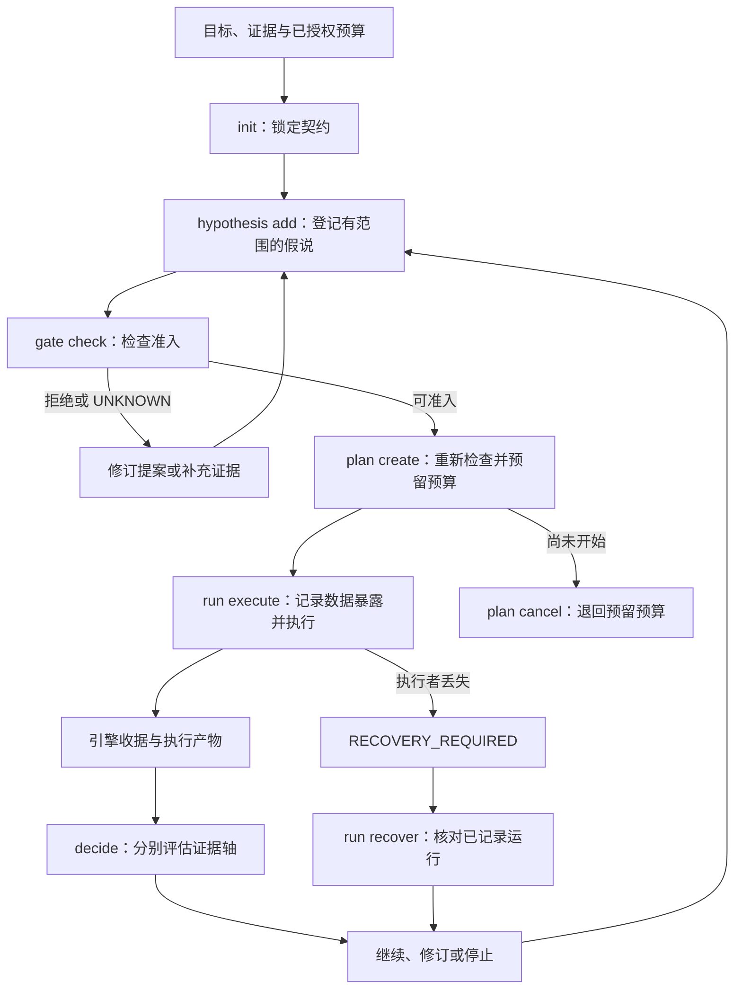

# 科研工作流：职责、执行与证据

[English](research-workflow.md) · [文档导航](README.zh-CN.md) · [形式化验证](formal-verification.zh-CN.md)

RDS 自动化部分科研协作工作，辅助人类研究者选择下一次实验，在已授权范围内完成它，再依据证据决定后续路线。研究者确定目标与资源，实际证据决定声明能有多强。三件事分别说明：组件描述软件职责，L1–L4 描述工作层次，CLI 记录执行状态；每个命题有自己的证据评估。

## 五个组件及其职责

前三个组件支撑基本科研闭环，Advisor 和 RSI 是两个增强组件。这一分组说明职责，不代表已发布版本已经自主接通了所有环节。

| 分组 | 组件 | 职责 |
| --- | --- | --- |
| 基础 | 科研规程 Skill | 与研究者协作，指导意图理解、证据收集、实验设计、结果解释和任务接续。 |
| 基础 | 执行与验收内核 | 绑定计划与资源，检查适用约束，执行所支持的实验，并记录产物、收据与恢复状态。 |
| 基础 | 研究状态与记忆 | 通过 `.rds` 项目记录、判断图和 Obelisk 历史检索，保留目标、配置、结果、失败条件与决策依据。 |
| 增强 | Advisor | 沿真实观测、历史、判断依赖和有范围的规则，提出能够区分竞争解释、改变下一次决策的实验候选。 |
| 增强 | RSI | 提出有范围的规则与工作策略修订，进行评估，再依据证据保留或回滚。 |

预算检查、探针、日志处理和适用的数学检查属于执行与验收内核；判断图与历史来源支撑研究状态与记忆。Lean 兼容协作针对适合的数学子任务，不替代更广研究声明所需的实验证据。L1–L4 跨越这些组件，不是额外组件。

## Advisor：现有实现与发展方向

Advisor 的目标从真实证据出发，沿判断图和有范围的规则生成或组合候选。每个候选应说明竞争解释、可区分它们的观测，以及正负结果分别怎样改变下一次决策。先判断候选的决策价值，再按已授权总成本筛选；保留推导过程与证据来源。

现有实现提供诊断与修订线索，以及有范围的规则检索。把证据驱动的候选生成与组合完整接通，仍是发展方向。规则匹配和启发式阈值不构成因果诊断。Advisor 的科研成功率、研究质量或费用节省，需要独立研究轨迹支持，不能由可运行的辅助程序或合成回归案例推出。RSI 同样先产生候选策略变更，其改善需要下面所述的 L4 评估。

## L1–L4 工作职责

这是 RDS 用于说明工作的分级，不是行业标准，也不是数据库中的四个状态。实验可以回到前面的工作；运行成功不会自动将项目升级到 L4。

| 层级 | 工作与输入 | 交付物 | 进入下一步决策的条件 |
| --- | --- | --- | --- |
| L1 · 证据辅助 | 阅读目标、相关代码、文献、日志和旧决定；通过 Obelisk 找回缺失历史。 | 可追溯证据、竞争解释、缺失信息与不确定性。 | 来源足以明确一个能影响决策的问题；缺证据之处仍须注明。 |
| L2 · 实验建议 | 在预算和部署可用输入的约束下，比较因果上不同的路线。 | 有范围的假说、证伪条件、公平对照、数据使用计划、最小有用收益，以及正负结果的后续行动。 | 实验能够区分解释，完整成本已经获得授权。 |
| L3 · 有界执行闭环 | 绑定已授权契约、假说、代码、数据、验证器与资源分配。 | 执行产物、引擎收据、分开的证据评估，以及恢复记录。 | 只在声明范围内解释实际结果，再继续、修订或停止。 |
| L4 · 经验证的策略改进 | 根据重复失败或反例提出有适用范围的规则修订。 | 可审阅的候选规则，以及研究轨迹的前瞻比较。 | 独立案例、相同总成本的比较支持所声称的策略改善；保留失败与限制。 |

公开 `main` 当前提供 L2 技能协议和 L3 标量参考基础；规则与 Advisor 提供修订线索。[PR #2](https://github.com/kongtou20070406/RDS/pull/2) 增加了经过检查的标量证书与修复候选。单次模型收益或单个数学证书，都不能验证 L4 研究策略。

## 参考 CLI 的单次实验流程

可运行源文件见 [examples/reference-run](../examples/reference-run/contract.json)，完整 PowerShell 示例见[首页](../README.zh-CN.md#快速上手)。

| 操作 | 含义与边界 |
| --- | --- |
| `init --contract` | 锁定命题、评估器、基线、数据划分身份和预算；不同契约使用新的 root。 |
| `hypothesis add --spec` | 登记用途、竞争解释和证伪条件；存在数学义务时须明确声明。 |
| `gate check --plan` | 检查提案但不预留资源。通过只是建议性的结果；后续预留会重新检查可变约束。 |
| `plan create --spec` | 准入后以事务原子预留资源；探索不能花掉确认预算底线。 |
| `run execute --id` | 使用已绑定代码和数据，记录数据访问、产物与引擎收据；开始执行即计入分配额度，失败也计入。 |
| `decide --run` | 读取收据，评估任务收益与机制证据；不接受手写指标收益或成功标志。 |
| `plan cancel --id` / `run recover --id` | 取消尚未开始的预留，或核对中断运行；失联执行者被标为 `RECOVERY_REQUIRED`，已消耗预算保留。恢复不会续跑执行或静默启动替代实验。 |
| `status` | 查看已记录的运行状态；不产生科学确认。 |

全局 `--root` 放在子命令之前。参考运行每次分配不超过 60 秒；账本计量分配给执行者的运行时间。准备、评估开销和外部 GPU 作业需要另外核算，参考内核不是通用训练调度器。

## 证据轴与决策条件

| 记录轴 | 可以说明什么 | 单独不能说明什么 |
| --- | --- | --- |
| 验证器 `status` 与 `assurance` | 声明性质是否经过检查，以及采用哪种检查方式。 | 实用收益、因果归因或独立科学确认。 |
| `run_status` | 执行成功、失败、超时或需要恢复。 | 科学支持或反驳。 |
| `assessment.task_gain` | 开发集证据；或在合格确认数据上的冻结有限比较和最小有用收益条件。 | 总体泛化或研究搜索策略改善。 |
| `assessment.mechanism` | 在支持模型内记录的干预与证伪证据。 | 分数上升本身不能支持机制；普通运行仍为 `UNTESTED`。 |

用开发数据做选择，独立确认前冻结选择，并记录已有暴露。探索信号与确认分别报告；看过或用于选择的数据不能通过改名变成独立数据。内核无法发现未报告的系统外访问。

显式数学声明的 `FAIL` 和 `UNKNOWN` 都阻止形式准入。数学检查成功不能绕过预算、代码绑定和数据使用约束。准入证书与执行观测的区别见形式化验证指南。

## 从 L3 回到 L2，以及怎样验证 L4

优先使用已有证据和同 seed 的公平对照，不常规安排多 seed 实验。只有已经观察到 seed 不稳定、可能影响当前结论，且决策价值足以支撑授权成本时，才建议追加；现有证据不足时直接注明不确定性。

运行失败或超时应先诊断执行问题；有效的科学负结果则可能收窄假说或改变路线。任务收益成立但机制未测，只能在对应证据层级支持收益表述。

策略更新先保留为可审阅候选。在未用过的研究案例上，前瞻比较旧策略和新策略；相同总预算必须包含失败尝试、诊断、验证与评估。记录版本、信息暴露、停止规则和负结果。复用开发案例或只展示最佳模型，不能证明策略改进。

Obelisk 提供相关历史原始记录，`.rds/state.sqlite3` 提供运行契约和收据。检索到的文字不产生新授权，执行账本也不是另一个会话记忆库。
