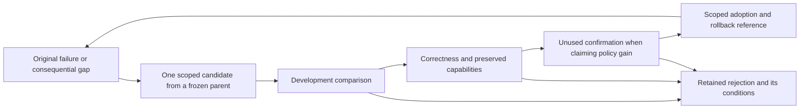

# Evolve RDS from research failures

RSI improves RDS's own rules, tools and search policy. Use a small failure-driven loop: preserve the original failure, identify the reusable missing capability, freeze one candidate change and its parent, compare them using the same acceptance standard, then adopt a scoped improvement or retain the rejection. Task-specific cases validate the capability; avoid encoding one current task or numerical instance into the general mechanism. Tool development, failures, comparison and confirmation consume the authorized research budget. Do not turn a passing software check into a scientific-performance claim.

## Three objects, three adoption meanings

| Object | Change | Required acceptance | Permitted conclusion |
| --- | --- | --- | --- |
| Decision rule | A sourced prerequisite, diagnostic or scope correction | Existing bounded `meta evaluate-rule` replay, preserved passing cases, declared holdout improvement, independent replay at `apply-rule`, reversible adoption | This finite rule regression improved. |
| Tool / verifier | A new capability or a corrected implementation | Frozen implementation and trusted specification; known positive, negative and boundary cases; original artifacts; independent mathematical/code review where soundness changes; existing capability regression; versioned integration | The checked implementation supports the stated capability. |
| Research policy | Probe selection, branching, curriculum allocation or parent selection | Whole paired research trajectories with equal model/information access and total budget, development selection followed by unused confirmation | A measured policy gain within this task/distribution, if it survives confirmation. |

The implemented automatic rule-adoption path does **not** adopt arbitrary code, certify checker soundness or establish research-policy improvement. A checker cannot approve a change to its own mathematical acceptance standard merely by rewriting expected answers. Changing that standard needs a separate protocol revision and review; ordinary compatible repairs remain within existing authorization.

## The loop and its fixed boundary



Keep the research objective, quantifiers, evaluator, protected proof obligations and total budget fixed for an ordinary candidate. Each candidate records its parent version, actual motivating artifact, edit scope, competing explanation, discriminator, falsifier, stopping condition and positive/negative next action. Use the existing RDS project bindings, receipts, checkpoints and RSI records; Obelisk locates prior decisions, and MRS retains authorized mathematical records. No separate conversation-memory store is needed.

A useful improvement can expand capability without lowering the current best radius. Conversely, a better radius after more search does not prove a better policy. Maintain separate `CAPABILITY`, `TASK_GAIN`, `MECHANISM` and `SEARCH_POLICY` evidence, and keep `UNKNOWN` distinct from false. Preserve the incumbent artifact; do not replace the raw trajectory with max-so-far scores.

For capability accumulation, retain working parents and their measured scope. Use the current accepted parent first. If actual stagnation warrants branching, predeclare a bounded alternative parent and branch budget; do not revive the same rejected intervention without changed evidence, scope or computation. Archive diversity is a candidate method, not a guaranteed improvement.

## Example: a staged disk-covering curriculum

Treat successive n as a **development curriculum**. Previously solved values, known constructions and previously inspected cases remain regression/development material. Adjacent n are related tasks, not automatically independent confirmation. Publish which inputs and feedback influenced each edit.

When the human chooses strict sequential completion, advance to n + 1 only after establishing the requested obligations for n: the exact radius, a nonzero integer polynomial with every coefficient and a rational isolating interval, exact centers, coverage of the entire closed disk, and an unrestricted global lower bound equal to that radius. Record missing obligations separately; a coverage PASS cannot authorize this progression. If a later human instruction chooses a direct n = 100 proof route, follow that active contract and retain the earlier curriculum as history. Published results may be used after checking their original statements and assumptions; distinguish cited theorems from independent proofs. This example is a research protocol, not an automatic mathematical gate or a universal requirement to solve small instances first.

Start with the exact small-n results and the counterexample to an invalid covering argument. Accumulate full-domain coverage checking, exact rational/interval handling, boundary handling, counterexample reporting and reusable construction tools only when each resolves an actual blocker. A full-partition covering certificate proves an upper bound; proving the globally optimal radius requires a lower bound over all allowed centers, independent of a chosen symmetry or combinatorial family.

For example, increasing a dyadic verifier's depth so the **same centers and radius** change from UNKNOWN to PASS closes a certification gap. It is not a smaller radius or a same-budget policy gain. Count the added verification cost. Preserve the original UNKNOWN receipt and both configurations.

If policy gain is evaluated later, freeze the model, prompts/information, seeds/starting constructions, allowed tools, evaluator and the complete cost allowance before either arm. Charge proposal generation, Advisor work, failures, compilation, verification, selection and confirmation. Reuse an unchanged control only with the original complete identity. Compare final valid results at that allowance, time to a certified threshold and validity failures. Define success and regression tolerances before reading confirmation outcomes. Abandon the policy-gain claim if confirmation gain disappears or validity regresses.

## Implemented input-exposure guard

The ordinary `meta evaluate-rule` and `meta apply-rule` paths record replay inputs in the active project's `.rds/rsi/confirmation/exposures.json`. Writes reserve inputs atomically **before** baseline/candidate grading. Failed or timed-out grading retains the exposure. Same frozen candidate, base graph, casepack and replay-program identity can replay for auditing and adoption; that replay supplies no additional confirmation credit.

Ordinary regressions retain their existing finite acceptance behavior and also mark inputs exposed. To request the stricter guard, add an optional field to the casepack:

```json
{"confirmation_campaign": "disk-cover-rule-iteration-1"}
```

This field is added to the existing casepack, which still requires its original cases, budgets, partitions and expectation commitment. Use the same persistent project for the lineage:

```text
python -B scripts/rds_cli.py --root <project> meta evaluate-rule --rule <candidate.json> --graph <base-graph.json> --cases <cases.json> --output <evaluation.json>
python -B scripts/rds_cli.py --root <project> meta apply-rule --rule <candidate.json> --graph <base-graph.json> --cases <cases.json> --evaluation <evaluation.json>
```

Python callers pass `confirmation_dir=<project>/.rds/rsi` to `evaluate_candidate`; use the same `record_dir` at `apply_rule`. A confirmation campaign without persistent history is rejected. Replay code includes the exposure helper in its source fingerprint. Old reports require a new version-bound review, as with other replay-engine changes.

For a different frozen evaluation, previously exposed heldout payloads are rejected before replay, including when case IDs, expected grades or campaign names change. Development/heldout overlap and duplicate heldout payloads are rejected. The project ledger supports at most 128 distinct frozen evaluations and 8192 input fingerprints; reaching the bound stops admission, without discarding history. Known material evaluated through an untracked older tool must be recorded as ordinary development before claiming fresh confirmation.

**The guarantee is exact payload exposure in this preserved project ledger.** Payload identity uses replay engine, context and templates. Equivalent inputs with different representations or extra context fields can produce different fingerprints; prior exposure outside the ledger is unknown. The guard does not attest private sealing, authentic labels, semantic independence, statistical confidence or a general OS access boundary. Protect the ledger and evaluator from candidate edits. Do not reset a project or delete its ledger to manufacture freshness. Current reports explicitly return `independent_sealing=NOT_ATTESTED` and `research_policy_gain_measured=false`. Public example cases are development fixtures, never an independent research test.

## Reference patterns checked on 2026-10-01

- [Self-Harness v3, 2026-08-20](https://arxiv.org/abs/2606.09498v3): execution-trace weakness mining, minimal harness proposals and regression validation. Adopt the failure-to-edit structure; its reported task gains do not establish transfer to RDS or this geometry task.
- [Meta-Harness v1, 2026-03-30](https://arxiv.org/abs/2603.28052v1): searches harness code using prior candidates, scores and traces. This supports retaining original candidate evidence, not a unique RDS novelty claim.
- [Darwin Gödel Machine v3, 2026-03-12](https://arxiv.org/abs/2505.22954v3): explores an archive of parent agents. Try a small bounded archive only when it resolves a consequential stagnation question.
- [Statistical Gödel Machine v2, 2026-09-17](https://arxiv.org/abs/2510.10232v2): separates exploration and statistical confirmation with a global error budget. RDS's current conditional Lean theorem checks and this input guard do not implement that statistical acceptance system.

See [development verification](development-loop.md), [resource planning](resource-planning.md), and [the evidence discipline](../references/rsi-evidence.md). The first useful delivery is one replayable improvement applied at the next safe research boundary; larger policy claims require their own fair evaluation.
